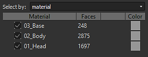

# Interface héritée Bakers

Voici la description de l&#39;interface de Baker disponible dans les versions de [Adobe Substance 3D Designer](https://www.adobe.com/fr/products/substance3d-designer.html) antérieures à la version 6.0.4.

## Vue d’ensemble

Le panneau boulanger est divisé en 4 parties :

### 1 : Scène

Permet de définir la partie du maillage impliquée dans le processus de cuisson.

Nouveauté de la version 6 : vous pouvez également sélectionner par matériau :

### 2 : Boulangers

En appuyant sur le bouton , vous pouvez ajouter les boulangers souhaités à la liste de traitement

>[!NOTE]
>
> Les boulangeries sont traitées selon l&#39;ordre des listes (de haut en bas) : cela peut être important si vous voulez réutiliser le résultat d&#39;un boulangerie (comme la carte normale) dans un autre processus de boulangerie

Cliquer sur le « + » dans la mise en page des boulangers vous permet d&#39;ajouter les boulangers dans une pile (Vous pouvez mettre autant de boulangers que vous le souhaitez dans une pile).

.

Vous pouvez supprimer un processus de cuisson de la liste en appuyant sur 

Vous pouvez réorganiser la liste des processus de cuisson en sélectionnant un processus de cuisson et en utilisant 

### 3 : Paramètres Bakers

Cette section affiche les options spécifiques pour le boulanger actuellement sélectionné.

### 4 : Paramètres Communs

Affiche les paramètres partagés entre les boulangers.

>[!NOTE]
>
> Par défaut, la modification de l&#39;un de ces paramètres affecte tous les boulangers, sauf si vous cochez la case Paramètres de remplacement, communs à tous les boulangers : dans ce cas, les modifications seront locales au boulanger actuel.

* **Le champ Nom de la ressource** vous permet de modifier le nom du bitmap généré, si vous le souhaitez.
* **La liste déroulante Format de fichier** vous permet de modifier le format de fichier par défaut (format bitmap Windows ou OS/2, « BMP »).
* **La case à cocher** **Placer** la ressource dans un dossier spécifique au maillage vous permet de choisir si l&#39;image bitmap générée est stockée au même niveau que le modèle ou à l&#39;intérieur d&#39;un nouveau sous-dossier nommé « Ressources ».
* **La méthode** vous permet de définir si la nouvelle ressource bitmap doit être liée ou incorporée dans le package de Substance.
* **Le dossier** vous permet de définir où enregistrer les mappages.

Le processus de cuisson démarre en appuyant sur le bouton OK en bas à droite de la fenêtre des boulangers.

Nouveauté de la version 6 : vous pouvez désormais annuler le processus de cuisson à l’aide du bouton d’annulation :

