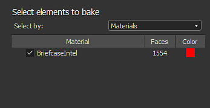

# Bakers

La cuisson fait référence à l&#39;action de **transfert d&#39;informations basées sur le maillage dans les textures**. Ces informations sont ensuite lues par des ombrages et/ou des filtres de Substance pour générer des effets ou des textures plus avancés.

>[!NOTE]
>
> Pour en savoir plus sur la cuisson, consultez la [Documentation sur la cuisson](https://experienceleague.adobe.com/en/docs/substance-3d/bakers/home).

<table>
<tr style="border: 0;">
<td width="100.00%" style="border: 0;" valign="top">

La fenêtre de cuisson est accessible via le fichier de maillage dans la fenêtre [Explorateur](../interface/the-explorer-window/the-explorer-window.md). Cliquez avec le bouton droit de la souris sur le nom du maillage et sélectionnez « **Informations sur le modèle de cuisson** » pour ouvrir la fenêtre de cuisson.

</td>
<td width="33.33%" style="border: 0;" valign="top">

Option 

</td>
</tr>
</table>

## Vue d’ensemble

La fenêtre de cuisson de est divisée en plusieurs panneaux qui sont décrits ci-dessous.

<table>
<tr style="border: 0;">
<td style="border: 0;" valign="top">

### Eléments à cuire

Ce panneau contrôle la partie du maillage en bas-poly qui sera utilisée pour effectuer la cuisson.

Elle répertorie la géométrie trouvée dans le fichier de maillage low-poly. Par défaut, la liste est basée sur les matériaux individuels trouvés dans le fichier, mais elle peut être commutée en sous-maillages à la place lorsque cela est pertinent. Vous pouvez décocher les éléments qui doivent être ignorés pendant le processus de cuisson.

</td>
<td style="border: 0;" valign="top">

</td>
</tr>
</table>

<table>
<tr style="border: 0;">
<td style="border: 0;" valign="top">

### Sortie

Ce panneau contrôle l’emplacement de la texture cuite.

</td>
<td style="border: 0;" valign="top">

</td>
</tr>
</table>

| *Paramètre* | *Description* |
| --- | --- |
| **Méthode** | Contrôle la façon dont les textures cuites seront stockées avec le package de Substance.Valeurs possibles :<ul data-preserve-html="true"><li data-preserve-html="true"><strong>Incorporé</strong> : la texture cuite est stockée dans un sous-dossier en regard du package de Substance avec un nom spécifique.</li><li data-preserve-html="true"><strong>Lié</strong> (par défaut) : la texture cuite est stockée dans le dossier défini, puis référencée dans le pack de Substances.</li></ul> |
| **Dossier** | Emplacement des textures cuites lors de l’enregistrement. Cliquez sur le bouton à trois points pour ouvrir une boîte de dialogue de fichier et choisissez le dossier d’exportation. Une coche sera visible à droite pour indiquer si le dossier existe réellement ou non. |
| **Nom** | Convention de dénomination des textures cuites. Cliquez sur le bouton à trois points pour ouvrir une liste déroulante et insérer d’autres espaces réservés (nom de pain, personnalisé, matière, filet). |
| **Exemple** | Simuler un nom de fichier pour tester la convention de dénomination. |
| **Placer la ressource dans un dossier spécifique au maillage** | Si cette option est activée, les textures cuites sont enregistrées dans un dossier nommé fichier de filet. |

### Maillages haute définition

Ce panneau contrôle la liste des maillages à haute densité de polices et les paramètres associés. Voir les [paramètres communs](https://experienceleague.adobe.com/en/docs/substance-3d/bakers/bakers-settings/common-parameters) pour plus d&#39;informations.

### Valeurs par défaut

Voir les [paramètres communs](https://experienceleague.adobe.com/en/docs/substance-3d/bakers/bakers-settings/common-parameters) pour plus d&#39;informations.

### Liste et paramètres de rendu des bakers

La **liste de rendu des Bakers** permet de choisir la texture bakée que vous souhaitez générer. Par défaut, la liste est vide.

* **Ajout d&#39;un nouveau boulanger :** Cliquez sur le bouton « Ajouter un boulanger ».
* **Suppression d&#39;un boulanger :** sélectionnez le boulanger dans la liste, puis cliquez sur le bouton « Supprimer le boulanger ».
* **Placement d&#39;un boulanger en haut :** sélectionnez le boulanger dans la liste, puis cliquez sur le bouton « Placer en haut ».
* **Descente d&#39;un baker :** sélectionnez le baker dans la liste, puis cliquez sur le bouton « Push down ».

Chaque boulanger hérite par défaut des valeurs par défaut (voir ci-dessus). La taille (résolution) peut par exemple être remplacée en cliquant sur la cellule sur la ligne du baker. Cela est vrai pour les autres paramètres de la ligne.

Lorsque vous cliquez sur un baker dans la liste, la vue Paramètres de Baker est mise à jour avec ses paramètres spécifiques.

Pour en savoir plus sur les paramètres spécifiques, voir : [Paramètres de Bakers](https://experienceleague.adobe.com/en/docs/substance-3d/bakers/bakers-settings/bakers-settings).

