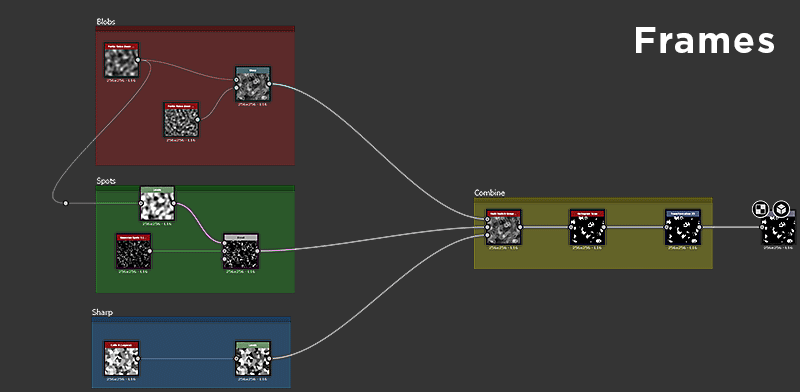
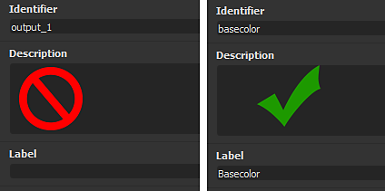

# Règles de création de graphiques

La création de graphes volumineux et complexes peut rapidement devenir déroutante et difficile à explorer. Un certain nombre d&#39;outils peuvent être utilisés pour atténuer ces problèmes, et il y a de bonnes habitudes à prendre pour éviter les problèmes plus tard. Cette page fournit une liste concluante des techniques que nous vous recommandons d’utiliser pour créer des graphiques propres, efficaces et fonctionnels, faciles à partager et à comprendre.

## Général

### Organisation du graphique

#### Éléments du graphe

Les éléments de graphique sont des objets d&#39;assistant qui peuvent être placés à côté et autour de vos nœuds dans [la vue Graphique](../../interface/the-graph-view/the-graph-view.md). Parmi les trois, le cadre offre les avantages les plus rapides et les plus importants, tandis que le commentaire et le coin de navigation sont plus adaptés à des scénarios spécifiques.

#### Images

La principale caractéristique qui permet d’obtenir des graphiques plus nets et plus faciles à lire est l’emplacement des images autour des groupes principaux de votre graphique. Sans bloc, un grand graphique est presque illisible, et même les petits graphiques deviennent beaucoup plus faciles à comprendre une fois les blocs dessinés. L&#39;un des grands avantages des images est que leurs <b> noms sont toujours rendus à la même échelle</b>, même si vous effectuez un zoom arrière très éloigné.

Les cadres permettent de comprendre beaucoup plus facilement ce qui se passe dans un graphique. Ils peuvent vous aider, en tant qu’auteur, à reprendre votre travail des mois plus tard, ou aider un autre utilisateur, tel qu’un collègue, à trouver son chemin dans un graphique auquel il n’est pas habitué.

Utilisez les critères suivants lors de l’importation d’images :

* Identifiez **les blocs de fonctionnalité** (par exemple, 8 nœuds qui, ensemble, produisent un effet de dirt) et regroupez-les à l’aide d’images.
* Essayez toujours d&#39;**utiliser des couleurs différentes** pour vos images : les images avec la même couleur bleue par défaut ne se démarquent pas beaucoup les unes des autres.
* Utilisez des **noms clairs et descriptifs** qui ne sont pas trop longs (voir la section ci-dessous pour obtenir plus de conseils)
* Ne mettez pas **trop ou trop peu** dans un cadre, car cela n&#39;améliore pas la lisibilité. Le montant exact diffère évidemment entre les graphiques et les fonctionnalités.
* Si nécessaire, **ajoutez du texte dans la description** pour comprendre ce qui se passe dans un cadre.

#### Commentaires et épingles

Les commentaires et les épingles sont secondaires par rapport aux blocs et ne sont pas indispensables pour les graphiques correctement créés. Ils peuvent être utilisés dans les scénarios suivants :

* Les commentaires sont parfaits pour ajouter du texte supplémentaire au-delà de ce que permet la description d’un cadre. Vous pouvez ajouter de petits morceaux de texte par nœud, principalement pour des informations peu détaillées. Les commentaires ne sont pas correctement mis à l’échelle et ne sont pas lus à un niveau de zoom éloigné.
* Les épingles de navigation vous permettent de parcourir des zones spécifiques du graphique à l’aide du raccourci F2. Cela peut être utile pour les très grands graphiques où il faut souvent sauter entre deux zones qui sont très éloignées l&#39;une de l&#39;autre.

### Emplacement d’entrée et de sortie

Les entrées et les sorties doivent être placées aux extrémités des graphiques : toutes les sorties à droite, toutes les entrées à gauche, chacune alignée verticalement. Cela facilite leur recherche et leur identification.

L’exemple ci-dessus est un cas extrême : les images ne sont pas toujours nécessaires ou possibles, mais il doit être clair que l’alignement vertical des Entrées et Sorties est beaucoup plus clair qu’un placement aléatoire et mélangé.

### Réacheminement des liens

Dans les grands graphes très longs, les liens sont parfois établis sur une très grande étendue. Cela conduit à des fils de liaison confus traversant le graphique sans beaucoup de contrôle. Le raccourci « Alt + Maj + Faire glisser » vous permet de réorganiser ces liens, de les rediriger sur un chemin différent en subdivisant un lien et en ajoutant une poignée supplémentaire au milieu. Il est recommandé de l’utiliser dans les scénarios où cela est logique.

### Étiquette, identificateur et utilisation

Tout graphique destiné au partage ou à la publication doit faire l’objet d’une attention particulière dans les métadonnées supplémentaires afin d’améliorer la convivialité. Les points suivants sont importants :

Les étiquettes suggérées par défaut ne sont jamais suffisantes. Prenez le temps et les efforts nécessaires pour ajouter des étiquettes personnalisées aux paramètres exposés et à vos entrées et sorties.

Essayez de ne pas avoir d&#39;identificateur et de libellé trop différents : dans le cas où l&#39;identificateur est utilisé ailleurs (dans plusieurs fonctions), il peut être très difficile de trouver quelle propriété d&#39;interface utilisateur est liée à quelle variable.

Essayez de faire correspondre vos libellés aux termes que vous utilisez dans les cadres (libellés de cadre) et les commentaires. Il est ainsi plus facile de savoir quelle section du graphique est liée à quel paramètre exposé

### Paramètres

Lors de l’exposition des paramètres, il est important de ne pas se limiter à l’étiquette et à l’identifiant. Gardez les points suivants à l’esprit :

* Sélectionnez le type d’éditeur approprié. Un Slider n&#39;a pas toujours de sens : un élément Angle ou Dropdown Ui sont également possibles.
* Définissez les valeurs Min et Max appropriées et décidez si leur verrouillage est judicieux.
* Choisissez une valeur par défaut logique : les valeurs par défaut qui ne servent à rien doivent être évitées.
* Envisagez de remapper la plage via une [fonction](../../function-graphs/function-graphs.md)si nécessaire : un curseur de 0,125 à 0,357 n’a aucun sens, vous pouvez facilement remapper cela avec une interpolation linéaire et faire en sorte que l’élément d’interface utilisateur utilise une plage de 0 à 1.

## Graphes Substance

### Gestion des couleurs et des niveaux de gris

Une grande prudence est requise lors de l’utilisation des données de couleur et de niveaux de gris, car il est difficile de mélanger les deux types à la volée. Il convient de garder à l’esprit les points suivants :

* Les graphiques ne doivent jamais contenir de liens (d’erreur) en pointillés rouges.
* Il ne doit pas y avoir de conversions inutiles entre la couleur et les niveaux de gris et vice versa. Dans certains cas, l’option « Insérer automatiquement le nœud de conversion couleur/niveaux de gris » dans les préférences du graphique peut entraîner de longues chaînes inutiles de nœuds de conversion ancrés.
* Les données sont idéalement conservées le plus longtemps possible en niveaux de gris, et converties uniquement en cas de nécessité absolue. Cela réduit la complexité et réduit les performances.
* Les entrées et les sorties doivent être créées ou configurées avec le type approprié à l&#39;esprit : par exemple, il n&#39;est pas logique d&#39;avoir une entrée « masque » définie sur couleur si elle sera convertie en niveaux de gris pour une utilisation comme masque binaire.

### Contrôle de la résolution

Le contrôle de la résolution d&#39;un graphique à [Substances](../../compositing-graphs/substance-compositing-graphs.md) peut prêter à confusion. Vous devez donc faire preuve de prudence pour procéder correctement. En commettant des erreurs, vous risquez d’affecter gravement les performances ou de générer des résultats inutilisables de mauvaise qualité.

[Pour bien comprendre cette rubrique, assurez-vous de connaître les tailles de sortie absolues et relatives.](../../compositing-graphs/output-size/output-size.md)

* Dans la plupart des cas, un graphique doit être défini sur « Relative à la résolution du parent », à moins qu’il existe une exception très spécifique où cela n’est pas nécessaire (très rare).
* Les nœuds ne doivent généralement pas avoir de paramètres de remplacement pour la taille de sortie. Dans la plupart des cas, il est préférable de contrôler la résolution via les propriétés Parent ou Graphe.
* Pour les bitmaps, veillez tout particulièrement à ce que la taille de sortie absolue par défaut ne s’étende pas à l’ensemble du Graphe. Dans ce cas, elle doit être remplacée par la taille Relatif au parent. Il s&#39;agit de l&#39;une des rares exceptions à la règle ci-dessus.
