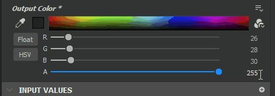

# Tons directs (Pantone)

Les tons directs constituent un autre mode de sélection des couleurs. Substance 3D Designer vous permet de choisir des couleurs dans les catalogues de couleurs plutôt que dans le RGB ou le sélecteur de couleurs HSV standard. Les systèmes de gestion des couleurs et de reproduction correspondants sont ainsi parfaitement adaptés. Cela vous permet de vous assurer que les couleurs numériques utilisées dans Designer correspondent étroitement à celles des produits manufacturés.

Actuellement, Spot Colors propose dix-sept livres Pantone.

## Gestion des couleurs

Les tons directs étant destinés à une reproduction et une correspondance précises des couleurs, il est essentiel de configurer la[gestion des couleurs](../../color-management/color-management.md) pour Designer avant de commencer à travailler. Les tons directs fonctionnent mieux avec la gestion des couleurs <b>Adobe Color Engine (ACE)</b>, pas avec OCIO. Ils fonctionneront avec le mode hérité, mais vous ne pouvez pas être sûr qu’ils s’affichent correctement si votre moniteur n’est pas étalonné pour sRGB.

En bref, la configuration de la gestion des couleurs pour les tons directs implique les opérations suivantes :

* Étalonnez votre moniteur en générant ou en obtenant le profil ICC approprié.
* Activez la gestion des couleurs avec Adobe Color Engine (ACE) dans les préférences de Designer.
* Définissez 2D et vue 3D pour utiliser le profil approprié à partir de votre moniteur.
* Redémarrez pour appliquer les modifications.
* Vérifiez la correspondance des couleurs entre Designer et une autre application Adobe telle qu’Adobe Illustrator ou Photoshop. La couleur « <b>Pantone Rhodamine Red C</b> » du premier livre Pantone, Solid Coated, est un bon cas d&#39;essai car elle peut varier considérablement si la gestion des couleurs n&#39;est pas correcte.

>[!WARNING]
>
> **Couleurs des vignettes**
> 
> Les vignettes de nœud ne sont *pas gérées par couleur par défaut*. Par conséquent, seules les couleurs du profil approprié s&#39;affichent dans la vue 2D. La gestion des couleurs des vignettes peut être activée dans les Préférences sous la gestion des couleurs de votre projet, mais elle a un faible coût au niveau des performances.

## Utilisation des tons directs

### Passage du RGB au ton direct

Même si vous configurez la gestion des couleurs, les sélecteurs de couleurs restent définis par défaut sur RGB ou HSV. Vous devez les convertir manuellement en tons directs. Ce paramètre est stocké par paramètre et est même reporté lorsque vous exposez un paramètre.

1. Cliquez sur le bouton  <b>Type de sélecteur de couleurs</b> en regard du nuancier du RGB.
1. Au lieu de <b>couleurs RGB</b>, choisissez n&#39;importe quel <b>catalogue de couleurs</b> dans la liste déroulante.
1. L&#39;icône du  <b>type de sélecteur de couleurs</b> change et son interface passe en mode <b>Tons directs</b>.

{width="512px"}

### Choix et recherche de tons directs

Il existe plusieurs façons de rechercher et de choisir des tons directs dans un catalogue de couleurs.

* Vous pouvez utiliser les   <b>flèches gauche et droite</b> de chaque côté des pages du livre pour basculer entre les pages. Vous pouvez également cliquer et faire glisser sur l’affichage de la page pour faire défiler les pages.
* Vous pouvez cliquer sur n’importe quelle couleur de la page active pour la sélectionner. Souvent, davantage de couleurs sont disponibles et nécessitent un léger défilement vers le bas.
* Vous pouvez utiliser la barre de recherche pour rechercher une couleur par nom ou par numéro. Cette recherche ne correspond qu&#39;aux noms des couleurs dans le livre, il n&#39;y a pas de logique complexe en cours ; la recherche « gris » ne donnera que des résultats avec le mot « gris » dans leur nom, vous ne verrez aucune couleur grise qui n&#39;a que des nombres dans leur nom.
* Pour agrandir l&#39;interface et la rendre plus facile à utiliser pour le catalogue de couleurs, cliquez sur la zone d&#39;aperçu des couleurs entre l&#39;icône  <b>Pipette</b> et la  <b>flèche gauche</b>.

{width="512px"}

### Choix et conversion des tons directs

Les tons directs peuvent être sélectionnés à l&#39;aide de l&#39;outil  <b>Pipette</b>. En mode Ton direct, cela signifie que la couleur échantillonnée dans le RGB sera convertie en ton direct correspondant le plus proche dans le livre actuellement sélectionné.

L&#39;outil <b>Pipette</b> de Designer peut être utilisé n&#39;importe où sur votre écran, sans restriction. Cela signifie que vous pouvez utiliser Designer en tant qu&#39;outil de conversion des tons directs.

Si vous changez de catalogue ou revenez dans RGB à partir d’un catalogue de tons directs, la couleur sélectionnée sera convertie selon la correspondance la plus proche. Cela signifie que vous pouvez convertir les couleurs entre les livres et de nouveau dans le RGB.

>[!WARNING]
>
> La conversion de tons directs d’un livre à un autre constitue une opération sans perte. Souvent, la conversion aller-retour n’aboutit pas à la même couleur que celle avec laquelle vous avez commencé !

{width="512px"}
