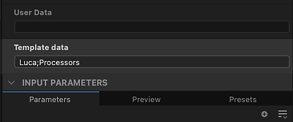

# Création d’un graphe Substance

La création de textures dans Designer commence par la création d’un graphique de Substance, à partir d’un modèle prédéfini ou d’un graphique vide.

## Création d’un graphique

Pour commencer le processus de création d&#39;un graphique de [Substance](../../compositing-graphs/substance-compositing-graphs.md), vous pouvez utiliser l&#39;une des méthodes suivantes :

* &#x200B;
  <table>
  <tr style="border: 0;">
  <td style="border: 0;" valign="top">

  Dans l&#39;écran d&#39;accueil, cliquez sur le bouton <b>Nouveau graphique</b>.

  </td>
  <td style="border: 0;" valign="top">

  {zoomable="yes"}

  </td>
  </tr>
  </table>

* &#x200B;
  <table>
  <tr style="border: 0;">
  <td style="border: 0;" valign="top">

  Sur n&#39;importe quel élément de package *existant* dans l&#39;[Explorateur](https://helpx.adobe.com/fr/substance-3d/unlisted/documentation/sddoc/the-explorer-129368147.html), cliquez sur <b>RMB</b> et accédez à <b>Nouveau > graphique de Substance</b> dans le menu contextuel.

  </td>
  <td style="border: 0;" valign="top">

  {zoomable="yes"}

  </td>
  </tr>
  </table>

* &#x200B;
  <table>
  <tr style="border: 0;">
  <td style="border: 0;" valign="top">

  Dans la barre d&#39;outils principale, cliquez sur le bouton  <b>Nouveau graphique de Substance</b>.

  </td>
  <td style="border: 0;" valign="top">

  {zoomable="yes"}

  </td>
  </tr>
  </table>

* &#x200B;
  <table>
  <tr style="border: 0;">
  <td style="border: 0;" valign="top">

  Dans le [menu principal](https://helpx.adobe.com/fr/substance-3d/unlisted/documentation/sddoc/the-main-menu-143720673.html), accédez à <b>Fichier > Nouveau > graphique de Substance...</b>

  </td>
  <td style="border: 0;" valign="top">

  

  </td>
  </tr>
  </table>

* Appuyez sur la touche <b>Ctrl+N</b> (Windows) / <b>Cmd+N</b> (macOS).

Quelle que soit la méthode choisie, la boîte de dialogue <b>Nouveau graphique de Substance</b> s&#39;affiche.

## Modèles de graphiques

Quelle que soit la méthode utilisée pour créer un graphique de Substance, la boîte de dialogue <b>Nouveau graphique de Substance</b> s&#39;affiche toujours. Elle vous permet de configurer le nouveau graphique.

{zoomable="yes"}

### Modèles

Designer inclut des modèles de graphiques avec des nœuds préconfigurés pour vous aider à démarrer plus rapidement. Ils peuvent inclure des nœuds de [sortie](../../compositing-graphs/nodes-reference-for-com/atomic-nodes/output/output.md), des nœuds simples pour transmettre des valeurs à ces sorties, par exemple [Couleur uniforme](../../compositing-graphs/nodes-reference-for-com/atomic-nodes/uniform-color/uniform-color.md), ainsi que des nœuds d&#39;[entrée](../../compositing-graphs/nodes-reference-for-com/atomic-nodes/input/input.md).

Double-cliquez sur un modèle dans la liste ou sélectionnez-le et cliquez sur le bouton <b>Créer</b> pour créer un graphique de Substance à l&#39;aide de ce modèle. Par défaut, le nouveau graphique est placé dans un nouveau package non enregistré.

>[!TIP]
>
> Partir de zéro
> 
> Pour commencer à partir d&#39;un graphique entièrement vide, sélectionnez le modèle <b>Vide</b> dans la catégorie « Vide ».

>[!NOTE]
>
> Changement de modèle
> 
> Si vous sélectionnez le mauvais modèle, vous *ne pouvez pas* passer à un autre modèle après avoir créé le graphique.
> 
> Pour importer votre graphique existant vers un autre modèle, vous pouvez créer un graphique à l’aide du modèle approprié et copier-coller le graphique vers le nouveau modèle. Reconnectez les nœuds selon les besoins, en particulier les nœuds de sortie.

<table>
<tr style="border: 0;">
<td width="100.00%" style="border: 0;" valign="top">

Chaque modèle est répertorié par son libellé et son sous-titre.

Le sous-titre fournit plus de contexte sur le *cas d&#39;utilisation* du modèle : le modèle de matériau sur lequel il est basé, le logiciel avec lequel il est destiné à s&#39;intégrer, etc.

En mode <b>Vignettes</b>, le sous-titre est placé sous l&#39;étiquette dans un texte plus foncé et plus petit.

Dans les modes d&#39;affichage <b>Liste</b>, <b>Packs</b> et <b>Répertoires</b>, le sous-titre est ajouté à l&#39;étiquette de la manière suivante : *Étiquette - Sous-titre*.

</td>
<td width="25.00%" style="border: 0;" valign="top">

</td>
</tr>
</table>

### Exemples de matériaux

La catégorie <b>Échantillons de matière</b> comprend une [sélection de graphiques](../../compositing-graphs/creating-compositing-gra/material-samples/material-samples.md) dont vous pouvez vous inspirer et avec lesquels vous pouvez faire des expériences.

Vous pouvez également accéder aux échantillons directement à partir de l&#39;écran d&#39;accueil, en utilisant le bouton <b>Accéder aux échantillons</b>.

Tous les échantillons sont basés sur l&#39;[modèle de matériau](../../interface/3d-view/material-properties/material-properties.md#openpbr).

{zoomable="yes"}

<table>
<tr style="border: 0;">
<td style="border: 0;" valign="top">

### Info-bulle d’informations

Le survol de l’icône d’informations pour chaque élément de modèle affiche une info-bulle contenant des informations supplémentaires sur le modèle :

<b>Type :</b> type de ressource que le modèle est censé produire. Ce paramètre est modifiable dans les [propriétés du graphique](../../compositing-graphs/graph-parameters/graph-parameters.md).

<b>Description :</b> détails sur le modèle tels que le workflow qu&#39;il intègre, son cas d&#39;utilisation prévu et des recommandations pour son utilisation.

<b>Sorties :</b> les nœuds [Sortie](../../compositing-graphs/nodes-reference-for-com/atomic-nodes/output/output.md) du modèle, le cas échéant.

</td>
<td style="border: 0;" valign="top">

{zoomable="yes"}

</td>
</tr>
</table>

<table>
<tr style="border: 0;">
<td width="100.00%" style="border: 0;" valign="top">

### Modes d’affichage

La liste des modèles peut être affichée dans différents modes à l&#39;aide du bouton <b>Afficher les modes</b>.

Le filtrage effectué par la catégorie et le fichier de projet sélectionnés est appliqué dans toutes les vues.

</td>
<td width="33.33%" style="border: 0;" valign="top">

{zoomable="yes"}

</td>
</tr>
</table>

+++Modes d’affichage
{zoomable="yes"}

<b>Vignettes</b>

Cartes avec des vignettes fournissant un aperçu ou une icône du type de modèle.

{zoomable="yes"}

<b>Liste</b>

Les modèles sont répertoriés par leur étiquette uniquement.

{zoomable="yes"}

<b>Packs</b>

Les modèles sont répertoriés par leur étiquette en tant qu’enfants du fichier de pack auquel ils appartiennent.

Survolez un élément de fichier de package pour afficher une info-bulle avec son chemin complet.

{zoomable="yes"}

<b>Répertoires</b>

Les modèles sont répertoriés par leur étiquette en tant qu’enfants du répertoire hébergeant le fichier de pack auquel ils appartiennent.

Survolez un élément de répertoire pour afficher une info-bulle avec son chemin complet.

+++

### Propriétés

Après avoir sélectionné le modèle, vous pouvez définir des informations de base concernant le nouveau graphique. Il peut être modifié à tout moment après la création du graphique.

<b>Nom du graphique</b> : identifiant du graphique. Il doit être unique pour un package donné et ne peut pas inclure d’espaces ni de caractères spéciaux.

<b>Taille</b> : résolution parent du graphique, qui contrôle la résolution de sortie de la plupart des nœuds. Pour en savoir plus, consultez la page [Taille de sortie](../../compositing-graphs/output-size/output-size.md). La largeur et l’height sont liés par défaut. Vous pouvez rompre leur lien en cliquant sur le bouton Lier situé entre les zones de liste déroulante Largeur et height.

<b>Créer un graphique dans</b> : vous pouvez utiliser cette zone de liste déroulante pour créer un *nouveau* package pour le nouveau graphique ou ajouter le nouveau graphique à tout *package existant* déjà chargé dans le panneau [Explorateur](https://helpx.adobe.com/fr/substance-3d/unlisted/documentation/sddoc/the-explorer-129368147.html).

### Info-bulle Aide

Passez le curseur de la souris sur l’icône représentant un point d’interrogation pour afficher une info-bulle avec un bouton pointant directement vers cette page, afin de pouvoir consulter cette documentation si nécessaire.

{zoomable="yes"}

## Gestion des modèles

<table>
<tr style="border: 0;">
<td width="100.00%" style="border: 0;" valign="top">

### Filtrage par catégorie

Les catégories permettent de regrouper les modèles qui sont liés les uns aux autres par cas d’utilisation ou type d’actif.

Utilisez la zone de liste déroulante <b>Catégorie</b> pour sélectionner la catégorie par laquelle vous souhaitez filtrer les modèles.

</td>
<td width="41.67%" style="border: 0;" valign="top">

{zoomable="yes"}

</td>
</tr>
</table>

<table>
<tr style="border: 0;">
<td width="100.00%" style="border: 0;" valign="top">

Les modèles peuvent avoir une catégorie configurée dans leurs <b>données de modèle</b> [attribut de graphique](../../compositing-graphs/graph-parameters/graph-parameters.md), qui est utilisé comme filtre pour affiner la liste des modèles :

&lt;category>;&lt;subtitle>

Des catégories personnalisées peuvent être configurées dans les modèles fournis par les fichiers de projet (voir ci-dessous). Ces catégories sont ensuite ajoutées à la liste dans la zone de liste déroulante.

</td>
<td width="50.00%" style="border: 0;" valign="top">

{zoomable="yes"}

</td>
</tr>
</table>

<table>
<tr style="border: 0;">
<td width="100.00%" style="border: 0;" valign="top">

### Filtrage par fichier de projet

Si l&#39;un des [fichiers de projet](../../interface/preferences-window/project-settings/project-settings.md) actifs fournit un ou plusieurs chemins de modèle, les graphiques dans les fichiers de package trouvés à ces chemins seront ajoutés à la liste des modèles.

Ensuite, utilisez le bouton <b>Filtrer par fichier de projet</b> pour réduire la liste des modèles à ceux fournis par un fichier de projet spécifique.

</td>
<td width="33.33%" style="border: 0;" valign="top">

{zoomable="yes"}

</td>
</tr>
</table>
