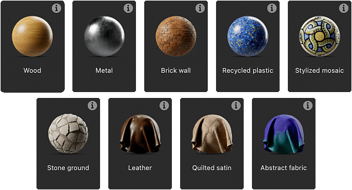
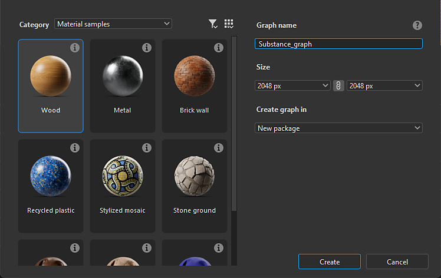

# Exemples de matériaux

Designer propose une sélection d’exemples de graphes couvrant différents types de matériaux, pour en tirer des leçons et les tester.

Les exemples sont destinés à être utilisés comme modèle de graphe, ce qui signifie qu&#39;ils sont accessibles en <b>créant un nouveau graphe de Substance de données</b>.
Le nouveau graphe est une <b>copie entièrement modifiable</b> de l&#39;exemple, que vous pouvez modifier, décomposer et développer à votre guise.
Vous pouvez créer autant de nouveaux graphes que vous le souhaitez à partir des échantillons.

Tous les échantillons sont basés sur le modèle de matériau **OpenPBR**, une nouvelle norme du secteur de plus en plus prise en charge.

Lors de la création d&#39;un nouveau graphe de Substance, vous trouverez les exemples dans la [boîte de dialogue Nouveau graphe de Substance](../../../compositing-graphs/creating-compositing-gra/creating-a-substance-compositing-graph.md) :

<table>
<tr style="border: 0;">
<td style="border: 0;" valign="top">

{zoomable="yes"}

Ouvrez la zone de liste déroulante <b>Catégorie</b> et sélectionnez <b>Exemples de Matériau</b> pour répertorier les modèles disponibles.

</td>
<td style="border: 0;" valign="top">

{zoomable="yes"}

Vous pouvez accéder directement à la liste des échantillons dans la boîte de dialogue, en utilisant le bouton <b>Accéder aux échantillons</b>, placé de manière pratique
dans l&#39;<b>écran d&#39;accueil</b>.

</td>
</tr>
</table>

<table>
<tr style="border: 0;">
<td width="33.33%" style="border: 0;" valign="top">

Dans la boîte de dialogue, survolez l’icône d’informations d’un élément d’exemple pour obtenir plus d’informations sur les concepts et les techniques
exploré dans l’exemple.

</td>
<td width="100.00%" style="border: 0;" valign="top">

{zoomable="yes"}

</td>
</tr>
</table>

Double-cliquez sur un élément pour créer un graphe à partir de cet échantillon. Vous pouvez également sélectionner l’échantillon et cliquer sur
le bouton <b>Créer</b>.

Double-cliquez sur un élément pour créer un graphe à partir de cet échantillon. Vous pouvez également sélectionner l’échantillon et cliquer sur
le bouton <b>Créer</b>. Une fois qu’un échantillon de matériau est sélectionné et que la création du graphe est validée, la boîte de dialogue se ferme
et une copie de l’échantillon est chargée en tant que nouveau graphe dans la Vue du graphe.

Par défaut, la première sortie de l&#39;échantillon est chargée dans la vue 2D et les textures sont appliquées à la vue 3D.
Ainsi, votre espace de travail est automatiquement configuré et vous êtes prêt à commencer. (Ce paramètre peut être modifié dans les [préférences](../../../interface/preferences-window/preferences-window.md) de Designer)

>[!NOTE]
> 
> Les exemples de matériau utilisent la version <code>OpenPBR 1.1</code> modèle de matériau et visualisation dans la vue 3D signifie :
> le matériau dans la vue 3D passera automatiquement à l&#39;<code>OpenPBR Surface</code> shader afin de
> affichez l’échantillon avec précision.

{zoomable="yes"}
