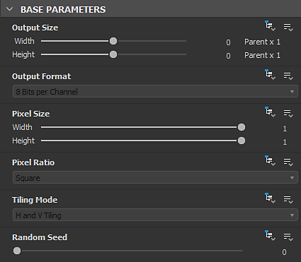

# Paramètres de graphe

Cette page décrit les paramètres standard du <b>graphe de Substance</b>.

Un graphe comporte plusieurs paramètres que vous pouvez modifier. Vous pouvez les retrouver en cliquant sur *espace vide* dans le graphe ou en sélectionnant l&#39;*élément de graphe* dans le panneau <b>Explorateur</b>. Les paramètres seront ensuite affichés dans la vue Paramètres.

## Paramètres de base

<table>
<tr style="border: 0;">
<td style="border: 0;" valign="top">

Cette section inclut des paramètres qui ont un impact sur *tous les nœuds qu&#39;elle contient*.

En effet, chaque nœud de ce graphe dont les paramètres de base sont définis sur la [méthode d&#39;héritage](../../compositing-graphs/inheritance-compositing/inheritance-in-substance-compositing-graphs.md) Relative au parent obtiendra ses valeurs à partir des paramètres de base *du graphe*.

Les valeurs des paramètres de base du graphe dépendent du contexte dans lequel le graphe est utilisé.

</td>
<td style="border: 0;" valign="top">

{width="512px" zoomable="yes"}

</td>
</tr>
</table>

Par exemple, lorsque le graphe est utilisé comme instancier dans un autre graphe, ses paramètres de base utilisent par défaut la méthode d’héritage « Relative à l’entrée ». Cela signifie qu&#39;ils obtiendront leurs valeurs à partir du nœud connecté à son entrée principale. (Sauf s&#39;ils ont été [remplacés](#input-parameters))

Dans la plupart des cas, l’héritage joue un rôle important dans la définition de ces valeurs et dans la manière dont elles évoluent dans le graphe. Il est donc fortement recommandé d&#39;acquérir une bonne compréhension de l&#39;[héritage dans les graphes de Substance](../../compositing-graphs/inheritance-compositing/inheritance-in-substance-compositing-graphs.md) avant d&#39;utiliser ces paramètres.

|                      |                                                                                                                                                                                                                                                                                                                                                                                                                                     |
|:---------------------|:------------------------------------------------------------------------------------------------------------------------------------------------------------------------------------------------------------------------------------------------------------------------------------------------------------------------------------------------------------------------------------------------------------------------------------|
| <b>Taille de sortie</b> | Ce paramètre vous permet de choisir la *résolution de base* des images dans le graphe.  Utilisez la commande 

 verrouillez le bouton pour que les valeurs de hauteur et de largeur correspondent et conservez le carré de l&#39;image lors des réglages de taille.  *Par défaut : (0,0) - Relatif au parent* [En savoir plus](../../compositing-graphs/output-size/output-size.md) |
| <b>Format de sortie</b> | Permet de choisir le *nombre de bits par pixel de base* dans le graphe, parmi les options suivantes :<ul data-preserve-html="true"><li data-preserve-html="true">8 bits</li><li data-preserve-html="true">16 bits</li><li data-preserve-html="true">HDR Low Precision 16F (virgule flottante 16 bits)</li><li data-preserve-html="true">HDR High Precision 32F (32 bits à virgule flottante)</li></ul>*Par défaut : 8 bits par canal - Relatif au parent* |
| <b>Taille de pixel</b> | Définit la taille en pixels. Nous vous recommandons de conserver les valeurs **Largeur** et **Height** définies sur **1**.*Par défaut : (1,1) - Relatif au parent* |
| <b>Mode Répétition</b> | Définit le *mode de répétition* de base dans le graphe à partir de ces options :<ul data-preserve-html="true"> <li data-preserve-html="true">Aucune répétition</li> <li data-preserve-html="true">Répétition horizontale</li> <li data-preserve-html="true">Répétition verticale</li> <li data-preserve-html="true">Répétition H+V (horizontale et verticale)</li> </ul>*Par défaut : Répétition H et V - Relatif au parent* |
| <b>Générateur aléatoire</b> | Définit la *valeur de départ aléatoire* de base pour le graphe.  Utilisez la commande 

 pour attribuer une nouvelle valeur aléatoire à la valeur de départ aléatoire.  *Par défaut : 0 - Relatif au parent* |

<table>
<tr style="border: 0;">
<td width="100.00%" style="border: 0;" valign="top">

## Attributs

La section <b>Attributs</b> contient *métadonnées* pour le graphe, qui fournit des informations pour *identifier*, *catégoriser* et *appliquer* le graphe tel que conçu par son auteur.

</td>
<td width="33.33%" style="border: 0;" valign="top">

{zoomable="yes"}

</td>
</tr>
</table>

+++Liste des attributs

|                      |                                                                                                                                                                                                                                                                                                                                                                                                                                                                                                                                                                                                                                                                                                                                                                                                                                                                                                                                                                                                                                                                                                                                                                                                                                                                                                                                                                                                                                                                                             |
|:---------------------|:--------------------------------------------------------------------------------------------------------------------------------------------------------------------------------------------------------------------------------------------------------------------------------------------------------------------------------------------------------------------------------------------------------------------------------------------------------------------------------------------------------------------------------------------------------------------------------------------------------------------------------------------------------------------------------------------------------------------------------------------------------------------------------------------------------------------------------------------------------------------------------------------------------------------------------------------------------------------------------------------------------------------------------------------------------------------------------------------------------------------------------------------------------------------------------------------------------------------------------------------------------------------------------------------------------------------------------------------------------------------------------------------------------------------------------------------------------------------------------------------|
| **Identifiant** | Il s&#39;agit du nom du graphe, qui doit être *unique*. Vous ne pouvez pas avoir deux graphes ou plus avec le même <b>Identifiant</b> dans le même pack. Il est utilisé comme *nom* du graphe dans le panneau [Explorateur](../../interface/the-explorer-window/the-explorer-window.md).  *Remarque :* l&#39;identifiant *ne peut pas être une chaîne vide*. Les chaînes vides sont automatiquement remplacées par `_` ou `Substance_graph`. Vous ne pouvez utiliser *que* les caractères suivants pour cette valeur : *`A-Z, 1-9, @$%[{]}_-`.* Les caractères non autorisés sont automatiquement remplacés par `_`.  *Par défaut : nouveau\_Graphe, ou définis par l&#39;utilisateur lors de la création du graphe* |
| **Libellé** | L&#39;étiquette <b>Label</b> est utilisée à la place de l&#39;<b>Identifiant</b> pour afficher le *nom* du graphe afin d&#39;améliorer la lisibilité dans les scénarios *exposés* aux utilisateurs, par exemple l&#39;étiquette [Bibliothèque](../../interface/the-library/the-library.md) ou [instancier](../creating-compositing-gra/graph-instances-sub-gra/graph-instances-sub-graphs.md).  Une étiquette peut être *non unique* et peut contenir des caractères spéciaux.  *Conseil :* si vous renommez un graphe, par exemple dans l&#39;[Explorateur](../../interface/the-explorer-window/the-explorer-window.md), vous pouvez également modifier son étiquette !  *Par défaut : vide* |
| **Type** | Le <b>Type</b> est utilisé pour définir l&#39;objectif prévu d&#39;un [graphe de Substance](../../compositing-graphs/substance-compositing-graphs.md). Il est principalement destiné à la fonctionnalité d&#39;interopérabilité [&#39;Envoyer&#39;](../../interface/the-explorer-window/send-to-interoperability/send-to-interoperability.md). |
| **Modèle de matériau** | La définition du modèle de matériau du graphe permet de s&#39;assurer que le shader approprié est utilisé dans la vue 3D, si un shader *correspondant au modèle* est disponible. Par ex. l&#39;affichage d&#39;un graphe avec le mode de matériau `OpenPBR v1.1` dans la vue 3D sélectionne le shader `OpenPBR Surface` dans pour le matériau cible.  Si aucun shader correspondant n&#39;est trouvé ou si le modèle du graphe est défini sur `Undefined`, le shader utilisé pour le matériau cible dans la vue 3D est *inchangé*. |
| **Taille physique** | Cette valeur spécifie la dimension de la texture dans le *monde physique*, en X (longueur), Y (largeur) et Z (height). Elle est donc intrinsèquement liée au matériau qui est produit sur le graphe. La taille physique peut être utilisée, par exemple, pour afficher la texture à son rapport correct dans la <b>vue 2D</b> et la <b>vue 3D</b>.  *Conseil :* la taille physique d&#39;un graphe de Substance peut être récupérée en tant que valeur Flottant 3 dans les graphes de fonction de graphe appliqués à n&#39;importe quel nœud de ce vue 3D, à l&#39;aide de la [variable intégrée](../../function-graphs/variables/system-variables/system-variables.md) de $physicalsize.  *Remarque :* La valeur **Z** n&#39;est actuellement *pas prise en compte* dans la **Substance**. La valeur d&#39;**échelle d&#39;Height** du matériau doit donc être définie à l&#39;aide d&#39;un nœud **Output** défini sur l&#39;utilisation de **échelle de hauteur**, ou directement dans les **propriétés de Matériau**.  *Par défaut : (0,0,0)* |
| **Icône** | Cette zone vous permet de définir une *icône* qui sera utilisée par la <b>bibliothèque</b> pour afficher l&#39;entrée de ce graphe, à la fois en tant que <b>SBS</b> et <b>SBSAR</b>. L&#39;icône est également utilisée dans d&#39;autres situations, telles que l&#39;<b>Étagère</b> de [Substance 3D Painter](https://www.adobe.com/fr/products/substance3d-painter.html). La zone offre les options suivantes :<ul data-preserve-html="true"> <li data-preserve-html="true"><b>Parcourir</b> : vous permet de parcourir vos fichiers système pour trouver l&#39;<i>image existante</i> qui doit être utilisée comme icône</li> <li data-preserve-html="true"><b>Générer</b> : génère une icône à l&#39;aide d&#39;un <i>paramètre prédéfini</i> intégré du nœud <b>Rendu PBR</b></li> <li data-preserve-html="true"><b>Coller</b> : permet de coller les données d&#39;image actuellement dans le <i>presse-papiers</i> sous forme d&#39;icône</li> <li data-preserve-html="true"><b>Supprimer</b> : cette option <i>supprime</i> l&#39;icône existante et laisse l&#39;emplacement de l&#39;icône <i>vide</i></li> </ul>*Remarque :* l&#39;option **Générer** utilise la **Taille physique** pour déterminer l&#39;**échelle d&#39;Height** du **Rendu PBR** pour son effet de displacement. Si un nœud **Output** défini sur l&#39;utilisation **physicalsize** existe dans le graphe, cette sortie est utilisée. Si aucune sortie de ce type n&#39;existe, la valeur des **attributs** du graphe est utilisée *à la place*. Si la valeur de l&#39;attribut est (0,0,0), alors la *valeur prédéfinie* de 0,1 est utilisée.  *Remarque :* lorsque *aucune icône* est définie, la *première image en sortie* du graphe est utilisée à la place.  *Valeur par défaut : Vide* |
| **Package** | Nom de fichier *absolu* pour le **pack** auquel appartient ce graphe.Le bouton **Dossier** peut vous permettre d&#39;ouvrir une nouvelle *fenêtre de l&#39;explorateur de fichiers* système à cet emplacement.*Par défaut : nom de fichier du pack / vide si le pack n&#39;a jamais été enregistré* |
| **Exposé dans SBSAR** | Cela contrôle si le graphe et ses sorties peuvent être *affichés* dans le fichier **SBSAR** publié à partir du **pack** du graphe. Ceci est utile si certains graphes du pack sont utilisés uniquement en tant que *sous-graphes* pour le graphe principal du pack et que *ne doivent pas apparaître* dans le **SBSAR**.*Par défaut : Oui* |
| **Afficher dans la bibliothèque** | Détermine si le graphe doit être *visible* dans la **bibliothèque**, si le package est stocké dans un emplacement *surveillé* par la **bibliothèque**.*Par défaut : à définir dans l&#39;onglet Bibliothèque des paramètres du projet* |
| **Description** | Ceci est le *texte de description* du graphe.Il est visible dans l&#39;*info-bulle* pour l&#39;entrée de graphe dans la **bibliothèque**, n&#39;importe quel nœud de **instance** pour ce graphe et le logiciel avec une **intégration de Substance de données** existante.*Par défaut : vide* |
| **Catégorie** | Vous pouvez utiliser ce champ pour définir une *catégorie* pour cet élément de graphe dans la **bibliothèque**.*Valeur par défaut : vide* |
| **Auteur** | Vous pouvez utiliser ce champ pour placer le *nom* de l&#39;auteur.*Par défaut : vide* |
| **URL d&#39;auteur** | Ce champ vous permet de saisir une *URL*, par exemple le site Web de l&#39;auteur.*Par défaut : vide* |
| **Balises** | Vous pouvez utiliser ce champ pour ajouter vos propres *balises* afin d&#39;améliorer la *recherchabilité* et la *découvrabilité* du graphe.*Par défaut : vide* |
| **Groupe** | Active le regroupement des éléments dans le menu Nœud. Les ressources telles que les graphes ou les bitmaps partageant une valeur « Groupe » commune sont regroupées dans une section portant le nom du groupe. *Par défaut : vide* |
| **Données utilisateur** | Vous pouvez utiliser ce champ pour ajouter vos propres données supplémentaires. Ceci est utile pour les intégrations personnalisées dans les logiciels tiers. Substance 3D Painter et Sampler utilisent ces données utilisateur pour définir certains comportements spécifiques.*Par défaut : vide* |
| **Données de modèle** | Lorsqu&#39;un graphe de Substance est utilisé comme modèle, cet attribut définit la catégorie et le sous-titre du [modèle](../../compositing-graphs/creating-compositing-gra/creating-a-substance-compositing-graph.md). Ils sont ainsi séparés : &lt;category>;&lt;subtitle>   *Default : Empty* |

+++

## Paramètres d&#39;entrée

<table>
<tr style="border: 0;">
<td style="border: 0;" valign="top">

Tous les paramètres spécifiques au graphe, y compris les [paramètres exposés](../../compositing-graphs/manage-parameters/exposing-a-parameter/exposing-a-parameter.md), sont [gérés](../../compositing-graphs/manage-parameters/manage-parameters.md), modifiés et prévisualisés ici.

[Les paramètres prédéfinis](../../compositing-graphs/manage-parameters/parameter-presets/parameter-presets.md) peuvent également être créés pour tout ou partie des paramètres.

</td>
<td style="border: 0;" valign="top">

{zoomable="yes"}

</td>
</tr>
</table>

+++Remplacement des paramètres de base
Lorsque vous utilisez un graphe dans un autre graphe comme [instancier](../creating-compositing-gra/graph-instances-sub-gra/graph-instances-sub-graphs.md), vous pouvez contrôler la valeur par défaut de tout paramètre de base sur ce nouvel instancier.

Ouvrez le menu hamburger en haut de la section « Paramètres d&#39;entrée » et accédez au sous-menu « Remplacer les paramètres de base » pour sélectionner un paramètre de base pour lequel vous souhaitez définir une valeur par défaut arbitraire.

L&#39;éditeur du paramètre sélectionné apparaîtra en haut de la liste des paramètres d&#39;entrée de graphe. Vous pouvez ensuite ajuster leur valeur et leur [méthode d&#39;héritage](../../compositing-graphs/inheritance-compositing/inheritance-in-substance-compositing-graphs.md) selon vos besoins.

+++

>[!IMPORTANT]
>
> Les onglets <b>Aperçu</b> et <b>Paramètres prédéfinis</b> sont désactivés lors de l&#39;[édition contextuelle](../../interface/preferences-window/preferences-window.md).

## Entrées

<table>
<tr style="border: 0;">
<td style="border: 0;" valign="top">

Dans cette partie, tous les nœuds [d&#39;entrée](../../compositing-graphs/nodes-reference-for-com/atomic-nodes/input/input.md) du graphe sont répertoriés.

Vous pouvez les réorganiser en les faisant glisser sur la poignée située à l’extrême gauche de chaque élément.

</td>
<td style="border: 0;" valign="top">

{zoomable="yes"}

</td>
</tr>
</table>

## Sorties

<table>
<tr style="border: 0;">
<td style="border: 0;" valign="top">

Dans cette partie, tous les nœuds [Output](../../compositing-graphs/nodes-reference-for-com/atomic-nodes/output/output.md) du graphe.

Vous pouvez les réorganiser en les faisant glisser sur la poignée située à l’extrême gauche de chaque élément.

</td>
<td style="border: 0;" valign="top">

{zoomable="yes"}

</td>
</tr>
</table>
