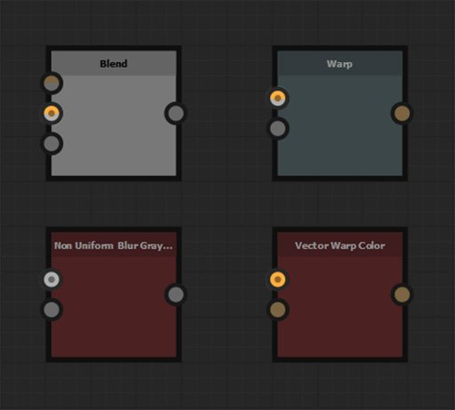

# Héritage dans les graphes Substance

Cette page décrit l&#39;application de l&#39;héritage dans les [graphes de Substances](../../compositing-graphs/substance-compositing-graphs.md) dans [Substance 3D Designer](https://www.adobe.com/fr/products/substance3d-designer.html) et son impact sur la sortie du graphe.

{width="1400px"}

## Vue d’ensemble

Tous les nœuds d&#39;un graphique de Substance peuvent *hériter* de la valeur de certains paramètres d&#39;une source. L&#39;héritage signifie que la modification de la valeur dans la source *effectuera cette modification* sur tous les nœuds qui en héritent. C’est l’un des concepts fondamentaux qui sous-tendent la capacité de Substance 3D Designer à générer des ressources paramétriques.

>[!NOTE]
>
> Un fichier de projet annoté démontrant l&#39;héritage est disponible dans la section [Exemples de graphiques de Substance](../../compositing-graphs/sample-compositing-graphs/sample-substance-compositing-graphs.md) de cette documentation.

### Méthodes d’héritage

<table>
<tr style="border: 0;">
<td style="border: 0;" valign="top">

{width="128px"}

<b>Absolu</b>

Aucun héritage, la valeur est définie *arbitrairement et localement* pour le paramètre

</td>
<td style="border: 0;" valign="top">

{width="128px"}

<b>Relative à l&#39;entrée</b>

La valeur est héritée des données connectées à l&#39;*entrée principale* du nœud

</td>
<td style="border: 0;" valign="top">

{width="128px"}

<b>Relative au parent</b>

La valeur est héritée du *parent* du nœud ou du graphique

</td>
</tr>
</table>

Les méthodes d&#39;héritage sont appliquées pour les [paramètres de base](../../compositing-graphs/graph-parameters/graph-parameters.md) d&#39;un nœud, qui sont l&#39;ensemble de paramètres communs à tous les nœuds qui contrôlent les *aspects fondamentaux* de leur comportement. Ces paramètres sont les suivants :

* **Taille de sortie**
* **Format de sortie** (c&#39;est-à-dire, profondeur de bits)
* **Taille De Pixel**
* **Rapport Pixel**
* **Mode mosaïque**
* **Générateur aléatoire**

Cela devrait vous permettre d&#39;apprécier l&#39;impact que les modifications apportées au nœud *one* peuvent avoir sur la résolution, la précision et le comportement de mosaïque de *tous les nœuds en aval* de celui-ci.

>[!WARNING]
>
> Rappel important pour comprendre les concepts abordés dans cette page : un *nœud d&#39;instance* est un [nœud représentant un graphique dans un autre graphique](../../compositing-graphs/creating-compositing-gra/graph-instances-sub-gra/graph-instances-sub-graphs.md), avec ses *propres valeurs de paramètres discrets*, d&#39;où le terme *instance*.\
> Par exemple, deux nœuds de [bruit de Perlin](../../compositing-graphs/nodes-reference-for-com/node-library/texture-generators/noises/perlin-noise/perlin-noise.md) dans un même graphique sont des représentations d&#39;un graphique source *identique* (`perlin_noise` dans `noise_perlin_noise.sbs`) avec leurs *propres ensembles* de valeurs de paramètre.

>[!NOTE]
>
> **Taille de sortie :** utilisez le bouton de verrouillage  pour que la valeur Height *corresponde* à la valeur Largeur\
> **Valeur de départ aléatoire :** utilisez le bouton  pour attribuer une nouvelle valeur aléatoire à la valeur de départ aléatoire.

## Apporter des modifications

### Modification des méthodes d’héritage

Dans le panneau Propriétés, tous les paramètres répertoriés dans la section [Paramètres de base](../../compositing-graphs/graph-parameters/graph-parameters.md) des propriétés d&#39;un nœud disposent d&#39;un bouton déroulant (icône) <b>Définir la méthode d&#39;héritage</b> en regard de leur libellé.\
Ce bouton permet de sélectionner la méthode d&#39;héritage à utiliser pour un paramètre.

{width="512px"}

Dans la plupart des cas, les paramètres de base d&#39;un *nœud* sont définis sur *Relatif à l&#39;entrée*, pour tirer parti du comportement procédural de l&#39;enchaînement des nœuds, tandis que les paramètres de base d&#39;un *graphe* sont définis sur *Relatif au parent*, de sorte que les paramètres globaux peuvent s&#39;adapter au contexte dans lequel le graphique est utilisé.

### MODIFICATION DES VALEURS HÉRITÉES

Certains paramètres de base, tels que [Taille de sortie](../../compositing-graphs/output-size/output-size.md), Taille de pixel ou Générateur aléatoire, peuvent être modifiés *par rapport à la valeur héritée*.

Par exemple, lorsque le paramètre Taille de la sortie utilise une méthode d&#39;héritage *Relative à...*, une valeur ou `(1, -1)` signifie une puissance de deux résolutions *au-dessus* de la valeur héritée pour X et une puissance de deux résolutions *au-dessous* de la valeur héritée pour Y, par exemple :

* Valeur héritée : `(9, 9)` qui est `2^9, 2^9 = 512, 512`
* Valeur relative : `(1, -1)` qui est `2^(9+1), 2^(9-1) = 256, 1024`

>[!NOTE]
>
> La page [Taille de sortie](../../compositing-graphs/output-size/output-size.md) approfondit ce paramètre de base critique et il est recommandé de la lire pour comprendre comment la résolution finale d&#39;un nœud est calculée.

Si une fonction est appliquée à un paramètre Base, le résultat de la fonction sera également interprété à l&#39;aide de la méthode d&#39;héritage du paramètre.\
En gardant à l&#39;esprit l&#39;exemple Taille de sortie, une fonction visant à augmenter de deux fois la résolution héritée en X et Y doit générer la valeur `(2, 2)` Integer2.

## Parenté des nœuds et des graphiques

Lors de l’utilisation de la méthode Héritage relatif au parent, vous devez comprendre ce qu’est exactement ce parent dans un contexte spécifique.

Le parent d&#39;un nœud est le *graphe* dans lequel il existe.

Le parent d&#39;un graphique est le *contexte* dans lequel il existe :

* Si ce graphique est un sous-graphique instancié dans un autre graphique hôte en tant que *nœud d&#39;instance*, le parent du sous-graphique est le *nœud d&#39;instance*. Le parent de ce nœud d&#39;instance est le *graphique hôte*.
* Si ce graphique est un graphique racine, le parent est l&#39;*application elle-même* et la valeur définie par l&#39;application pour un paramètre donné. Par exemple, les graphiques hériteront du paramètre <b>Taille du gabarit</b> défini dans la barre d&#39;outils de la [vue Graphique](../../interface/the-graph-view/the-graph-view.md).

>[!WARNING]
>
> La parenté est *appliquée telle quelle* lors de la publication d’un pack dans des fichiers de ressources Substance 3D (SBSAR). Cela signifie que la définition de n&#39;importe quel paramètre sur la méthode d&#39;héritage *absolue* *verrouille* ce paramètre à sa valeur actuelle dans la ressource publiée.\
> Bien que cela soit souhaitable pour les nœuds [Bitmap](../../compositing-graphs/nodes-reference-for-com/atomic-nodes/bitmap/bitmap.md) ou à des [fins d&#39;optimisation](../../best-practices/performance-optimization/performance-optimization-guidelines.md), par exemple, nous vous recommandons *vivement* d&#39;utiliser des méthodes d&#39;héritage *relatives à...* lorsque vous travaillez dans des graphiques de Substance, à moins qu&#39;il n&#39;existe un *objectif clair et délibéré* d&#39;agir autrement.

### MODIFICATION CONTEXTUELLE

Lors de l&#39;utilisation de la [modification contextuelle](../../compositing-graphs/creating-compositing-gra/graph-instances-sub-gra/graph-instances-sub-graphs.md) sur un nœud d&#39;instance de graphique, le parent du graphique est le *nœud d&#39;instance*. Dans ce cas, le paramètre <b>Taille du parent</b> dans la barre d&#39;outils de la vue [Graphique](../../interface/the-graph-view/the-graph-view.md) est *désactivé*, car le graphique hérite de ses paramètres de base du nœud d&#39;instance.

Cette caractéristique est le *point* de l&#39;édition contextuelle et doit être *prise en compte* lors de la définition de la méthode d&#39;héritage et de l&#39;évaluation des valeurs actuelles des paramètres de base de n&#39;importe quel nœud.

## Héritage avec plusieurs entrées

Lorsqu’un graphique comporte plusieurs entrées, chaque entrée peut hériter de ses données d’entrée distinctes ou du graphique, selon sa méthode d’héritage :

<table>
<tr style="border: 0;">
<td style="border: 0;" valign="top">

{width="128px"}

<b>Relative à l&#39;entrée</b>

L’entrée hérite de ses données d’entrée distinctes, quels que soient les paramètres de base du graphique. Cela est très utile pour contrôler les données par entrée.

</td>
<td style="border: 0;" valign="top">

{width="128px"}

<b>Relative au parent</b>

L&#39;entrée hérite du graphe et les données qu&#39;elle reçoit sont adaptées en conséquence.

</td>
<td style="border: 0;" valign="top">

</td>
</tr>
</table>

### Entrée principale

<table>
<tr style="border: 0;">
<td style="border: 0;" valign="top">

<table>
<tr style="border: 0;">
<td style="border: 0;" valign="top">

{width="48px"}

</td>
<td style="border: 0;" valign="top">

{width="48px"}

</td>
<td style="border: 0;" valign="top">

{width="48px"}

</td>
</tr>
</table>

L&#39;une des entrées peut être définie comme **entrée principale** du graphique en cliquant sur **RMB** sur ce nœud [Entrée](../../compositing-graphs/nodes-reference-for-com/atomic-nodes/input/input.md) et en sélectionnant l&#39;option **Définir comme entrée principale** dans le menu contextuel.

</td>
<td style="border: 0;" valign="top">

</td>
</tr>
</table>

Lorsque le graphique est instancié dans un autre graphique en tant que nœud d&#39;instance, tous les paramètres Base du nœud d&#39;instance définis sur *Relative à l&#39;entrée* héritent des données connectées à *cette entrée*. L&#39;entrée Primary d&#39;un nœud d&#39;instance peut être identifiée par le petit point sombre dans son connecteur.

Les autres entrées qui sont définies sur *Relative au parent* hériteront des mêmes valeurs de paramètres de base, car elles héritent du *graphe* qui hérite du *nœud d&#39;instance\**, qui hérite de l&#39;entrée Primary.

\*: c&#39;est vrai que le graphique utilise la méthode d&#39;héritage* Relative au parent*.

## Exemples

Voici quelques exemples couvrant différents cas d’héritage, et l’interaction des méthodes d’héritage définies dans les acteurs suivants, de haut en bas :

1. Application
1. Graphique Hôte
1. Nœud d&#39;instance dans le graphique hôte
1. Sous-graphique : graphique référencé par le nœud d&#39;instance.
1. Nœuds dans le sous-graphique

La *méthode d&#39;héritage* définie pour un acteur s&#39;affiche en orange juste au-dessus. Le *flux d&#39;héritage* vers sa source s&#39;affiche avec des lignes orange.

Les lettres représentent *des ensembles distincts* de paramètres de base et devraient permettre de suivre les données héritées par chaque acteur.

<table>
<tr style="border: 0;">
<td style="border: 0;" valign="top">

**Exemple A**

{zoomable="yes"}

</td>
<td style="border: 0;" valign="top">

**Exemple B**

{zoomable="yes"}

</td>
</tr>
</table>

<table>
<tr style="border: 0;">
<td style="border: 0;" valign="top">

**Exemple C**

{zoomable="yes"}

</td>
<td style="border: 0;" valign="top">

**Exemple D**

{zoomable="yes"}

</td>
</tr>
</table>

## Résolution des problèmes d’héritage

Au fur et à mesure que vous construisez votre graphique et que vous augmentez sa complexité, vous risquez de rencontrer des résultats inattendus causés par l’héritage. Si la sortie d&#39;un nœud a une résolution ou une précision incorrecte (c&#39;est-à-dire, la profondeur de bit), vous devez *remonter la chaîne d&#39;héritage* pour localiser l&#39;origine de ces valeurs.

Un bon point de départ consiste à vérifier les données affichées juste en dessous d&#39;un nœud : il s&#39;agit de la résolution, du format de couleur et de la précision de l&#39;image produite par la *première sortie* du nœud. Bien que la compréhension de la résolution soit simple, le deuxième élément de données vaut la peine d&#39;être détaillé :

* Le *préfixe de lettre* fait référence au format de couleur de l&#39;image :
  * <b>L</b> : luminance (c&#39;est-à-dire, niveaux de gris)
  * <b>C</b> : Couleur
* Le *nombre* fait référence à la profondeur de bits de l’image, de la plus faible à la plus haute précision :
  * <b>8</b> : entier 8 bits (256 étapes en 0-1)
  * <b>16</b> : entier 16 bits (65 536 étapes en 0-1)
  * <b>16F</b> : virgule flottante 16 bits (valeurs de faible précision au-delà de 0-1, y compris les négatifs)
  * <b>32F</b> : 32 bits en virgule flottante (valeurs de haute précision supérieures à 0-1, y compris les négatifs)

Si le nœud a plusieurs sorties, vous pouvez vérifier leur résolution et leur précision de deux manières simples :

* Double-cliquez sur <b>LMB</b> sur le *connecteur de sortie* pour afficher l&#39;image dans la [vue 2D](../../interface/2d-view/2d-view.md) et vérifiez les informations affichées dans le *coin inférieur gauche* de l&#39;aire d&#39;affichage 2D
* Créez un nœud [Levels](../../compositing-graphs/nodes-reference-for-com/atomic-nodes/levels/levels.md) ou [Transformation 2D](../../compositing-graphs/nodes-reference-for-com/atomic-nodes/transformation-2d/transformation-2d.md) et connectez son entrée à la sortie que vous souhaitez vérifier. Le nœud *héritera de la sortie* par défaut, et vous pouvez ensuite vérifier les valeurs sous le nœud.

Vous pouvez maintenant remonter la chaîne des nœuds dans le graphique et essayer de trouver le *premier nœud* où les valeurs inattendues apparaissent. Vérifiez la méthode d&#39;héritage de ses paramètres de base.

Si rien ne cloche et que le nœud est un nœud d&#39;instance, vous devez aller plus loin et ouvrir le graphique référencé par ce nœud d&#39;instance. Répétez le processus en commençant par les nœuds de sortie du graphique et en remontant.

### UN EXEMPLE COURANT

En particulier, le concept d&#39;*entrée principale* est facilement *négligé* et peut entraîner des problèmes d&#39;héritage.

Le nœud [Blend](../../compositing-graphs/nodes-reference-for-com/atomic-nodes/blend/blend.md) est très sensible à cela, car il est utilisé très fréquemment. Son entrée <b>Arrière-plan</b> est son entrée principale.

{width="512px"}

Vous devez faire attention à l’ordre dans lequel vous fusionnez les deux entrées : l’entrée dont vous souhaitez conserver la résolution et la précision vers le bas du graphique doit être connectée à l’entrée Arrière-plan, si le mode de fusion dont vous avez besoin le permet. Si ce n&#39;est pas le cas, vous devrez peut-être modifier les paramètres de base du nœud de fusion et leur méthode d&#39;héritage pour compenser.
