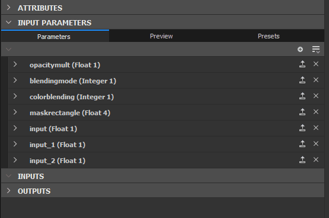
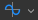

# Exposition d’un paramètre

Exposer des paramètres est l&#39;un des outils les plus puissants et est essentiel pour ouvrir vos graphes à d&#39;autres applications telles que Substance 3D Painter, Substance 3D Sampler et Substance Integrations pour Maya et 3DS Max.

Cette page explique tous les concepts requis pour commencer à exposer. Il est recommandé [de commencer par découvrir ce qu&#39;est une Instance de graphe](../../../compositing-graphs/creating-compositing-gra/graph-instances-sub-gra/graph-instances-sub-graphs.md)avant de continuer sur cette page. Il est également utile de comprendre[la différence entre Publish et Exportation, ainsi que les types de fichiers concernés.](../../../getting-started/overview/overview.md)

*\*Les lignes transparentes en pointillés ci-dessus sont une représentation abstraite de la connexion\
des paramètres exposés aux paramètres de Graphe.*

## Compréhension des paramètres et exposé

+++Qu’est-ce qu’un paramètre ?
*Un paramètre est une valeur simple, avec un élément d&#39;interface utilisateur, qui contrôle le comportement d&#39;un graphe.* Vous les utilisez constamment dans tous les logiciels de Substance : pour changer une couleur, pour définir un mode de fusion, pour choisir une valeur d&#39;opacité, etc... Sans paramètres, les logiciels de Substance de données ne permettraient aucune personnalisation.

Les paramètres peuvent prendre différentes formes : curseurs, cadrans, zones de saisie, menus déroulants, etc... Les valeurs qu’ils représentent peuvent être de différents types : valeurs décimales, valeurs entières (entier), valeurs booléennes (vrai/faux), et même des fragments de texte.

+++

+++Qu&#39;est-ce qui « expose » ?
***Exposer est le processus consistant à rendre un paramètre disponible pour une utilisation en dehors de votre Vue du graphe de données actuelle.***  Lors de la création d&#39;un Graphe, vous sélectionnez généralement un nœud pour modifier les paramètres de ses propriétés. Lorsqu&#39;il est exposé, vous *activez l&#39;accès à ce paramètre à partir d&#39;un panneau de contrôle externe*. Ce « panneau de contrôle externe » peut signifier différentes choses en fonction du contexte : lorsqu’il est utilisé en tant qu’Instance de graphe dans Designer, il agit simplement comme un autre nœud. Utilisés dans Substance 3D Painter, Substance 3D Sampler ou une intégration, ces paramètres exposés seront *le seul contrôle* dont vous disposez sur le graphe.

+++

+++Pourquoi exposer est-il utile ?
***Exposer des paramètres est ce qui fait que Substance 3D Designer va au-delà d&#39;un simple éditeur de textures, en vous permettant de créer des outils de génération de textures personnalisables et dynamiques*** **.** Sans exposer, les Matériaux de Substance ne seraient pas très différents des textures statiques : vous n’auriez aucun moyen de modifier leurs sorties.

+++

+++Pourquoi ne pas exposer chaque paramètre automatiquement, tout le temps ?
<b> [graphes de Substance](../../../compositing-graphs/substance-compositing-graphs.md) peuvent devenir compliqués et contenir des centaines de paramètres à la fois. Il n&#39;est pas logique de toujours afficher tous les paramètres à un utilisateur, en particulier si vous créez des graphes avec un objectif simple, qui n&#39;ont pas besoin de nombreux paramètres.</b> Lorsque vous exposez des paramètres, vous travaillez en tant que concepteur d’interface utilisateur ou UX : vous vous demandez quelles commandes sont logiques, quelles valeurs sont requises et comment les rendre faciles à utiliser pour vous-même, pour les autres utilisateurs en ligne ou pour vos collègues.

+++

+++Dois-je faire des calculs pour exposer ? Dois-je comprendre les graphes de la fonction Substance ?
***Les connaissances mathématiques ne sont pas requises pour utiliser correctement les paramètres Exposés, de même que l&#39;utilisation des fonctions.***  En tant qu&#39;utilisateur débutant, vous pouvez presque totalement éviter d&#39;avoir à effectuer des opérations mathématiques dans les [graphes de fonction](../../../function-graphs/function-graphs.md). La seule chose fortement recommandée est une [connaissance correcte des différents types de données tels que l&#39;Entier, le Flottant et le Booléen.](../../../function-graphs/nodes-reference-for-fun/function-nodes-overview/function-nodes-overview.md)

+++

## Comment exposer

Actuellement, il existe deux méthodes principales pour exposer les paramètres. Une méthode est plus adaptée pour exposer rapidement un seul paramètre, la seconde méthode est plus adaptée pour exposer plusieurs paramètres en un seul balayage.

{width="512px"}

### MÉTHODE D&#39;EXPOSE UNIQUE

1. Recherchez le paramètre à exposer dans le panneau [Propriétés](../../../interface/properties/properties.md), sous l&#39;onglet Paramètres spécifiques
1. Cliquez sur le bouton des options déroulantes 
1. Choisissez  <b>Exposer comme nouvelle entrée de graphe</b> dans la liste déroulante, la première option.
1. La boîte de dialogue <b>Exposer le paramètre</b> s&#39;affiche. Définissez les propriétés du paramètre comme vous le souhaitez.

   Il est recommandé de modifier au moins l&#39;<b>Identifiant</b> et l&#39;<b>étiquette</b>
1. Appuyez sur <b>OK</b> pour confirmer
1. Le nom du paramètre devient *bleu* et le \
   Le bouton <b> Modifier la fonction de paramètre</b> apparaît en regard des options du menu déroulant pour confirmer que le paramètre est exposé

>[!NOTE]
>
> La plupart des champs numériques prennent en charge les *formules mathématiques de base* comme entrée, par exemple, `17+3.5`, `7/3`, `(4+2)*3`. Appuyez sur *Entrée* pour valider la formule. Le résultat sera saisi dans le champ. Si la formule n’est pas valide, le champ revient à sa valeur précédente.\
> Certains champs numériques d&#39;autres parties de l&#39;application, tels que dans le dock [Propriétés](../../../interface/properties/properties.md), prennent également en charge cette fonctionnalité.

{width="512px"}

### Méthode d’expose par lots

Lorsque vous exposez un paramètre, cette méthode est un peu plus lente que la précédente. Lorsque vous exposez plusieurs paramètres, c&#39;est beaucoup plus rapide.

1. Au lieu de rechercher un seul paramètre, recherchez le bouton  <b>exposes multiples</b> en haut à droite de l&#39;onglet <b>Paramètres spécifiques</b>
1. Choisissez <b>Paramètres d&#39;expose par lot...</b> dans le menu déroulant
1. La boîte de dialogue <b>expose par lot</b> s&#39;affiche, vous permettant de personnaliser l&#39;expose de tous les <b>paramètres spécifiques</b> d&#39;un nœud
1. Utilisez les cases à cocher <b>Tous</b>, <b>Aucun</b> ou spécifiques pour décider quels paramètres exposer
1. Cliquez sur un nom de paramètre sous la colonne <b>identifiant d&#39;entrée de Graphe</b> dans la liste pour modifier son nom.
1. Cliquez sur un <b>nom de groupe</b> sous la colonne <b>Groupe d&#39;entrée par Graphe</b> dans la liste pour ajouter un (sous-)groupe pour un paramètre spécifique
1. Utilisez les zones de saisie <b>identifiant d&#39;entrée de Graphe</b> et <b>Groupe d&#39;entrée de Graphe</b> en bas pour ajouter un préfixe, un suffixe et des groupes d&#39;entrée à tous les paramètres exposés à la fois. Toutes ces valeurs sont appliquées en plus des réglages par paramètre.
1. Cliquez sur <b>OK</b> pour confirmer et exposer tous les paramètres sélectionnés. Les noms des paramètres affichent désormais *bleu* pour confirmer que les paramètres sont exposés, ainsi qu&#39;un bouton  <b>Modifier la fonction</b>.

## Restrictions

Certaines limitations sont liées à l’expose de paramètres, comme indiqué dans le tableau ci-dessous.

| Type de paramètre | Raison |
| --- | --- |
| [Gradient Ramp](../../../compositing-graphs/nodes-reference-for-com/atomic-nodes/gradient-map/gradient-map.md), [Curve Editor](../../../compositing-graphs/nodes-reference-for-com/atomic-nodes/curve/curve.md), [Font](../../../compositing-graphs/nodes-reference-for-com/atomic-nodes/text/text.md), [Levels Histogram](../../../compositing-graphs/nodes-reference-for-com/atomic-nodes/levels/levels.md) | Exiger des widgets qui ne sont pas disponibles pour les paramètres créés par l’utilisateur. |

Une autre limitation importante est liée aux [paramètres statiques](../../../glossary/glossary.md). Ils ne peuvent pas être modifiés dans une [ressource Substance 3D publiée (SBSAR)](../../publishing-asset-files/publishing-substance-3d-asset-files-sbsar.md).

Les paramètres statiques (par opposition aux paramètres dynamiques) *ne peuvent pas être modifiés à la volée* une fois le graphe *cuit*, c&#39;est-à-dire traité afin d&#39;exécuter son algorithme rapidement et efficacement. La cuisson a lieu dans Designer chaque fois que le graphe est *modifié* ou *publié*.

Ainsi, les paramètres statiques sont visibles et modifiables dans Designer, mais sont *masqués* dans une ressource Substance 3D publiée. Vous pouvez utiliser le mode Aperçu pour voir ces limitations en vigueur avant de publier sur une ressource Substance 3D : voir « Prévisualisation des paramètres » ci-dessous.

Pour contourner le problème, vous pouvez utiliser un nœud [Commutateur](../../../compositing-graphs/nodes-reference-for-com/node-library/filters/blending/switch/switch.md) ou [Commutateur multiple](../../../compositing-graphs/nodes-reference-for-com/node-library/filters/blending/multi-switch/multi-switch.md) et plusieurs jeux de logique pour basculer entre différentes valeurs/états pour ces paramètres.

| Nœud | Paramètre |
| --- | --- |
| Tous les nœuds | Mode répétition Format des pixels |
| [Couleur uniforme](../../../compositing-graphs/nodes-reference-for-com/atomic-nodes/uniform-color/uniform-color.md) | Mode colorimétrique |
| [Processeur de pixels](../../../compositing-graphs/nodes-reference-for-com/atomic-nodes/pixel-processor/pixel-processor.md) | Mode colorimétrique |
| [Fusion](../../../compositing-graphs/nodes-reference-for-com/atomic-nodes/blend/blend.md) | Zone de recadrage de Simulation de transparence du mode de fusion |
| [FX-Map](../../../compositing-graphs/nodes-reference-for-com/atomic-nodes/fx-map/fx-map.md) | Mode de fusion |
| [Quadrant](../../../function-graphs/fxmaps/the-quadrant-node/the-quadrant-node.md) | Filtrage d’Image d&#39;entrée alpha de motif |

## Modification des paramètres exposés

Une fois exposé, il n&#39;est plus possible d&#39;accéder à un paramètre comme auparavant. La modification de sa valeur, le renommage, l’organisation dans l’interface utilisateur et même la suppression du paramètre se produisent au niveau des propriétés du Graphe. Cette section explique comment procéder.

Pour modifier les options d’un paramètre exposé :

1. Cliquez sur le bouton Options de liste déroulante  en regard du paramètre exposé déjà sélectionné
1. Sélectionnez <b> Modifier l&#39;entrée de graphe exposée</b>. Cela vous amène directement à l’entrée correspondante dans les propriétés du graphe
1. Double-cliquez dans une zone vide de votre graphe pour accéder aux propriétés du graphe, puis recherchez le paramètre dans la liste des <b>Paramètres d&#39;entrée</b>
1. Cliquez sur votre graphe dans l&#39;<b>Explorateur</b>, puis recherchez le paramètre dans la liste des <b>Paramètres d&#39;entrée</b>

{width="512px"}

### PARAMÈTRES D&#39;ENTRÉE

Tous les paramètres exposés sont répertoriés sous l’onglet Paramètres d&#39;entrée. Les propriétés suivantes sont disponibles pour les cas les plus courants tels que les Flottants et les Entiers avec le type d’éditeur par défaut.

1. <b>Identifiant</b> : identifiant unique pour ce paramètre. Ne peut pas contenir d’espaces ni de caractères spéciaux.
1. <b>Libellé</b> : libellé réservé à l&#39;interface utilisateur. Si aucun libellé n’est défini, l’identifiant est affiché dans l’interface utilisateur. Peut contenir des espaces et des caractères spéciaux
1. <b>Groupe</b> : regroupez les paramètres dans une section réductible pour garder de longues listes de paramètres propres et gérables. Les paramètres sont regroupés s&#39;ils partagent *exactement le même nom* de groupe. Utilisez le caractère `/` pour créer *des sous-groupes*, par exemple `My Group/My Sub-group`
1. <b>Description</b> : champ de texte pour la description, utilisé comme info-bulle.
1. <b>Type/Éditeur</b> : définissez le type de données ainsi que le type de l&#39;éditeur d&#39;interface utilisateur. Certains éditeurs ne sont disponibles que pour certains types de données (par exemple, une liste déroulante uniquement pour l’Entier). *Dans de nombreux cas, la modification de l&#39;éditeur efface les valeurs par défaut. Faites attention.*
1. <b>Par défaut</b> : valeur par défaut à laquelle le paramètre commence. Il s’agit également de la valeur utilisée dans le graphe lors de l’affichage de l’aperçu des nœuds. Essayez d&#39;utiliser une valeur facile et utilisable ici, évitez les cas extrêmes.
1. <b>Min</b> : valeur minimale pour l’interface utilisateur.
1. <b>Max</b> : valeur maximale pour l’interface utilisateur.
1. <b>Verrouille</b> : définissez si Min et Max sont des limites souples ou strictes (autorisez l&#39;utilisateur à dépasser les limites).
1. <b>Étape</b>:Set de précision ou de granularité de la valeur.
1. <b>Données utilisateur</b> : données utilisateur personnalisées, disponibles à toutes fins.
1. <b>Visible si</b> : système d’expression spécial permettant d’afficher ou de masquer les paramètres en fonction des conditions externes. Voir [Visible si : contrôlez la visibilité des entrées, sorties et paramètres](../../../compositing-graphs/visible-control-vis/visible-if-control-visibility-of-inputs-outputs-and-parameters.md)

{width="512px"}

#### Liste déroulante

La <b>liste déroulante</b> pour les types d&#39;Entier est un cas particulier. Il n&#39;y a pas de Valeur par défaut, Min ou Max, mais un seul paramètre Valeur qui vous permet de définir une liste d&#39;éléments.

* Chaque élément correspond à un élément de la liste déroulante.
* La première valeur d&#39;un article est l&#39;entier interne réel utilisé par le graphe. Assurez-vous de les configurer correctement pour votre [commutateur multiple](../../../compositing-graphs/nodes-reference-for-com/node-library/filters/blending/multi-switch/multi-switch.md) par exemple (ils commencent à 1, pas à 0).
* La deuxième valeur est l’étiquette d’interface utilisateur affichée à l’utilisateur.
* La troisième case vous permet de marquer un élément comme élément sélectionné par défaut.
* La croix X supprime un élément, la croix + en ajoute un

{width="512px"}

#### Réorganiser

Vous pouvez facilement réorganiser les paramètres en faisant glisser les poignées foncées à bandes vers la gauche du nom du paramètre d&#39;entrée dans la liste. Gardez à l’esprit que les paramètres de regroupement peuvent affecter l’ordre.

{width="512px"}

### PRÉVISUALISATION DES PARAMÈTRES

Comme la configuration des paramètres peut être difficile sans voir le résultat final, un <b>mode Aperçu</b> peut être activé pour vérifier l&#39;apparence et le comportement externe de l&#39;interface utilisateur des paramètres. Cliquez sur l&#39;onglet <b>Aperçu</b> en haut au milieu du panneau déroulant Paramètres d&#39;entrée.

Normalement, toutes les modifications apportées en <b>mode Aperçu</b> sont *supprimées*. Vous pouvez toutefois utiliser le bouton <b>Appliquer</b>en regard de l&#39;icône en forme d&#39;œil pour définir les valeurs actuelles du mode Aperçu<b></b> comme *nouvelles valeurs par défaut*.

[Le mode Aperçu vous permet également de créer des paramètres prédéfinis intégrés.](../../../compositing-graphs/manage-parameters/parameter-presets/parameter-presets.md)

>[!IMPORTANT]
>
> Le mode Aperçu est désactivé lors de l&#39;utilisation de [l&#39;édition contextuelle](../../../interface/preferences-window/preferences-window.md).

>[!WARNING]
>
> Le mode Aperçu vise à représenter l&#39;expérience d&#39;une [ressource Substance 3D publiée (SBSAR)](../../publishing-asset-files/publishing-substance-3d-asset-files-sbsar.md) de la manière la plus précise possible. Par conséquent, les limitations répertoriées sur cette page s&#39;appliquent dans ce mode, notamment l&#39;absence de *paramètres statiques dans la liste*.

{width="512px"}

### COPIER-COLLER DES PARAMÈTRES

Les paramètres peuvent être copiés-collés entre les graphes.

Un seul paramètre peut être copié avec le bouton Copier . Plusieurs paramètres peuvent être copiés via le menu Paramètres . Sélectionnez Copier les entrées pour copier toutes les entrées.

Sélectionnez Coller les entrées  dans le menu Paramètres  pour coller un ou plusieurs paramètres.

Si vous souhaitez transférer des valeurs, et non le paramètre exposé lui-même, [en savoir plus sur les paramètres prédéfinis](../../../compositing-graphs/manage-parameters/parameter-presets/parameter-presets.md).

## Retrait et nettoyage des paramètres exposés

En raison de la nature des paramètres, lorsque vous pouvez avoir un Paramètre d&#39;entrée contrôlant plusieurs nœuds, ou lorsque des Paramètres d&#39;entrée peuvent exister sans contrôler un nœud, des problèmes peuvent se produire avec des paramètres manquants ou inutilisés. Vous trouverez ci-dessous une description des problèmes courants et de leurs solutions.

{width="512px"}

### SUIVI DES PARAMÈTRES ROMPUS SUR LES NOEUDS

Vous pouvez suivre quel paramètre est utilisé par quel nœud via l&#39;outil Node Finder Tool , qui se trouve dans la barre supérieure de la Vue du graphe. Cliquez dessus pour rechercher des nœuds à l&#39;aide de paramètres spécifiques.

Si un nœud a un problème réel, il affichera un badge d&#39;avertissement  dans son coin supérieur gauche. Placer le pointeur de la souris sur le badge affiche une info-bulle contenant plus d’informations.

Pour réinitialiser et supprimer un problème, pour le paramètre que vous souhaitez corriger ou réinitialiser, cliquez sur le bouton déroulant  en regard du bouton Modifier la fonction et sélectionnez  <b>Réinitialiser. </b>Cela ramène un paramètre à son état précédent, non exposé. Le nom bleu redevient gris pour refléter cela.

{width="512px"}

### NETTOYAGE DES PARAMÈTRES D&#39;ENTRÉE INUTILISÉS

Si vous avez perdu la trace de vos Paramètres d&#39;entrée et ne savez plus lesquels sont utilisés, ils peuvent être nettoyés à l&#39;aide d&#39;un petit outil. Cliquez sur le bouton du menu Paramètre d&#39;entrée  et sélectionnez <b>Nettoyer les entrées</b>.

Une nouvelle boîte de dialogue contenant la liste de tous les paramètres inutilisés s’affiche. Cochez ou décochez les paramètres à supprimer ou à conserver, puis cliquez sur OK. Si aucune boîte de dialogue ne s’affiche, il n’y a actuellement aucun paramètre inutilisé à nettoyer.

{width="512px"}

### SUPPRESSION DE PARAMÈTRES

La suppression d&#39;un paramètre en cours d&#39;utilisation nécessite deux étapes distinctes.

1. Sur le nœud doté du paramètre exposé, cliquez sur la flèche de déroulement à droite du bouton Exposition de la fonction, qui est de couleur bleue : . Choisissez ensuite « Rétablir la valeur par défaut ». Cela supprime l&#39;utilisation du paramètre sur ce nœud. répétez l&#39;opération pour tout autre nœud utilisant le même paramètre. « Rétablir la valeur par défaut » réinitialise également la plage du widget de paramètre à sa *plage souple*.
1. Dans la liste Paramètres d&#39;entrée du Graphe, cliquez sur le X à droite de l&#39;entrée du paramètre. Le paramètre est ainsi complètement supprimé. Si des nœuds tentent d&#39;utiliser ce paramètre, un badge d&#39;avertissement s&#39;affiche (voir ci-dessus).
