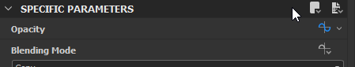
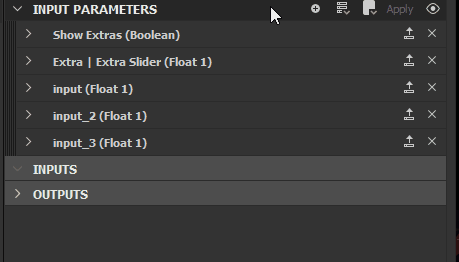

# Paramètres prédéfinis

Les paramètres prédéfinis donnent à l’utilisateur la possibilité de stocker et de transférer de grandes quantités de valeurs préconfigurées pour un ensemble de paramètres.Ils peuvent être utiles dans de nombreux scénarios et sont plus utiles lorsqu&#39;une grande quantité de paramètres avec un large éventail de possibilités est présente.

Il existe deux façons de stocker et de charger des paramètres prédéfinis. Les deux ont des cas d’utilisation différents, détaillés ci-dessous.

{width="512px"}

## Paramètres prédéfinis externes

Les paramètres prédéfinis externes impliquent un fichier externe sur le disque, un fichier \*.SBSPRS. Ils peuvent être transférés entre différents graphes et nœuds, mais uniquement au sein de l’application. Leur objectif principal est exactement le suivant : transférer un certain nombre de valeurs trop grandes pour les copier une par une.

Les paramètres prédéfinis externes sont disponibles pour tous les paramètres spécifiques sur [instances de graphique](../../../compositing-graphs/creating-compositing-gra/graph-instances-sub-gra/graph-instances-sub-graphs.md), pour la plupart des paramètres spécifiques sur [nœuds atomiques](../../../compositing-graphs/nodes-reference-for-com/atomic-nodes/atomic-nodes.md) ([les exceptions sont les paramètres qui ne peuvent pas être exposés](../../../compositing-graphs/manage-parameters/exposing-a-parameter/exposing-a-parameter.md)) et pour les paramètres d&#39;entrée exposés dans les [paramètres](../../graph-parameters/graph-parameters.md)paramètres d&#39;un graphique de Substance.

Ils sont simplement enregistrés et chargés via ce menu. Les fichiers SBSPRS enregistrés peuvent être chargés sur n’importe quel autre nœud ou graphique.

>[!NOTE]
>
> Même les correspondances partielles fonctionneront : les paramètres stockés dans un SBSPRS qui n&#39;existent pas sur le nœud chargé, seront simplement ignorés. Cela signifie que vous pouvez transférer des propriétés entre des nœuds qui sont généralement similaires, [comme la version en couleurs et en niveaux de gris de Tile Sampler](../../../compositing-graphs/nodes-reference-for-com/node-library/texture-generators/patterns/tile-sampler/tile-sampler.md) ! Tous les paramètres partagés se chargeront. La correspondance se produit sur l&#39;identificateur et le type.

{width="512px"}

## Paramètres prédéfinis intégrés

Le fonctionnement des paramètres prédéfinis intégrés est différent de celui des paramètres prédéfinis externes. Leur principal avantage est qu&#39;ils sont contenus dans le fichier SBS ou SBSAR, de sorte qu&#39;ils peuvent être facilement transférés et chargés en Substance Painter, Maya et 3DS Max (actuellement non disponible dans Substance 3D Sampler, UE4 et Unity). L&#39;utilisateur n&#39;a pas à jouer avec les fichiers SBSPRS non plus.

Ils ont un autre objectif : il n’est pas possible de les transférer entre les nœuds et les graphiques (il vous faudrait utiliser des paramètres prédéfinis externes pour cela). Ils peuvent également être créés uniquement sur les paramètres d’entrée des propriétés d’un graphique et uniquement en mode Aperçu.

Le workflow est le suivant :

1. Basculez en <b>mode Aperçu</b> pour les <b>paramètres d&#39;entrée</b>
1. Définir les valeurs sur le résultat souhaité
1. Cliquez sur <b>+</b> en regard de la liste déroulante des paramètres prédéfinis pour créer un nouveau paramètre prédéfini incorporé. Le paramètre prédéfini est ensuite immédiatement créé et stocké

Les paramètres prédéfinis intégrés ne peuvent pas être modifiés par la suite, mais ils peuvent être renommés. Pour les modifier et les supprimer, cliquez sur l’icône d’engrenage en regard de la liste déroulante et de l’icône +. Appuyez sur le signe moins en regard d’un paramètre prédéfini pour le supprimer.

Il n’y a plus rien à faire pour activer les paramètres prédéfinis : une fois publiés en tant que SBSAR, vos paramètres prédéfinis seront disponibles dans la Substance Painter après l’importation.

>[!IMPORTANT]
>
> L&#39;onglet <b>Paramètres prédéfinis</b> est désactivé lors de l&#39;utilisation de la [modification contextuelle](../../../interface/preferences-window/preferences-window.md).
