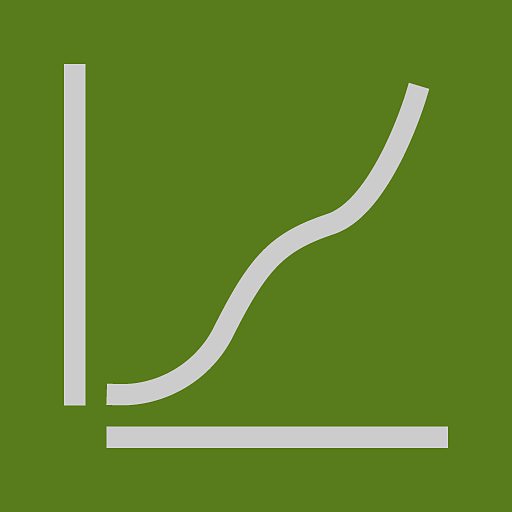
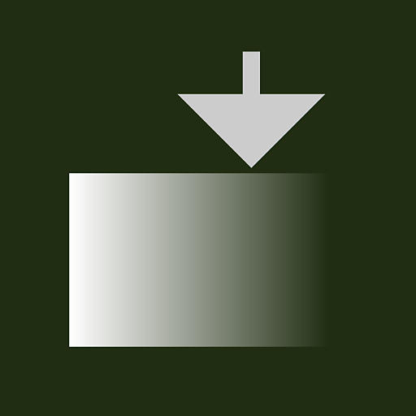

# Nœuds atomiques

Les nœuds atomiques sont les composantes de base des graphiques de Substance.

Tous les autres nœuds de graphique de Substance de données de la [bibliothèque](../../../interface/the-library/the-library.md) sont construits à partir de nœuds atomiques, si vous les décomposez à leur niveau le plus bas.

<table>
<tr style="border: 0;">
<td style="border: 0;" valign="top">

[Bitmap](../../../compositing-graphs/nodes-reference-for-com/atomic-nodes/bitmap/bitmap.md)

</td>
<td style="border: 0;" valign="top">

[Fusion](../../../compositing-graphs/nodes-reference-for-com/atomic-nodes/blend/blend.md)

</td>
<td style="border: 0;" valign="top">

[Flou](../../../compositing-graphs/nodes-reference-for-com/atomic-nodes/blur/blur.md)

</td>
<td style="border: 0;" valign="top">

[Courbe](../../../compositing-graphs/nodes-reference-for-com/atomic-nodes/curve/curve.md)

</td>
<td style="border: 0;" valign="top">

[Flou directionnel](../../../compositing-graphs/nodes-reference-for-com/atomic-nodes/directional-blur/directional-blur.md) [&#128279;](../../../compositing-graphs/nodes-reference-for-com/atomic-nodes/directional-blur/directional-blur.md)

</td>
</tr>
</table>

<table>
<tr style="border: 0;">
<td style="border: 0;" valign="top">

[Déformation directionnelle](../../../compositing-graphs/nodes-reference-for-com/atomic-nodes/directional-warp/directional-warp.md)

</td>
<td style="border: 0;" valign="top">

[Estampage](../../../compositing-graphs/nodes-reference-for-com/atomic-nodes/emboss/emboss.md)

</td>
<td style="border: 0;" valign="top">

[Distance](../../../compositing-graphs/nodes-reference-for-com/atomic-nodes/distance/distance.md)

</td>
<td style="border: 0;" valign="top">

[Dégradé (dynamique)](../../../compositing-graphs/nodes-reference-for-com/atomic-nodes/gradient-dynamic/gradient-dynamic.md)

</td>
<td style="border: 0;" valign="top">

[Map de dégradé](../../../compositing-graphs/nodes-reference-for-com/atomic-nodes/gradient-map/gradient-map.md)

</td>
</tr>
</table>

<table>
<tr style="border: 0;">
<td style="border: 0;" valign="top">

[FX-Map](../../../compositing-graphs/nodes-reference-for-com/atomic-nodes/fx-map/fx-map.md)

</td>
<td style="border: 0;" valign="top">

[Conversion en niveaux de gris](../../../compositing-graphs/nodes-reference-for-com/atomic-nodes/grayscale-conversion/grayscale-conversion.md)

</td>
<td style="border: 0;" valign="top">

[TSL](../../../compositing-graphs/nodes-reference-for-com/atomic-nodes/hsl/hsl.md)

</td>
<td style="border: 0;" valign="top">

[Couleur en entrée](../../../compositing-graphs/nodes-reference-for-com/atomic-nodes/input/input.md)

</td>
<td style="border: 0;" valign="top">

[Niveaux de gris d&#39;entrée](../../../compositing-graphs/nodes-reference-for-com/atomic-nodes/input/input.md) [&#128279;](../../../compositing-graphs/nodes-reference-for-com/atomic-nodes/input/input.md)

</td>
</tr>
</table>

<table>
<tr style="border: 0;">
<td style="border: 0;" valign="top">

[Valeur d&#39;entrée](../../../compositing-graphs/nodes-reference-for-com/atomic-nodes/input/input.md)

</td>
<td style="border: 0;" valign="top">

[Niveaux](../../../compositing-graphs/nodes-reference-for-com/atomic-nodes/levels/levels.md)

</td>
<td style="border: 0;" valign="top">

[Normale](../../../compositing-graphs/nodes-reference-for-com/atomic-nodes/normal/normal.md)

</td>
<td style="border: 0;" valign="top">

[Sortie](../../../compositing-graphs/nodes-reference-for-com/atomic-nodes/output/output.md)

</td>
<td style="border: 0;" valign="top">

[Processeur de pixels](../../../compositing-graphs/nodes-reference-for-com/atomic-nodes/pixel-processor/pixel-processor.md)

</td>
</tr>
</table>

<table>
<tr style="border: 0;">
<td style="border: 0;" valign="top">

[Accentuer](../../../compositing-graphs/nodes-reference-for-com/atomic-nodes/sharpen/sharpen.md)

</td>
<td style="border: 0;" valign="top">

[Permutation de canaux](../../../compositing-graphs/nodes-reference-for-com/atomic-nodes/channel-shuffle/channel-shuffle.md)

</td>
<td style="border: 0;" valign="top">

[SVG](../../../compositing-graphs/nodes-reference-for-com/atomic-nodes/svg/svg.md)

</td>
<td style="border: 0;" valign="top">

[Texte](../../../compositing-graphs/nodes-reference-for-com/atomic-nodes/text/text.md)

</td>
<td style="border: 0;" valign="top">

[Transformation 2D](../../../compositing-graphs/nodes-reference-for-com/atomic-nodes/transformation-2d/transformation-2d.md)

</td>
</tr>
</table>

<table>
<tr style="border: 0;">
<td style="border: 0;" valign="top">

[Couleur uniforme](../../../compositing-graphs/nodes-reference-for-com/atomic-nodes/uniform-color/uniform-color.md)

</td>
<td style="border: 0;" valign="top">

[Processeur de valeurs](../../../compositing-graphs/nodes-reference-for-com/atomic-nodes/value-processor/value-processor.md)

</td>
<td style="border: 0;" valign="top">

[Déformation](../../../compositing-graphs/nodes-reference-for-com/atomic-nodes/warp/warp.md)

</td>
<td style="border: 0;" valign="top">

</td>
<td style="border: 0;" valign="top">

</td>
</tr>
</table>

## Placement de nœuds atomiques

Il existe plusieurs façons de créer des nœuds atomiques dans les graphiques de Substance :

### <b>La palette de noeuds</b>

La palette de noeuds se trouve dans la barre d&#39;outils [Affichage graphique](../../../interface/the-graph-view/the-graph-view.md) et permet d&#39;accéder facilement aux nœuds atomiques : il vous suffit de cliquer sur un nœud ou de le faire glisser dans le graphique.

La palette est basculée à l&#39;aide de ce bouton : 

### <b>Menu du nœud</b>

Appuyez sur *Barre d&#39;espace* ou sur *Onglet* dans la vue Graphique pour afficher une liste de nœuds pouvant faire l&#39;objet de recherches et répertorier tous les nœuds atomiques par défaut.

Le champ de recherche vous permet de parcourir [tous les autres nœuds de la bibliothèque](../../../compositing-graphs/nodes-reference-for-com/node-library/node-library.md), y compris [votre propre contenu](../../../interface/the-library/managing-custom-content/managing-custom-content-and-filters.md) (si ajouté).

### <b>Menu contextuel du graphique</b>

Cliquez avec le bouton droit de la souris dans le graphique et accédez au sous-menu Ajouter un nœud pour accéder à une liste de nœuds atomiques.

### <b>Bibliothèque</b>

La catégorie « Nœuds atomiques » de la [bibliothèque](../../../interface/the-library/the-library.md) héberge tous les nœuds atomiques. Vous pouvez les faire glisser et les déposer dans un graphique en Substance.

### <b>Raccourcis clavier</b>

Vous pouvez définir [vos propres raccourcis clavier](../../../interface/preferences-window/preferences-window.md) pour créer instantanément n&#39;importe quel nœud dans un graphique, y compris les nœuds atomiques.
