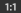

# Courbe

<table>
<tr style="border: 0;">
<td width="33.33%" style="border: 0;" valign="top">

{width="200px"}

</td>
<td width="100.00%" style="border: 0;" valign="top">

Remappe les valeurs d’une image à l’aide d’une courbe personnalisée.

Le nœud fournit une interface pour le remappage de tonalité d’image, similaire à d’autres applications d’édition d’image 2D. L’utilisateur peut placer des points et ajuster les courbes de Bézier pour remapper l’entrée, qui peut être en niveaux de gris ou en couleurs.Il est particulièrement utile avec les transitions de dégradé pour les remapper sur un profil d&#39;height spécifique, car il permet une modélisation très précise des profils de biseau et similaires.

</td>
</tr>
</table>

Contrairement à la plupart des autres nœuds, le nœud Courbe n&#39;a pas d&#39;interface standard standard avec les curseurs et les paramètres, mais présente plutôt un éditeur de courbes complet. Voir la section ci-dessous, qui peut être développée, pour savoir comment l’utiliser.

[Cela signifie toutefois qu&#39;aucun des paramètres d&#39;un nœud Courbe ne peut être exposé à un sous-graphe](../../../../compositing-graphs/manage-parameters/exposing-a-parameter/exposing-a-parameter.md). La seule option ici est d&#39;utiliser un [commutateur multiple](../../../../compositing-graphs/nodes-reference-for-com/node-library/filters/blending/multi-switch/multi-switch.md) pour basculer entre différents profils de courbe.

<table>
<tr style="border: 0;">
<td width="100.00%" style="border: 0;" valign="top">

</td>
<td width="83.33%" style="border: 0;" valign="top">

</td>
<td width="100.00%" style="border: 0;" valign="top">

</td>
</tr>
</table>

<table>
<tr style="border: 0;">
<td style="border: 0;" valign="top">

## Paramètres

### Éditeur de courbes

</td>
<td style="border: 0;" valign="top">

### Connecteurs d’entrée

### Connecteurs de sortie

</td>
<td style="border: 0;" valign="top">

### Exemples

</td>
</tr>
</table>

## Paramètres

|  |  |
| --- | --- |
| <b>Appliquer/Exposer la courbe</b> *Booléen* | Permet de copier la courbe utilisateur vers la sortie au lieu de l’appliquer à l’image d’entrée |
| <b>Adressage des courbes</b> *Booléen* | Ce paramètre détermine la façon dont les pixels HDR hors de la plage [0, 1] dans l’entrée sont traités : ils sont bridés ou pliés jusqu’à [0, 1]. |
| <b>Courbe</b> *Tableau de touches de courbes* | Courbe personnalisée utilisée pour mapper les valeurs de niveaux de gris en entrée.   Peut être modifié à l&#39;aide de l&#39;[éditeur de courbes](#curve-editor). |

## Éditeur de courbes

### Création et déplacement d’un point

Pour créer un point, double-cliquez simplement n’importe où sur la vue Courbe :

### Contrôle de l’influence des points

<table>
<tr style="border: 0;">
<td width="100.00%" style="border: 0;" valign="top">

Afin d&#39;obtenir des résultats précis, les nœuds de courbe offrent différents modes pour chaque point:

</td>
<td width="33.33%" style="border: 0;" valign="top">

</td>
</tr>
</table>

 Réinitialisez le mode de point à la valeur par défaut.

 Verrouillez/déverrouillez les 2 gestionnaires Bézier afin que l&#39;utilisateur puisse les déplacer ensemble ou indépendamment.

 Les deux côtés du point sont contrôlés par un gestionnaire Bézier.

 Le côté droit du point est contrôlé par un gestionnaire Bézier tandis que le côté gauche reste plat.

 Le côté gauche du point est contrôlé par un gestionnaire Bézier tandis que le côté droit reste plat.

 Les côtés des points restent plats

### Afficher l’histogramme d’entrée

Vous pouvez afficher/masquer l&#39;histogramme de votre saisie en cliquant simplement sur 

### Contrôle individuel de chaque couche (entrée de couleur)

<table>
<tr style="border: 0;">
<td width="100.00%" style="border: 0;" valign="top">

Lorsque vous saisissez un nœud de couleur, vous avez la possibilité d’ajuster la courbe de chaque couche :

Sélectionnez simplement la courbe que vous souhaitez ajuster dans la liste déroulante située en haut à droite :

</td>
<td width="33.33%" style="border: 0;" valign="top">

</td>
</tr>
</table>

En mode Courbe RGB, vous pouvez masquer/afficher les courbes de couche individuelles en appuyant/déplaçant  :

### Alignement, mise en miroir et inversion

<table>
<tr style="border: 0;">
<td width="100.00%" style="border: 0;" valign="top">

Si vous cliquez avec le bouton droit de la souris sur la vue Courbe, vous obtiendrez d&#39;autres options.

<b>Aligner en haut :</b> alignez les points sélectionnés horizontalement sur le plus haut.

<b>Aligner au milieu :</b> alignez les points sélectionnés horizontalement sur l&#39;height moyen de la sélection.

<b>Aligner en bas :</b> alignez les points sélectionnés horizontalement sur le point le plus bas.

</td>
<td width="50.00%" style="border: 0;" valign="top">

</td>
</tr>
</table>

<b>Répartir horizontalement/verticalement :</b> répartir les points sur l&#39;axe sélectionné

<b>Symétrie horizontale/verticale :</b> inversez les points sélectionnés en fonction de l&#39;axe sélectionné.

<b>Symétrie horizontale/verticale :</b> reflète la courbe entière, selon l&#39;axe sélectionné

### Raccourcis clavier

<table>
<tr style="border: 0;">
<td style="border: 0;" valign="top">

<b>LMB + Glisser</b>

Tracez une zone de sélection.

</td>
<td style="border: 0;" valign="top">

</td>
</tr>
</table>

<table>
<tr style="border: 0;">
<td style="border: 0;" valign="top">

<b>Maj + Glisser</b>

Contraindre le mouvement sur l’axe X ou Y.

</td>
<td style="border: 0;" valign="top">

</td>
</tr>
</table>

<table>
<tr style="border: 0;">
<td style="border: 0;" valign="top">

<b>Alt + LMB + Glisser</b>

Rompez temporairement les poignées pour les déplacer indépendamment.

</td>
<td style="border: 0;" valign="top">

</td>
</tr>
</table>

### Réglage du cadrage de la courbe

Lors de l’ajustement des gestionnaires, vous pouvez vous trouver dans un cas où un gestionnaire passe par-dessus la vue de courbe.

Dans ce cas, vous pouvez utiliser le bouton  pour adapter la taille au contenu.

Le bouton  réinitialise le niveau de zoom à 1

## Connecteurs d’entrée

|  |  |
| --- | --- |
| <b>Entrée</b> *Niveaux de gris/Couleur* PRINCIPAL | Image à traiter. |

## Connecteurs de sortie

|  |  |
| --- | --- |
| <b>Sortie</b> *Niveaux de gris/Couleur* |  |

## Exemples

*Bientôt disponible.*
