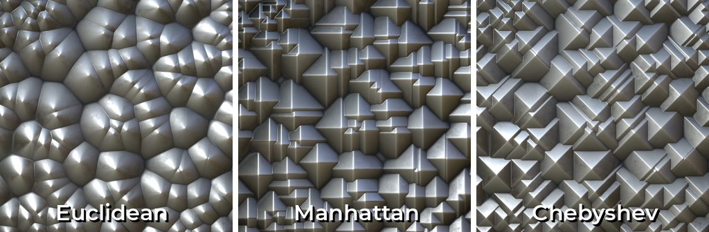

# Distance

<table>
<tr style="border: 0;">
<td width="33.33%" style="border: 0;" valign="top">

{width="200px"}

</td>
<td width="100.00%" style="border: 0;" valign="top">

Recherche la position du pixel blanc le plus proche dans un masque et génère soit un dégradé à partir de cette position, soit la couleur à cette position dans une image source.

Ce nœud crée un fondu linéaire vers l’extérieur (dégradé) à partir de tous les pixels de la valeur d’entrée max. supérieure à 0,5 échelle de gris.

</td>
</tr>
</table>

Le fondu externe en expansion se terminera dès qu&#39;il rencontrera une autre cellule : ils ne se chevaucheront jamais. En interne, il s&#39;agit en fait de calculer et d&#39;afficher la distance au pixel le plus proche > 0,5, le nœud de distance étant défini comme une pince/maximum.

Une texture source facultative permet de combiner les cellules avec la texture d’une texture d’entrée secondaire.

Le nœud de distance n&#39;est pas facile à maîtriser, mais ses principaux cas d&#39;utilisation consistent à étendre les masques existants de manière fiable (par rapport au flou et au réglage du contraste), à générer des cellules de bruit de type Voronoï et à biseauter les formes existantes avec un profil net et linéaire (qui peut être remappé ultérieurement).

Voir les [exemples](#examples) ci-dessous pour plus d&#39;informations.

<table>
<tr style="border: 0;">
<td width="100.00%" style="border: 0;" valign="top">

</td>
<td width="83.33%" style="border: 0;" valign="top">

</td>
<td width="100.00%" style="border: 0;" valign="top">

</td>
</tr>
</table>

<table>
<tr style="border: 0;">
<td style="border: 0;" valign="top">

## Connecteurs de sortie

</td>
<td style="border: 0;" valign="top">

### Exemples

</td>
</tr>
</table>

## Paramètres

|  |  |
| --- | --- |
| <b>Mode colorimétrique</b> *Booléen* | Permet de basculer entre une image en niveaux de gris et une image en couleur. Modifie également le type d’entrée « Entrée source ». |
| <b>Distance maximale</b> *Flotter* | Ajuste la distance maximale de détection de la bordure la plus proche dans le masque, en pixels. |
| <b>Combiner la source/la distance</b> *Booléen* | Déterminez la manière dont l&#39;entrée « Source » facultative est combinée avec les cellules finales.<ul data-preserve-html="true"> <li data-preserve-html="true"><i>Combiner :</i> combine la valeur « Entrée source » avec le masque linéaire en fondu. Si l&#39;entrée &#39;Source input&#39; est connectée, sa valeur est combinée à la distance calculée.</li> <li data-preserve-html="true"><i>Source uniquement :</i> le résultat est une couleur unie provenant uniquement de l&#39;« entrée Source ».</li> </ul> |
| <b>Mode Distance</b> *Nombre entier* | Sélectionne la méthode de calcul de la distance jusqu’à la bordure la plus proche dans le masque extrait :<ul data-preserve-html="true"> <li data-preserve-html="true"><i>Euclidéen :</i> somme des différences X/Y carrées.</li> <li data-preserve-html="true"><i>Manhattan :</i> somme des valeurs absolues des différences X/Y.</li> <li data-preserve-html="true"><i>Chebyshev :</i> valeur maximale absolue des différences X/Y.</li> </ul>  

 |

## Connecteurs d’entrée

|  |  |
| --- | --- |
| <b>Entrée de masque</b> *Niveaux de gris* PRINCIPAUX | Masque en niveaux de gris dont les bordures doivent être calculées pour une valeur de distance.   Un masque binaire est extrait de l&#39;image, en utilisant une valeur de seuil de 0,5, où toutes les valeurs au-dessus de ce seuil sont blanches et toutes les valeurs au-dessous sont noires. |
| <b>Entrée source</b> *Couleur/Niveaux De Gris* | Image en niveaux de gris facultative à partir de laquelle la valeur de pixel à la bordure la plus proche de l’entrée de masque doit être copiée. |

## Connecteurs de sortie

|  |  |
| --- | --- |
| <b>Sortie</b> *Couleur/Niveaux De Gris* |  |

## Exemples

<table>
<tr style="border: 0;">
<td style="border: 0;" valign="top">

{width="250px"}

</td>
<td style="border: 0;" valign="top">

{width="250px"}

</td>
<td style="border: 0;" valign="top">

{width="250px"}

</td>
</tr>
</table>
