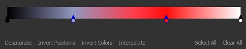
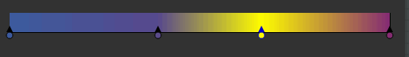
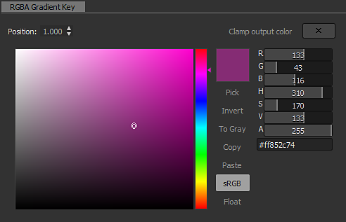

# Map de dégradé

<table>
<tr style="border: 0;">
<td width="33.33%" style="border: 0;" valign="top">

{width="200px"}

</td>
<td width="100.00%" style="border: 0;" valign="top">

Remappe les valeurs de niveaux de gris d’une image à l’aide d’un dégradé personnalisé.

Ce nœud a un double objectif : il peut être simplement utilisé comme <b> </b>nœud de conversion des niveaux de gris en couleurs ou, pour coloriser les niveaux de gris, je les mappe à une gamme de couleurs personnalisée.

</td>
</tr>
</table>

Le nœud offre un éditeur de dégradé avancé et riche en fonctionnalités pour mapper plusieurs couleurs avec précision : accédez à la section [Éditeur de dégradé](#gradient-editor) de cette page pour en savoir plus.

<table>
<tr style="border: 0;">
<td width="100.00%" style="border: 0;" valign="top">

</td>
<td width="83.33%" style="border: 0;" valign="top">

</td>
<td width="100.00%" style="border: 0;" valign="top">

</td>
</tr>
</table>

## Exemples

## Paramètres

|  |  |
| --- | --- |
| <b>Mode colorimétrique</b> *Booléen* | Définit le mode de sortie sur Couleur ou Niveaux de gris. |
| <b>Adressage de dégradé</b> *Booléen* | Définit le dégradé sur des valeurs de répétition (carreau) ou de pincement qui sont en dehors de la plage [0, 1]. |
| <b>Dégradé</b> *Tableau de clés de dégradé* | Dégradé personnalisé utilisé pour mapper les valeurs de niveaux de gris d’entrée.   Peut être modifié sur place ou à l&#39;aide de l&#39;[éditeur de dégradé](#gradient-editor). |

## Éditeur de dégradé

Cette fenêtre offre des commandes permettant de modifier le dégradé de référence utilisé par le nœud de Map de dégradé pour mapper les valeurs de niveaux de gris aux couleurs.

Il peut être ouvert à partir des <b>propriétés</b> du nœud de Map de dégradé de données de l&#39;une des manières suivantes :

* Cliquez sur LMB sur le bouton <b>Éditeur de dégradé</b> ;
* Double-cliquez sur LMB sur une épingle dans la barre de dégradé. L’épingle cliquée sera alors automatiquement sélectionnée dans l’Éditeur de dégradé afin que vous puissiez modifier directement ses valeurs.

### Modification des épingles de dégradé

Les couleurs et leur position le long du dégradé sont contrôlées par des épingles placées le long de la bande de dégradé.

Chaque épingle définit une couleur à sa position le long du dégradé.

Les parties du dégradé avant et après la première et la dernière épingles sont définies sur les couleurs de ces épingles respectivement.

Les commandes suivantes sont disponibles pour modifier des épingles :

<table>
<tr style="border: 0;">
<td style="border: 0;" valign="top">

<b>Ajouter un coin</b>

Cliquez sur LMB sur le dégradé ou juste en dessous pour ajouter une épingle à l’endroit où vous avez cliqué dans la barre de dégradé.

La nouvelle épingle sera définie sur la couleur du dégradé à cette position.

</td>
<td style="border: 0;" valign="top">

</td>
</tr>
</table>

<table>
<tr style="border: 0;">
<td style="border: 0;" valign="top">

<b>Déplacer l&#39;épingle</b>

Maintenez la touche LMB enfoncée et faites glisser les coins sélectionnés le long de la bande de dégradé pour les déplacer.

Vous pouvez également définir la position d&#39;un coin avec une valeur numérique en le sélectionnant et en utilisant le paramètre <b>Position</b>. La position est une valeur comprise dans la plage [0;1], où 0 correspond au début du dégradé et 1 à sa fin.

</td>
<td style="border: 0;" valign="top">

</td>
</tr>
</table>

Lorsque plusieurs coins sont sélectionnés, ils peuvent tous être déplacés *simultanément*. Lorsqu’une ou plusieurs épingles atteignent et atteignent la fin du dégradé à mesure qu’elles sont déplacées, deux comportements sont disponibles en fonction du bouton de la souris utilisé pour le déplacement :

* <b>LMB:</b> les épingles restent à la fin, ce qui signifie qu&#39;elles seront empilées à cet emplacement à mesure qu&#39;elles l&#39;atteignent et que leurs positions relatives sont modifiées ;
* <b>Mo :</b> les coins sont bouclés à l&#39;autre extrémité du dégradé, ce qui signifie que leur position relative reste inchangée.

<table>
<tr style="border: 0;">
<td style="border: 0;" valign="top">

<b>Supprimer le coin</b>

Sélectionnez les épingles et appuyez sur Supprimer, ou faites-les glisser hors de la bande de dégradé pour les supprimer.

</td>
<td style="border: 0;" valign="top">

</td>
</tr>
</table>

<table>
<tr style="border: 0;">
<td style="border: 0;" valign="top">

<b>Inverser les positions</b>

Permet de refléter la position des coins sélectionnés sur le dégradé.

</td>
<td style="border: 0;" valign="top">

</td>
</tr>
</table>

<table>
<tr style="border: 0;">
<td style="border: 0;" valign="top">

<b>Tout effacer</b>

Supprime tous les coins de la bande de dégradé.

</td>
<td style="border: 0;" valign="top">

</td>
</tr>
</table>

<b>Inverser les couleurs</b>

Ce bouton applique les couleurs négatives aux coins sélectionnés.

<b>Désaturer</b>

Ce bouton désature les couleurs définies sur les épingles sélectionnées.

### Modes d’interpolation

Une fois les coins configurés, vous pouvez contrôler la transition des couleurs d’un coin à l’autre à l’aide des modes d’interpolation disponibles :

+++Linéaire
Le mode d’interpolation par défaut : applique une interpolation linéaire simple entre chaque broche pour que le dégradé progresse uniformément.

+++

+++Tangentes plates
Lorsque vous considérez la transition entre les dégradés comme des courbes de Bézier où les coins sont des points de la courbe, ce mode définit ces points pour qu’ils aient des tangentes horizontales.

Il en résulte une transition évocatrice d’une interpolation à pas fluide.

Lorsque ce mode est sélectionné, le paramètre <b>Milieu</b> est activé et vous permet de décaler la position horizontale du milieu vertical de la courbe entre les points. Cela permet de faire basculer efficacement l&#39;échelle entre les tangentes « out » et « in ».

+++

+++Lisse
Lisse la courbe d’interpolation entre chaque point.

Lorsque ce mode est sélectionné, le paramètre <b>Smoothness</b> est activé et vous permet d&#39;ajuster l&#39;intensité du lissage lorsqu&#39;une valeur de 0 est égale au mode d&#39;interpolation <b>linéaire</b>.

+++

+++Aucune interpolation
La couleur change uniquement à l’emplacement d’une épingle et reste constante jusqu’à l’épingle suivante le long de la bande de dégradé.

Il en résulte des décalages importants entre les couleurs, et seules les couleurs définies par les épingles sont présentes sur le dégradé.

+++

### sélecteur de couleurs

Le sélecteur de couleurs permet de définir une couleur de plusieurs manières :

* <b>Barre de dégradé et de teinte</b>

  <table>
  <tr style="border: 0;">
  <td style="border: 0;" valign="top">

  Ajustez la position de l’objet dans le dégradé et de l’encoche dans la barre de teinte pour définir une couleur.

  </td>
  <td style="border: 0;" valign="top">

  

  </td>
  </tr>
  </table>

* <b>Curseurs RGB, HSV et Alpha</b>

  <table>
  <tr style="border: 0;">
  <td width="100.00%" style="border: 0;" valign="top">

  Les curseurs RGB, TSL et Alpha vous permettent de définir une couleur avec précision, en ajustant les curseurs ou en définissant directement leurs valeurs numériques.

  Vous pouvez également utiliser un code hexadécimal dans le champ de saisie dédié situé sous les curseurs.

  </td>
  <td width="33.33%" style="border: 0;" valign="top">

  

  </td>
  </tr>
  </table>

* <b>Choisir à l&#39;écran</b>

  <table>
  <tr style="border: 0;">
  <td style="border: 0;" valign="top">

  Utilisez le bouton <b>Choisir</b> et cliquez sur LMB n&#39;importe où dans l&#39;écran pour échantillonner la couleur à cet emplacement.

  </td>
  <td style="border: 0;" valign="top">

  

  </td>
  </tr>
  </table>

<table>
<tr style="border: 0;">
<td width="100.00%" style="border: 0;" valign="top">

La couleur sélectionnée est prévisualisée dans la moitié supérieure de la vignette couleur.\
La moitié inférieure affiche la couleur précédemment utilisée. Double-cliquez sur le LMB pour rétablir la couleur modifiée.

</td>
<td width="16.67%" style="border: 0;" valign="top">

</td>
</tr>
</table>

Lorsque plusieurs coins sont sélectionnés, les curseurs RGB, HSV et Alpha se transforment en curseurs delta (Δ), ce qui signifie qu’ils sont utilisés pour décaler la valeur de chaque coin d’une même valeur.

<table>
<tr style="border: 0;">
<td width="100.00%" style="border: 0;" valign="top">

En outre, les fonctionnalités suivantes sont disponibles sous la vignette de couleur en tant que boutons :

<b>Inverser :</b> remplace la couleur par son négatif ;

<b>Vers le gris :</b> désature la couleur ;

<b>Copier </b>*:* copier la couleur actuellement sélectionnée dans le Presse-papiers ;

<b>Coller :</b> passez à la couleur actuellement dans le Presse-papiers ;

<b>sRVB</b> : utilisez l&#39;espace colorimétrique sRVB pour afficher les couleurs. Lorsque cette option est désactivée, l’espace colorimétrique linéaire est utilisé ;

<b>Flottant :</b> valeurs du RGB d&#39;affichage, de la visibilité maximale (HSV) et du curseur Alpha en virgule flottante.

</td>
<td width="25.00%" style="border: 0;" valign="top">

</td>
</tr>
</table>

### Pipette de dégradé

L’outil Pipette de dégradé est l’une des fonctionnalités les plus utiles de ce nœud, car vous pouvez créer des dégradés complexes en traçant simplement une ligne sur une image de référence.

Le curseur <b>Précision</b> vous aidera à ajuster le dégradé que vous venez de créer en augmentant ou en diminuant le nombre de touches : plus leurs valeurs sont faibles, plus votre dégradé correspondra précisément aux valeurs que vous avez choisies.

## Connecteurs d’entrée

|  |  |
| --- | --- |
| <b>Entrée</b> *Niveaux de gris* PRINCIPAUX | Image en niveaux de gris à traiter. |

## Connecteurs de sortie

|  |  |
| --- | --- |
| <b>Sortie</b> *Niveaux de gris* |  |

## Exemples

*Bientôt disponible.*
