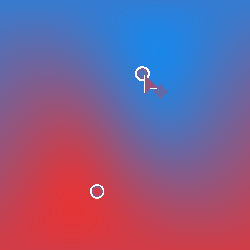

# Dégradé de 2 points

<table>
<tr style="border: 0;">
<td style="border: 0;" valign="top">

{width="250px"}

## Dégradé de 2 points

**Entrée :** *Vue/Outils HDRI 3D*

**Intermédiaire**

</td>
<td style="border: 0;" valign="top">

## Description

Crée un dégradé de 2 couleurs entre deux points sélectionnés par l’utilisateur. Le résultat est ajusté en fonction de la projection sphérique. Similaire à [Dégradé linéaire (HDRI)](../../../../../../compositing-graphs/nodes-reference-for-com/node-library/3d-view-library/hdri-tools/gradient-linear-hdri/gradient-linear-hdri.md), mais avec deux points au lieu d&#39;un.

## Paramètres

* **Position du point 1** :\
  Position du premier point sélectionnée par l’utilisateur. Possède un handle en vue 2D.
* **Couleur Point 1** : *(valeur chromatique)*\
  Couleur au début du dégradé.
* **Contraste Du Point 1** : *0.0 - 1.0*\
  Contraste du premier masque de point.
* **Position du point 2** :\
  Position du deuxième point sélectionnée par l’utilisateur. Possède un handle en vue 2D.
* **Couleur de point 2** : *(valeur de couleur)*\
  Couleur à la fin du dégradé.
* **Contraste du point 2** : *0.0 - 1.0* Contraste du second masque de point.

## Exemples d’images

</td>
</tr>
</table>
