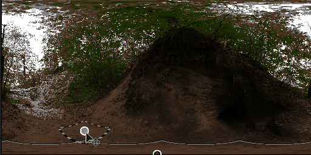

# Nadir patch

<table>
<tr style="border: 0;">
<td width="33.33%" style="border: 0;" valign="top">

{width="200px"}

<b>Entrée :</b> vue 3D > Outils HDRI

</td>
<td width="100.00%" style="border: 0;" valign="top">

## Description

Ce nœud fournit une fonctionnalité permettant de corriger le point au sol central (nadir) d&#39;une image mappée de manière sphérique. Il peut être utilisé pour masquer ou « cloner » un vilain nadir, ou un appareil photo ou un trépied visible. Cela fonctionne comme un [patch de duplication](../../../../../../compositing-graphs/nodes-reference-for-com/node-library/material-filters/scan-processing/clone-patch/clone-patch.md), mais avec des réglages pour les images mappées de manière sphérique. L’utilisateur sélectionne un point ailleurs dans l’image, c’est-à-dire le clone et le mélange au nadir. Le traitement ne nécessite aucune autre entrée externe qu’une seule HDRI, mais un masque externe peut être utilisé comme alpha pour l’effet de pièce.

L&#39;effet peut être rapidement vérifié et validé avec [Nadir extract](../../../../../../compositing-graphs/nodes-reference-for-com/node-library/3d-view-library/hdri-tools/nadir-extract/nadir-extract.md).

</td>
</tr>
</table>

## Entrées

|  |  |
|:---|:---|
| <b>Entrée</b> <i>Entrée couleur</i> |  |
| <b>Entrée de masque</b> <i>Entrée en niveaux de gris</i> | Emplacement de masque facultatif utilisé pour masquer le correctif. Fonctionne comme un alpha. |

## Paramètres

|  |  |
|:---|:---|
| <b>Activer</b> <i>Faux/Vrai</i> | Activez ou désactivez l’effet de correction. |
| <b>Afficher l&#39;Assistant Cadre</b> <i>Faux/Vrai</i> | Afficher ou masquer les lignes d&#39;assistant, à des fins de débogage. |
| <b>Thickness Cadre</b> <i>0.0 - 1.0</i> | Thickness des lignes auxiliaires. |
| <b>Échelle de correctif</b> <i>0.0 - 1.0</i> | Échelle globale et uniforme du correctif. Affecte la source et la cible. |
| <b>Taille du correctif</b> <i>0.0 - 1.0</i> | Taille non uniforme du patch. |
| <b>Rotation du correctif</b> <i>0.0 - 1.0</i> | Rotation du patch. Affecte la source et la cible. |
| <b>Alpha du correctif</b> <i>Entrée de masque carrée lisse, gaussienne</i> | Définissez le paramètre alpha à utiliser pour fusionner le patch avec l’arrière-plan. |
| <b>Dureté de correctif</b> <i>0.0 - 1.0</i> | Définissez la dureté/le contraste de la couche alpha. |
| <b>Décalage de rotation source</b> <i>0.0 - 1.0</i> | Rotation uniquement pour la source du correctif. |
| <b>Coordonnées De Position</b> |  |
| <b>Position source</b> | Position de la source. Possède un handle en vue 2D. |
| <b>Position du correctif</b> | Position de la cible. Possède un handle en vue 2D. |

## Exemples

<table style="margin-top: 32px; margin-bottom: 32px">
    <tr style="border: 0">
        <td style="border: 0; background: transparent">
            
        </td>
    </tr>
</table>
