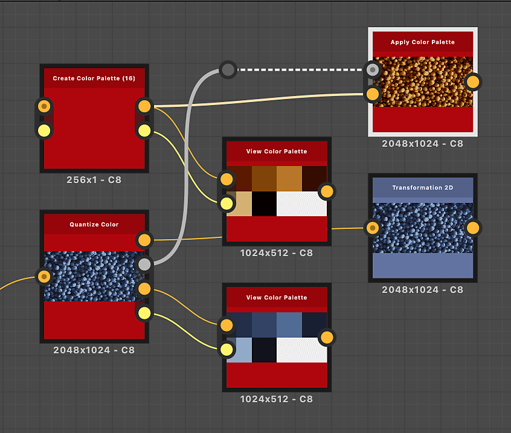

# Appliquer la palette de couleurs

<table>
<tr style="border: 0;">
<td width="33.33%" style="border: 0;" valign="top">

Icône {width="200px"}

<b>Entrée :</b> Filtres > Réglages

</td>
<td width="100.00%" style="border: 0;" valign="top">

## Description

Applique les couleurs d’une palette ordonnée à une image à l’aide d’un mappage d’ID.

La distribution des couleurs s’effectue en faisant correspondre les index du mappage d’ID aux index des couleurs de la palette.

Par exemple, les #2 de couleur de la palette seront appliquées à tous les pixels de la carte d’identité avec une valeur d’ID de 2.

Ce nœud peut être utilisé en combinaison avec les nœuds suivants : [Quantifier la couleur](../../../../../../compositing-graphs/nodes-reference-for-com/node-library/filters/adjustments/quantize-color/quantize-color.md), [Créer une palette de couleurs](../../../../../../compositing-graphs/nodes-reference-for-com/node-library/filters/adjustments/create-color-palette-16/create-color-palette-16.md), [Modifier la palette de couleurs](../../../../../../compositing-graphs/nodes-reference-for-com/node-library/filters/adjustments/modify-color-palette/modify-color-palette.md), [Afficher la palette de couleurs](../../../../../../compositing-graphs/nodes-reference-for-com/node-library/filters/adjustments/view-color-palette/view-color-palette.md).

</td>
</tr>
</table>

## Entrées

|  |  |
|:---|:---|
| <b>ID</b> <i>Niveaux de gris</i> PRINCIPAUX | Mappage d’ID d’entrée utilisé pour répartir les couleurs dans la palette d’entrée.   Un mappage d’ID est une image où les pixels qui font partie d’un ensemble (par exemple, une forme) contiennent tous la même valeur d’identification unique. Dans ce cas, la valeur est un nombre entier.   Un mappage ID peut être produit à l&#39;aide d&#39;un nœud [Quantize Color](../../../../../../compositing-graphs/nodes-reference-for-com/node-library/filters/adjustments/quantize-color/quantize-color.md). |
| <b>Palette</b> <i>Couleur</i> | Liste triée de couleurs RGB codées sous la forme d’une ligne de pixels. La palette peut contenir jusqu’à 256 couleurs. Il s&#39;agit de la palette que le nœud mappe aux index du mappage d&#39;ID.   Les palettes peuvent être produites avec un nœud [Quantifier la couleur](../../../../../../compositing-graphs/nodes-reference-for-com/node-library/filters/adjustments/quantize-color/quantize-color.md) et modifiées avec un nœud [Modifier la palette de couleurs](../../../../../../compositing-graphs/nodes-reference-for-com/node-library/filters/adjustments/modify-color-palette/modify-color-palette.md). |

## Sorties

|  |  |
|:---|:---|
| <b>Sortie</b> <i>Couleur</i> | Résultat du mappage des couleurs de la palette aux index du mappage d’ID. |

## Exemples

{zoomable="yes"}

<table>
  <tr>
    <td>
      
       <i>Avant</i>
    </td>
    <td>
      
       <i>Après</i>
    </td>
  </tr>
</table>

{zoomable="yes"}

<table>
  <tr>
    <td>
      
       <i>Avant</i>
    </td>
    <td>
      
       <i>Après</i>
    </td>
  </tr>
</table>
