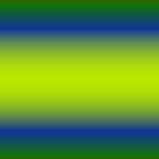

# Mélangeur de couches

<table>
<tr style="border: 0;">
<td style="border: 0;" valign="top">

{width="128px"}

## Mélangeur de couches

**Entrée :** *Filtres/Réglages*

**Simple**

</td>
<td style="border: 0;" valign="top">

## Description

Permet de mélanger, d’échanger et de fusionner des couches de RGB. Peut être utilisé pour agrandir les canaux, effectuer des conversions en niveaux de gris plus précises et différents types de packing.

## Paramètres

* **Canal Rouge** : *-200.0 -* 200.0\
  Détermine la proportion des canaux du RGB d’entrée qui passe dans le canal Rouge de sortie.
* **Canal Vert** : *-200.0 - 200.0*\
  Détermine la proportion des canaux du RGB d’entrée qui passe dans le canal vert de sortie.
* **Canal bleu** : *-200.0 - 200.0* Détermine la proportion des canaux du RGB d&#39;entrée qui passe dans le canal bleu de sortie.
* **Monochrome** : *Faux/Vrai* Sortie vers monochrome. Permet une conversion plus précise des niveaux de gris.

## Exemples d’images

</td>
</tr>
</table>
