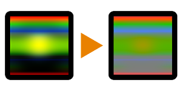

# Extrait de chrominance

<table>
<tr style="border: 0;">
<td style="border: 0;" valign="top">

## Extrait de chrominance

**Entrée :** *Filtres/Réglages*

**Simple**

</td>
<td style="border: 0;" valign="top">

## Description

Extrait la valeur de chrominance de l’entrée. La luminance est alors supprimée.

## Paramètres

*Aucun paramètre.*

## Exemples d’images

| 

 |
| --- |
|  |

</td>
</tr>
</table>
