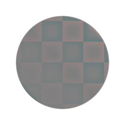
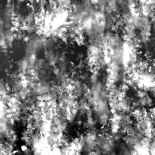

# Passe-haut

<table>
<tr style="border: 0;">
<td style="border: 0;" valign="top">

{width="128px"}

{width="128px"}

## Passe-haut (niveaux de gris)

**Entrée :** *Filtres/Réglages*

**Simple**

</td>
<td style="border: 0;" valign="top">

## Description

Effectue un filtre passe-haut, disponible en couleur ainsi que dans une version en niveaux de gris. Similaire à l’action Photoshop portant le même nom.\
Utile pour supprimer les grandes différences de luminance dans les images, par exemple lors du nettoyage de textures pour une mosaïque.

Important : assurez-vous d’utiliser la version appropriée pour vos commentaires. Utilisez « Passe-haut » pour les entrées Couleur et « Niveaux de gris passe-haut » pour les entrées Niveaux de gris.

## Paramètres

* **Rayon** : *0,0 - 64,0*\
  Rayon du filtre : un petit rayon supprime les petites différences, un rayon plus grand supprime les grandes zones.

## Exemples d’images

{width="400px"}

</td>
</tr>
</table>
