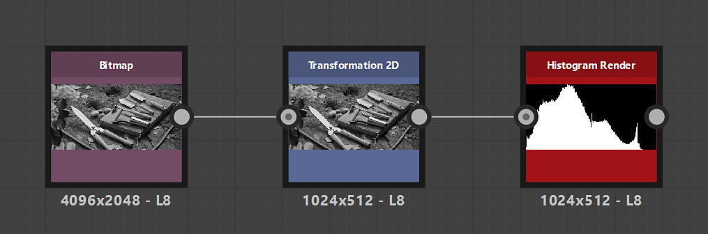

# Rendu de l’histogramme

<table>
<tr style="border: 0;">
<td width="33.33%" style="border: 0;" valign="top">

Icône {width="200px"}

<b>Entrée :</b> Filtres > Réglages

</td>
<td width="100.00%" style="border: 0;" valign="top">

## Description

Trace l’histogramme d’une image en niveaux de gris.

</td>
</tr>
</table>

## Entrées

|  |  |
|:---|:---|
| <b>Entrée</b> <i>Niveaux de gris</i> PRINCIPAUX | Image pour laquelle l’histogramme doit être dessiné. |

## Sorties

|  |  |
|:---|:---|
| <b>Sortie</b> <i>Niveaux de gris</i> | Visualisation de l’histogramme calculée à partir de l’image d’entrée. |

## Paramètres

|  |  |
|:---|:---|
| <b>Résolution de l&#39;histogramme</b> *Nombre entier* | La largeur de l’histogramme. Une valeur élevée permet une distribution plus fine des valeurs.   Les résolutions disponibles sont, en pixels : 256, 512, 1024, 2048, 4096 |
| <b>Échelle automatique</b> *Booléen* | Lorsque la valeur est True, remappe l’histogramme pour utiliser l’height complet de l’image.   Lorsque la valeur est False, chaque colonne utilise autant de pixels dans l’height que les occurrences d’une valeur dans l’image d’entrée. |
| <b>Échelle</b> *Flotter* | Met à l’échelle l’histogramme verticalement, où une valeur de 1 correspond à l’height complet de l’histogramme. |
| <b>Échantillonnage</b> *Nombre entier* | Méthode de filtrage de l’image de l’histogramme, qui a un impact sur le résultat lorsque la résolution de l’histogramme et la résolution de rendu ne concordent pas :<ul data-preserve-html="true"> <li data-preserve-html="true"><b>Bilinéaire :</b> applique un filtrage bilinéaire à l&#39;histogramme, ce qui produit des points interpolés</li> <li data-preserve-html="true"><b>Le plus proche :</b> échantillonne le pixel le plus proche sans filtrage, ce qui entraîne des pas plats</li> </ul> |
| <b>Symétrie de l&#39;axe Y</b> *Booléen* | Lorsque la valeur est True, l’histogramme est mis en miroir verticalement. |

## Exemples

{zoomable="yes"}

{zoomable="yes"}
