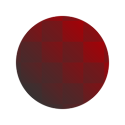

# Luminance passe-haut

<table>
<tr style="border: 0;">
<td width="33.33%" style="border: 0;" valign="top">

{width="128px"}

<b>Entrée :</b> Filtres > Réglages

</td>
<td width="100.00%" style="border: 0;" valign="top">

## Description

Annule les informations d&#39;éclairage en effectuant un [passe-haut](../../../../../../compositing-graphs/nodes-reference-for-com/node-library/filters/adjustments/highpass/highpass.md) sur la valeur de Luminance d&#39;entrée. Utile pour fixer les textures photographiées avec des informations d’éclairage. Peut être combiné dans [Substance 3D Designer](https://www.adobe.com/fr/products/substance3d-designer.html) avec plusieurs passes pour supprimer différentes fréquences des détails d&#39;éclairage.

Préserve mieux les couleurs que l&#39;[éclairage et annule les basses fréquences](../../../../../../compositing-graphs/nodes-reference-for-com/node-library/filters/adjustments/lighting-cancel-low-fre/lighting-cancel-low-frequencies.md).

</td>
</tr>
</table>

## Paramètres

|  |  |
|:---|:---|
| <b>Rayon</b> <i>0.0 - 64.0</i> | Rayon de l’effet passe-haut. Un rayon inférieur annule un éclairage plus petit et s’ajuste en fonction des images d&#39;entrée. |

## Exemples

<table style="margin-top: 32px; margin-bottom: 32px">
    <tr style="border: 0">
        <td style="border: 0; background: transparent">
            
        </td>
    </tr>
</table>
