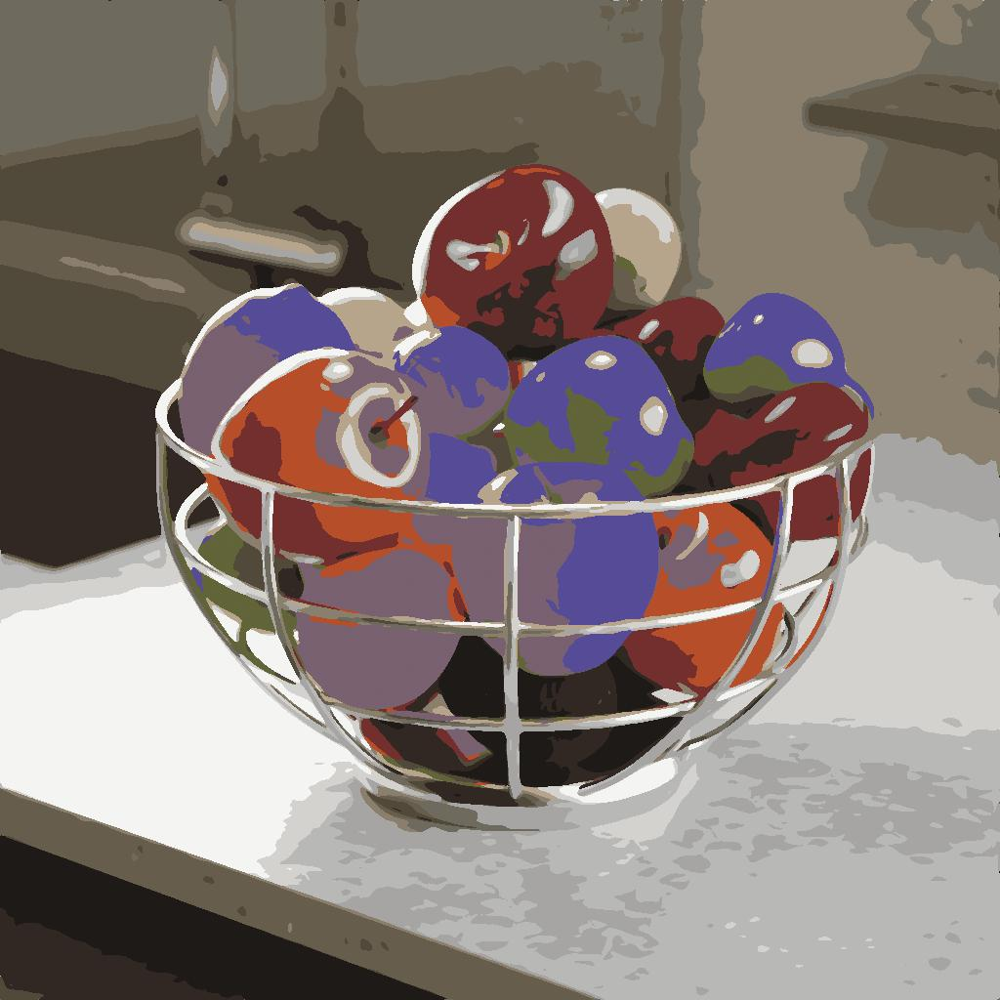

# Modifier la palette de couleurs

<table>
<tr style="border: 0;">
<td width="33.33%" style="border: 0;" valign="top">

Icône {width="200px"}

<b>Entrée :</b> Filtres > Réglages

</td>
<td width="100.00%" style="border: 0;" valign="top">

## Description

Modifie les couleurs d’une palette ordonnée et les applique à une image à l’aide d’un mappage d’ID.

Les couleurs peuvent être sélectionnées en faisant correspondre les index du mappage d’ID aux index de couleurs de la palette.

Par exemple, les #2 de couleur de la palette seront appliquées à tous les pixels de la carte d’identité avec une valeur d’ID de 2.

Ce nœud peut être utilisé en combinaison avec les nœuds suivants : [Quantifier la couleur](../../../../../../compositing-graphs/nodes-reference-for-com/node-library/filters/adjustments/quantize-color/quantize-color.md), [Créer une palette de couleurs](../../../../../../compositing-graphs/nodes-reference-for-com/node-library/filters/adjustments/create-color-palette-16/create-color-palette-16.md), [Appliquer la palette de couleurs](../../../../../../compositing-graphs/nodes-reference-for-com/node-library/filters/adjustments/apply-color-palette/apply-color-palette.md), [Afficher la palette de couleurs](../../../../../../compositing-graphs/nodes-reference-for-com/node-library/filters/adjustments/view-color-palette/view-color-palette.md).

</td>
</tr>
</table>

## Entrées

|  |  |
|:---|:---|
| <b>ID</b> <i>Niveaux de gris</i> PRINCIPAUX | Le mappage d’ID d’entrée utilisé pour sélectionner les couleurs, afin de les modifier et de les distribuer dans la sortie.   Un mappage d’ID est une image où les pixels qui font partie d’un ensemble (par exemple, une forme) contiennent tous la même valeur d’identification unique. Dans ce cas, la valeur est un nombre entier.   Un mappage ID peut être produit à l&#39;aide d&#39;un nœud [Quantize Color](../../../../../../compositing-graphs/nodes-reference-for-com/node-library/filters/adjustments/quantize-color/quantize-color.md). |
| <b>Palette</b> <i>Couleur</i> | Liste triée de couleurs RGB codées sous la forme d’une ligne de pixels. La palette peut contenir jusqu’à 256 couleurs. Il s&#39;agit de la palette que le nœud modifie.   Les palettes peuvent être produites avec les nœuds [Quantifier la couleur](../../../../../../compositing-graphs/nodes-reference-for-com/node-library/filters/adjustments/quantize-color/quantize-color.md) ou [Créer une palette de couleurs](../../../../../../compositing-graphs/nodes-reference-for-com/node-library/filters/adjustments/create-color-palette-16/create-color-palette-16.md). |

## Sorties

|  |  |
|:---|:---|
| <b>Sortie</b> <i>Couleur</i> | Résultat du mappage des couleurs de la palette modifiée aux index du mappage d’ID. |
| <b>Palette</b> <i>Couleur</i> | Palette mise à jour avec application des modifications de couleur spécifiées.   La palette peut être appliquée à une autre image avec le nœud [Appliquer la palette de couleurs](../../../../../../compositing-graphs/nodes-reference-for-com/node-library/filters/adjustments/apply-color-palette/apply-color-palette.md) ou visualisée avec le nœud [Afficher la palette de couleurs](../../../../../../compositing-graphs/nodes-reference-for-com/node-library/filters/adjustments/view-color-palette/view-color-palette.md). |

## Paramètres

|  |  |
|:---|:---|
| <b>Mode de sélection des couleurs</b> *Nombre entier* | Méthode de sélection de la couleur cible dans la palette qui doit être modifiée :<ul data-preserve-html="true"> <li data-preserve-html="true"><b>Index de couleur :</b> index de la couleur cible</li> <li data-preserve-html="true"><b>Espace image :</b> position dans le Map id où l&#39;index doit être échantillonné. Lorsque ce mode est sélectionné, un widget de position est disponible dans la vue 2D pour faciliter la sélection</li> </ul> |
| <b>Position de la couleur</b> *Flottant 2* *Disponible lorsque &#39;mode Choix de couleur&#39; est défini sur &#39;Espace image&#39;* | Position dans le mappage d’ID où l’index doit être échantillonné.   Utilisez l’objet dans la vue 2D pour sélectionner facilement un emplacement dans l’image.   Conseil : vous pouvez afficher l’image quantifiée à partir de laquelle le Map id est extrait, puis sélectionner le nœud Modifier la palette de couleurs pour afficher l’objet. La sélection d’une couleur à modifier devient ainsi plus intuitive. |
| <b>Index de couleurs</b> *Entier* *Disponible lorsque &#39;mode Choix de couleur&#39; est défini sur &#39;Index de couleurs&#39;* | Index de la couleur cible.   Les couleurs de la palette sont classées de gauche à droite et l’index de la première couleur est 0. |
| <b>Planche de sélection de couleurs</b> *Flotter* | Détermine l’étendue de la sélection jusqu’aux couleurs voisines.   Les couleurs sont disposées dans un *cube* dont la largeur, l&#39;height et la profondeur sont un dégradé où chaque composante d&#39;une couleur augmente de 0 à 1 (par ex. rouge, vert et bleu en RGB).   Ce paramètre permet de définir le contour de la couleur sélectionnée dans le cube. Les autres couleurs peuvent également être modifiées, où 1 correspond à la largeur totale du cube. |
| <b>Contraste de sélection de couleurs</b> *Flotter* | Contrôle le dégradé de retrait de la sélection par rapport aux couleurs voisines.   Les couleurs sont disposées dans un *cube* dont la largeur, l&#39;height et la profondeur sont un dégradé où une composante d&#39;une couleur augmente de 0 à 1 (par ex. rouge, vert et bleu en RGB).   Ce paramètre ajuste le retrait de la sélection sur les autres couleurs du cube autour de la couleur sélectionnée, où 0 est un dégradé régulier de la couleur sélectionnée vers la plus éloignée et 1 est une coupure entre entièrement inclus et non inclus. |
| <b>Espace colorimétrique de distance</b> *Nombre entier* | Les couleurs sont disposées dans un *cube* dont la largeur, l&#39;height et la profondeur sont un dégradé où une composante d&#39;une couleur augmente de 0 à 1 (par ex. rouge, vert et bleu en RGB).   Ce paramètre vous permet de sélectionner l’espace colorimétrique utilisé pour répartir les couleurs dans le cube, ce qui modifie les couleurs voisines.   Vous pouvez sélectionner l’espace colorimétrique qui correspond à votre cas d’utilisation :<ul data-preserve-html="true"> <li data-preserve-html="true"><b>Lab (couleur) :</b> un espace colorimétrique perceptif normalisé, qui distribue les couleurs de telle sorte que les couleurs qui « se rapprochent » se rapprochent réellement dans le cube. Ceci est approprié pour les images qui peuvent être visualisées sur des écrans.</li> <li data-preserve-html="true"><b>RGB (données) :</b> la couleur est divisée en rouge, vert et bleu et distribuée directement le long de cet axe, sans tenir compte de la perception humaine. Cela convient aux images contenant des données brutes, telles que les cartes de normales.</li> </ul> |
| <b>Mode</b> *Nombre entier* | Méthode de modification de la couleur cible :<ul data-preserve-html="true"> <li data-preserve-html="true"><b>Remplacer la couleur :</b> remplacez la couleur par une autre</li> <li data-preserve-html="true"><b>TSL :</b> ajustez la couleur à l&#39;aide des décalages de teinte, de saturation et de luminosité</li> </ul> |
| <b>Opacité</b> *Flotter* | Contrôle l’interpolation entre les couleurs d’origine et modifiées, où 1 signifie que la couleur modifiée remplace entièrement la couleur d’origine. |
| <b>Remplacer la couleur</b> *Flottant3* *Disponible lorsque &#39;Mode&#39; est défini sur &#39;Couleur de remplacement&#39;* | Indique la couleur qui doit remplacer la couleur d’origine. |
| <b>TSL</b> *Flottant 3* *Disponible lorsque &#39;Mode&#39; est défini sur &#39;TSL&#39;* | Contrôle les décalages de teinte, de saturation et de luminosité appliqués à la couleur d’origine. |

## Exemples

{zoomable="yes"}

{zoomable="yes"}

<table>
  <tr>
    <td>
      
       <i>Avant</i>
    </td>
    <td>
      
       <i>Après</i>
    </td>
  </tr>
</table>
