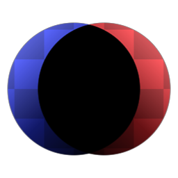

# Densité linéaire +

<table>
<tr style="border: 0;">
<td width="33.33%" style="border: 0;" valign="top">

{width="128px"}

<b>Entrée :</b> Filtres > Fusion

</td>
<td width="100.00%" style="border: 0;" valign="top">

## Description

Effectue une fusion Linear burn. La formule mathématique est Premier plan + Arrière-plan - 1.

</td>
</tr>
</table>

## Entrées

|  |  |
|:---|:---|
| <b>Premier plan</b> <i>Entrée couleur</i> |  |
| <b>Arrière-plan</b> <i>Entrée couleur</i> |  |
| <b>Masquer</b> <i>Entrée en niveaux de gris</i> | Emplacement de masque utilisé pour masquer les effets du nœud. |

## Paramètres

|  |  |
|:---|:---|
| <b>Opacité</b> <i>0.0 - 1.0</i> | Opacité de fusion entre le premier plan et l’arrière-plan. |
| <b>Simulation de transparence</b> <i>Faux/Vrai</i> | Active/désactive la fusion des couches alpha Premier plan et Arrière-plan. Si cette option est définie sur False, la couche alpha du premier plan est ignorée. |
