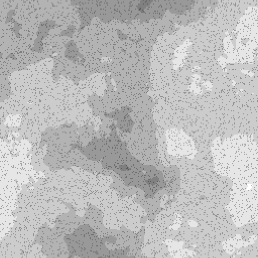

# Filtre médian en niveaux de gris

<table>
<tr style="border: 0;">
<td width="33.33%" style="border: 0;" valign="top">

<b>Entrée :</b> Filtres > Flous

</td>
<td width="100.00%" style="border: 0;" valign="top">

## Description

Ce filtre lisse le bruit d’une image tout en préservant les contours.

Pour chaque pixel, le nœud calcule une valeur de niveaux de gris en fonction de la valeur médiane des voisins du pixel.

</td>
</tr>
</table>

>[!NOTE]
>
> Voir aussi [Couleur de filtre médiane](../../../../../../compositing-graphs/nodes-reference-for-com/node-library/filters/blurs/median-filter-color/median-filter-color.md).

## Entrées

|  |  |
|:---|:---|
| <b>Entrée</b> <i>Niveaux de gris</i> | Image en niveaux de gris à laquelle appliquer le filtre. |

## Sorties

|  |  |
|:---|:---|
| <b>Sortie</b> <i>Niveaux de gris</i> | Image en niveaux de gris calculée par application du filtre à l&#39;image en niveaux de gris d&#39;entrée. |

## Paramètres

|  |  |
|:---|:---|
| <b>Taille du noyau</b> *Entier* | Un noyau est un groupe spécifique de valeurs utilisées dans les calculs d’un filtre. Dans ce contexte, ce sont les valeurs des pixels voisins.  Pour chaque pixel, le filtre prend tous les voisins autour de ce pixel dans un noyau carré et calcule la valeur médiane de tous les voisins.  Ce paramètre contrôle la taille de ce noyau carré, en pixels. Un noyau plus grand produit un effet de lissage plus fort et d&#39;une plus grande portée au prix d&#39;un certain niveau de détail.  *- 3x3:* un noyau de 3 pixels de large et 3 pixels de haut, totalisant 8 pixels voisins. *- 5x5:* un noyau de 5 pixels de large et 5 pixels de haut, totalisant 24 pixels voisins. |
| <b>Type de filtre</b> *Entier* | Calcul appliqué aux voisins échantillonnés dans le noyau.  *- Médiane :* Utilisez directement la valeur médiane de tous les voisins. *- MLMAD :* signifie &#39;Médiane de l&#39;écart absolu le moins médian&#39;. L&#39;écart tient compte de la différence d&#39;une valeur par rapport à la médiane. Au lieu d&#39;utiliser directement la valeur médiane qui peut être inclinée par un pixel aberrant avec un écart élevé, la méthode MLMAD utilise la médiane de tous les écarts. Cette méthode produit un effet de lissage plus intense qui peut aplatir les zones en fonction de la taille du noyau. |

## Exemples

<table>
  <tr>
    <td>
      
       <i>Avant</i>
    </td>
    <td>
      
       <i>Après</i>
    </td>
  </tr>
</table>

<table>
  <tr>
    <td>
      
       <i>Avant</i>
    </td>
    <td>
      
       <i>Après</i>
    </td>
  </tr>
</table>

<table>
  <tr>
    <td>
      
       <i>Avant</i>
    </td>
    <td>
      
       <i>Après</i>
    </td>
  </tr>
</table>
