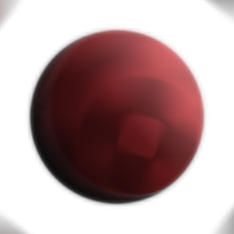

# Flou radial

<table>
<tr style="border: 0;">
<td style="border: 0;" valign="top">

## Flou radial (niveaux de gris)

**Entrée :** *Filtres/Flous*

**Simple**

</td>
<td style="border: 0;" valign="top">

## Description

Génère un flou de type mouvement rotatif sur une entrée.

## Paramètres

* **Échantillons** : *1 - 128* Définissez la qualité de l&#39;effet de flou.
* **Angle** : *0,0 - 0,5* Définissez la quantité de « rotation » de l&#39;effet.
* **Position centrale** :\
  Définissez le point central de l’effet.

## Exemples d’images

</td>
</tr>
</table>
