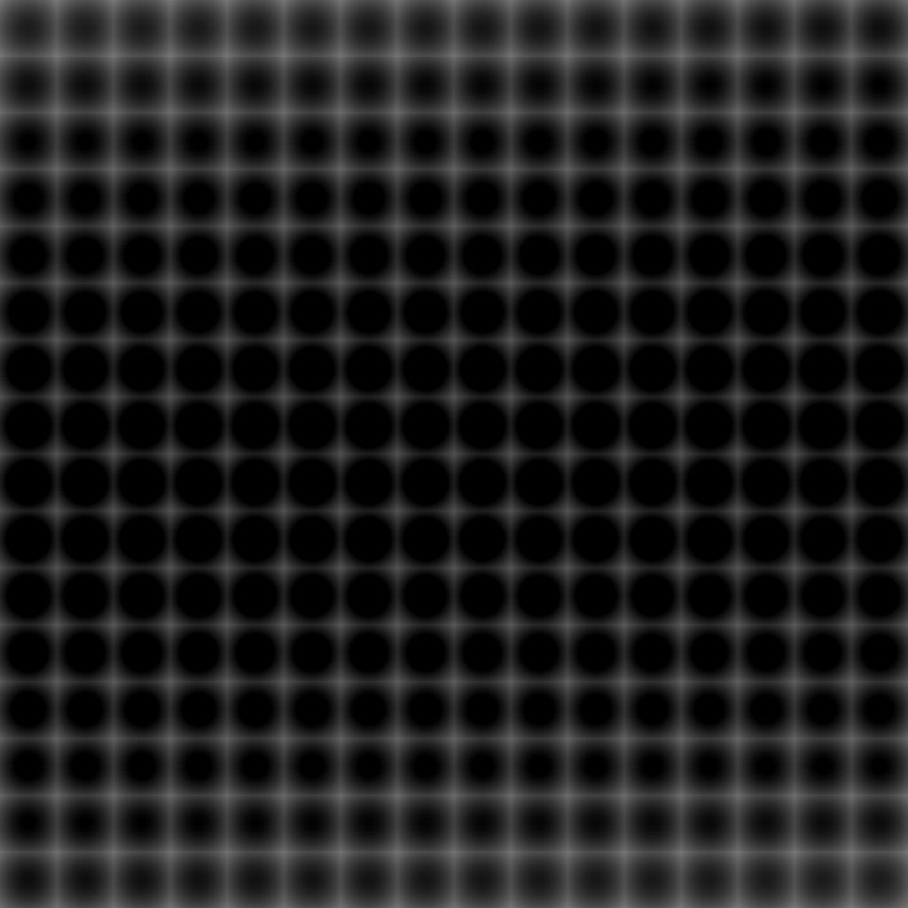

# SDF de texture 3D

<table>
<tr style="border: 0;">
<td width="41.60%" style="border: 0;" valign="top">

{width="200px"}

**Entrée :** *Filtre/Effet*

**Simple**

</td>
<td width="58.30%" style="border: 0;" valign="top">

## Description

Le nœud **3D Texture SDF** génère le *champ de distance signé* d&#39;une forme à partir du masque de *texture 3D* de l&#39;**entrée** représentant les tranches du *volume* de la forme.

</td>
</tr>
</table>

## Paramètres

### Entrées

* **Entrée de masque** *Niveaux de gris*\
  Le masque de *texture 3D* représentant les tranches du *volume* d&#39;une forme.

### Paramètres

* **Seuil** *Flottant*\
  Lorsque le volume de forme est décrit par un *dégradé de fondu*, définit la valeur de dégradé à laquelle la *surface* de la forme est *détectée*.
* **Sortie** *Entier*\
  Type de champ de distance qui doit être généré :
  * *Champ distance* : génère un champ distance décrivant les distances *à l&#39;extérieur* de la forme.
  * *Champ de distance signée* : génère un champ de distance décrivant les distances *à l&#39;extérieur* (positives) et *à l&#39;intérieur* (négatives) de la forme.

## Exemples d’images

<table>
<tr style="border: 0;">
<td style="border: 0;" valign="top">

{width="256px"}

</td>
<td style="border: 0;" valign="top">

{width="256px"}

</td>
<td style="border: 0;" valign="top">

{width="256px"}

</td>
</tr>
</table>
