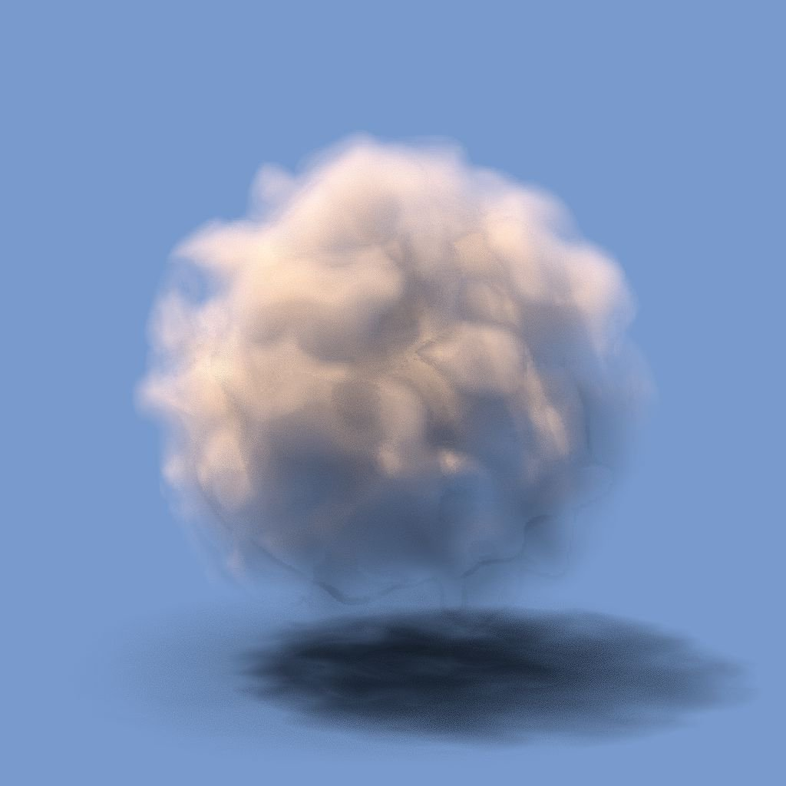
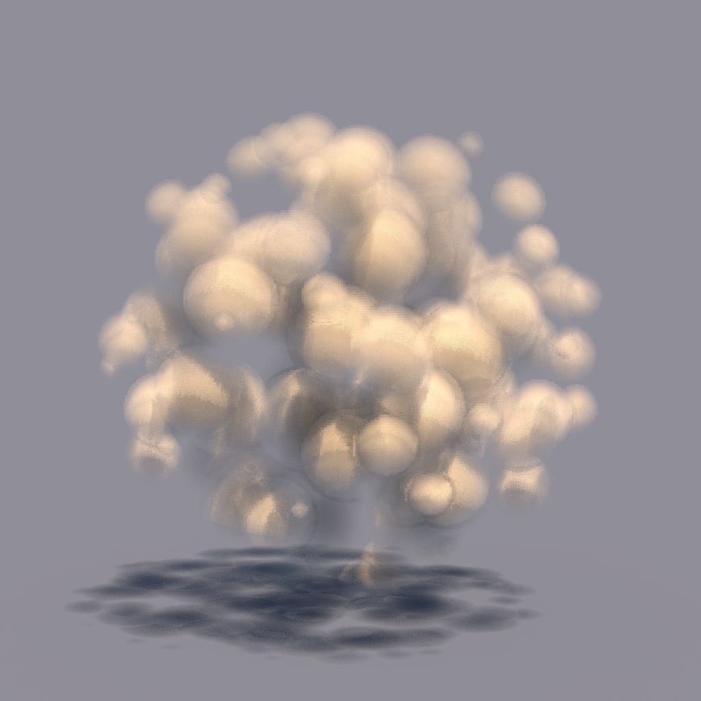

# Rendu du volume de texture 3D

<table>
<tr style="border: 0;">
<td width="33.33%" style="border: 0;" valign="top">

{width="200px"}

<b>Entrée :</b> Filtre > Effet

</td>
<td width="100.00%" style="border: 0;" valign="top">

## Description

Le nœud **Rendu du volume de texture 3D** effectue le rendu du volume d&#39;une forme décrite par une *texture 3D*, en utilisant son *champ de distance signé* correspondant à partir de l&#39;entrée d&#39;image **3D Champ de distance signée**.

Le volume est représenté dans les limites d&#39;un *cube unitaire*. L&#39;éclairage est calculé à l&#39;aide d&#39;une *lumière directionnelle* et d&#39;une *lucarne hémisphérique*.

>[!NOTE]
>
> Le champ de distance signé devrait être une texture **4096x4096** décrivant la forme avec une grille **16x16** de 256 tranches.\
> Vous pouvez utiliser le nœud [3D Texture SDF](../../../../../../compositing-graphs/nodes-reference-for-com/node-library/filters/effects/3d-texture-sdf/3d-texture-sdf.md) pour calculer le champ de distance signé pour une texture 3D de 256 tranches.

</td>
</tr>
</table>

## Entrées

|  |  |
|:---|:---|
| <b>Champ de distance signée 3D</b> <i>Niveaux de gris</i> | Image 4 096 x 4 096 représentant les 256 <i>tranches</i> du champ de distance signé</i> d&#39;une forme, organisées dans une grille 16 x 16.<i> Vous pouvez utiliser le nœud [3D Texture SDF](../../../../../../compositing-graphs/nodes-reference-for-com/node-library/filters/effects/3d-texture-sdf/3d-texture-sdf.md) pour calculer le champ de distance signé pour une texture 3D de 256 tranches. |
| <b>Densité</b> <i>Niveaux de gris</i> | Image 4 096 x 4 096 représentant les 256 <i>tranches</i> de la <i>densité</i> d&#39;une forme, disposées dans une grille 16 x 16. La densité est mappée à l&#39;aide de valeurs de niveaux de gris comprises entre 0 (entièrement transparent) et 1 (entièrement opaque). Vous pouvez utiliser des [masques de volume 3D](../../../../../../compositing-graphs/nodes-reference-for-com/node-library/texture-generators/patterns/3d-volume-mask/3d-volume-mask.md) ou des nœuds de bruit 3D ([Bruit Perlin 3D](../../../../../../compositing-graphs/nodes-reference-for-com/node-library/texture-generators/noises/3d-perlin-noise/3d-perlin-noise.md), [Voronoï 3D](../../../../../../compositing-graphs/nodes-reference-for-com/node-library/texture-generators/noises/3d-voronoi/3d-voronoi.md), [Bruit Fractal 3D à arêtes](../../../../../../compositing-graphs/nodes-reference-for-com/node-library/texture-generators/noises/3d-ridged-noise-fractal/3d-ridged-noise-fractal.md), etc.), associés à un nœud [Position de Texture 3D](../../../../../../compositing-graphs/nodes-reference-for-com/node-library/filters/effects/3d-texture-position/3d-texture-position.md) comme entrée de position, pour générer un masque de volume sous la forme d&#39;une texture 3D de 256 tranches. |

## Paramètres

|  |  |
|:---|:---|
| <b>Résolution de sortie</b> <i>Entier2</i> | Résolution de l&#39;image de sortie en <b>X</b> et <b>Y</b>, exprimée comme une <i>puissance de deux</i>. |
| <b>Position de la Caméra</b> <i>Float2</i> | Position de la caméra autour de la forme. Lorsque le nœud est sélectionné, vous pouvez utiliser le widget de position dans la <b>vue 2D</b> pour <i>orbite</i> de la caméra. |
| <b>Position claire</b> <i>Float2</i> | Position de la <i>lumière directionnelle</i> autour de la forme. Lorsque le nœud est sélectionné, vous pouvez utiliser le widget de position dans la <b>vue 2D</b> pour <i>orbite</i> la source lumineuse. |
| <b>Distance De Caméra</b> <i>Flotter</i> | Distance entre la caméra et la forme. |
| <b>Caméra FOV</b> <i>Flotter</i> | Champ de vision de l&#39;appareil photo en <i>degrés</i>. |
| <b>Absorption</b> <i>Flotter</i> | Règle la quantité de lumière absorbée lorsqu&#39;elle passe <i>à</i> dans le volume. |
| <b>Contour progressif</b> <i>Flotter</i> | Multiplie la valeur fournie par l&#39;entrée <b>Densité</b> avec la valeur de champ de distance <i>interne</i>. Cela ajuste efficacement la largeur du <i>dégradé de fondu</i> à partir de la limite extérieure du volume vers l&#39;intérieur. |
| <b>Mode Couleur Claire</b> <i>Nombre entier</i> | Définit la méthode d&#39;acquisition de la couleur de la lumière directionnelle : - <i>Température (Kelvin)</i> : la couleur résulte de la température de la lumière, où une valeur <i>inférieure</i> entraîne une couleur <i>plus chaude</i> - <i>RGB</i> : définissez la couleur à l&#39;aide des valeurs RGB |
| <b>Température de la lumière (Kelvin)</b> <i>Flotter</i> | Température de la lumière directionnelle, qui affecte sa <i>couleur</i>. Une valeur <i>inférieure</i> entraîne une couleur <i>plus chaude</i>. Valeurs utiles : 1800 K - Bougie 2800 K - Ampoule incandescente 5500 K - Lumière du jour 6200 K - Blanc naturel 7000 K - Ciel couvert <i>Remarque</i> : ce paramètre n’est disponible que lorsque le paramètre <b>Mode de couleur de la lumière</b> est défini sur <i>Température (Kelvin)</i>. |
| <b>Couleur claire</b> <i>Float3</i> | Couleur de la lumière directionnelle. <i>Remarque</i> : ce paramètre n&#39;est disponible que lorsque le paramètre <b>Mode de couleur de la lumière</b> est défini sur <i>Couleur RGB</i>. |
| <b>Intensité de la lumière</b> <i>Flotter</i> | Intensité de la lumière directionnelle. |
| <b>Couleur ambiante</b> <i>Float3</i> | Couleur de la lucarne ambiante. |
| <b>Intensité ambiante</b> <i>Flotter</i> | Intensité de la lucarne ambiante. |
| <b>Albédo</b> <i>Float3</i> | Couleur albédo du volume. |
| <b>Mode Arrière-plan</b> <i>Nombre entier</i> | Méthode d&#39;ombrage de l&#39;arrière-plan de la scène rendue, en fonction de la <b>couleur d&#39;arrière-plan</b> : -<i>ombrée</i> : la couleur est affectée par la <i>couleur</i> et l&#39;<i>intensité</i> -<i>couleur constante</i> de la lumière directionnelle : la couleur est appliquée uniformément <i>quelle que soit</i> la lumière directionnelle |
| <b>Couleur d&#39;arrière-plan</b> <i>Float4</i> | Couleur utilisée pour remplir l’arrière-plan de la scène rendue. |
| <b>Tramage</b> <i>Flotter</i> | Règle l&#39;intensité du <i>tramage du bruit bleu</i> utilisé pour lisser l&#39;ombrage. |
| <b>Activer le plan de Sol</b> <i>Booléen</i> | Lorsque la valeur <i>True</i> est appliquée, elle rend un plan au sol <i>infini</i>. Le <i>cube unitaire</i> entourant la forme repose sur ce plan. |
| <b>Plan Infini</b> <i>Booléen</i> | Définit le plan du sol sur <i>s&#39;étendre à l&#39;infini</i> jusqu&#39;à l&#39;horizon. <i>Remarque</i> : ce paramètre n&#39;est disponible que lorsque le paramètre <b>Activer le plan du Sol</b> est défini sur <i>Vrai</i>. |
| <b>Taille du plan du Sol</b> <i>Float2</i> | Ajuste la taille du plan du sol. <i>Remarque</i> : ce paramètre n&#39;est disponible que lorsque le paramètre <b>Activer le plan du Sol</b> est défini sur <i>Vrai</i> et le paramètre <b>Plan infini</b> sur <i>Faux</i>. |

## Exemples

<table style="margin-top: 32px; margin-bottom: 32px">
    <tr style="border: 0">
        <td style="border: 0; background: transparent">
            
        </td>
        <td style="border: 0; background: transparent">
            
        </td>
        <td style="border: 0; background: transparent">
            
        </td>
        <td style="border: 0; background: transparent">
            
        </td>
        <td style="border: 0; background: transparent">
            
        </td>
        <td style="border: 0; background: transparent">
            
        </td>
    </tr>
</table>
