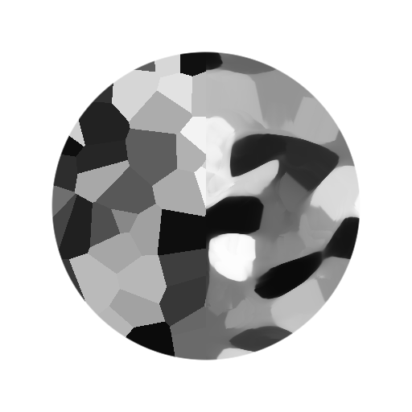
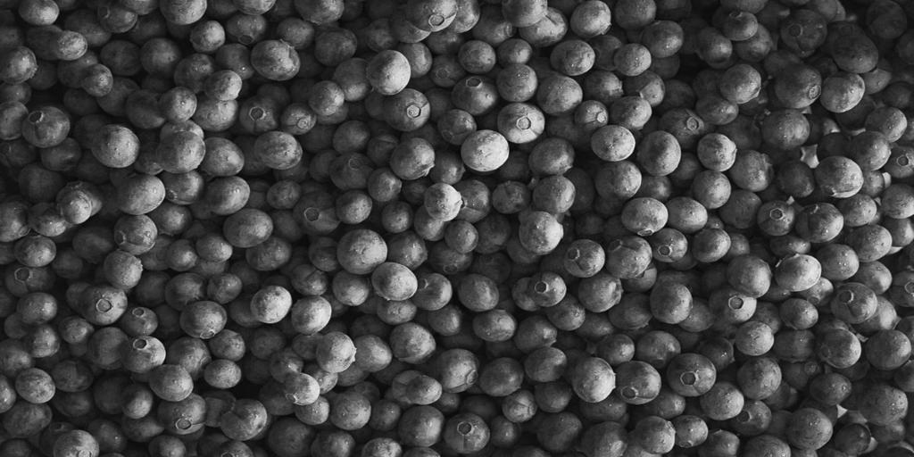
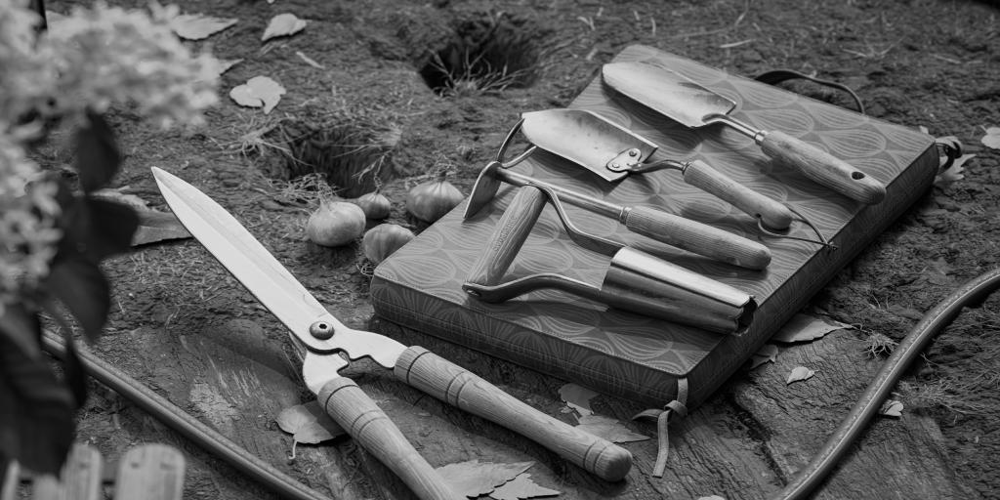

# Nuances de gris anisotropes de Kuwahara

<table>
<tr style="border: 0;">
<td width="33.33%" style="border: 0;" valign="top">

Icône {width="200px"}

<b>Entrée :</b> Filtres > Effets

</td>
<td width="100.00%" style="border: 0;" valign="top">

## Description

Applique un flou directionnel anisotrope conforme aux détails de l’image. Le résultat est une image qui semble *s&#39;écouler* dans la direction des formes qu&#39;elle contient.

Ce flou réglable calcule ou reçoit une *map direction* pour déterminer ce flux, qui peut être accentué pour former des zones plus plates et plus clairement définies.

Voir aussi : [Couleur kuwahara anisotrope](../anisotropic-kuwahara/anisotropic-kuwahara.md)

</td>
</tr>
</table>

L&#39;écoulement peut également être rompu par rotation de la direction dans laquelle le flou est appliqué. De même, une map direction personnalisée peut être utilisée pour remplacer celle calculée à partir de l’image.

Ce filtre peut produire un effet pictural et est utile pour la stylisation.

+++ Anisotropie

L&#39;intensité du flux est principalement contrôlée par le paramètre [Anisotropie](#parameters), comme le montre l&#39;image ci-dessous.

Gauche : Anisotropie 0,0 / Droite : Anisotropie 1,0

<table>
<tr style="border: 0;">
<td style="border: 0;" valign="top">

{zoomable="yes"}

</td>
<td style="border: 0;" valign="top">

{zoomable="yes"}

</td>
</tr>
</table>

+++

## Entrées

|                                                       |                                                                                                                                                                                                                                                                                                                         |
|-------------------------------------------------------|-------------------------------------------------------------------------------------------------------------------------------------------------------------------------------------------------------------------------------------------------------------------------------------------------------------------------|
| <b>Entrée</b> <i>Niveaux de gris</i> <code>PRINCIPAL</code> | Image en niveaux de gris à traiter. |
| <b>Mappage de l&#39;angle d&#39;Anisotropie</b> <i>Niveaux de gris</i> | Image en niveaux de gris décrivant la rotation supplémentaire appliquée à la direction calculée, où la valeur de niveaux de gris correspond à un nombre de tours.   Le mappage a toujours un effet lorsque le paramètre « Anisotropie » est défini sur 0, car il affecte la rotation du noyau utilisé par le filtre Kuwahara. |
| <b>feuille de Pente</b> <i>Niveaux de gris</i> | Mappage représentant les pentes auxquelles la map direction est conforme, en fonction de la valeur du paramètre Multiplicateur d&#39;entrée de mappage de Pente. |
| <b>Mappage de rayon (facultatif)</b> <i>Niveaux de gris</i> | Une fois connecté, le « rayon » de flou est multiplié par rapport à l’image d’entrée. |
| <b>Map direction</b> <i>Couleur</i> | Carte décrivant la direction utilisée par le noyau du filtre anisotrope.   Le mappage a toujours un effet lorsque le paramètre « Anisotropie » est défini sur 0, car il affecte la rotation du noyau utilisé par le filtre Kuwahara.   Remarque : cette entrée est utilisée uniquement lorsque le paramètre « Utiliser la Map direction d’entrée » est défini sur « Vrai ». |

## Sorties

|                                   |                                                                                                                                                                                                                                      |
|-----------------------------------|--------------------------------------------------------------------------------------------------------------------------------------------------------------------------------------------------------------------------------------|
| <b>Sortie</b> <i>Niveaux de gris</i> | Résultat du flou anisotrope appliqué par le nœud sur l’image d’entrée. |
| <b>Map direction</b> <i>Couleur</i> | Map direction calculée à partir de l’image d’entrée et utilisée pour appliquer le flou anisotrope.   Si le paramètre « Utiliser la Map direction d’entrée » est défini sur « Vrai », l’image fournie à l’entrée « Map direction » est utilisée et la sortie telle quelle. |

## Paramètres

|                                                                                                                              |                                                                                                                                                                                                                                                                               |
|------------------------------------------------------------------------------------------------------------------------------|-------------------------------------------------------------------------------------------------------------------------------------------------------------------------------------------------------------------------------------------------------------------------------|
| <b>Rayon</b> <i>Flotter</i> | Le rayon d’atténuation, où une valeur plus élevée produit un effet d’atténuation plus intense.   La valeur maximale est 32. |
| <b>Smoothness</b> <i>Flotter</i> | Règle la quantité de fusion des couleurs dans la direction calculée.   Lorsque cette valeur est définie sur 0, les couleurs sont principalement déplacées dans cette direction et il se produit très peu de fusion. |
| <b>Netteté</b> <i>Flotter</i> | Augmente le contraste des zones floues, les rendant plus plates et plus clairement définies. |
| <b>Anisotropie</b> <i>Flotter</i> | Ajuste la contribution de la map direction dans le flou.   La map direction et tous ses modificateurs (à la fois les paramètres et les cartes d&#39;entrée) ont toujours un effet lorsque cette valeur de paramètre est 0, car la map direction est utilisée dans le noyau de filtre Kuwahara. |
| <b>Utiliser la map direction d&#39;entrée</b> <i>Booléen</i> | Lorsque la valeur est True, aucune map direction n&#39;est calculée à partir de l&#39;image d&#39;entrée et l&#39;image connectée à l&#39;entrée Map direction est utilisée pour appliquer le flou anisotrope à la place. |
| <b>smoothness de capteur</b> <i>Flottant</i>  <i>Disponible lorsque &#39;Utiliser la map direction d&#39;entrée&#39; est défini sur &#39;False&#39;</i> | Règle l’intensité du flou appliquée aux directions calculées à partir de l’image et stockées dans la map direction.   L’augmentation de cette valeur garantit un résultat plus lisse lorsque l’image présente de nombreux détails de hautes fréquences. |
| <b>Angle d&#39;Anisotropie</b> <i>Flottant</i>  <i>Disponible lorsque &#39;Utiliser la map direction d&#39;entrée&#39; est défini sur &#39;False&#39;</i> | Permet d’ajouter une rotation à la map direction, en nombre de tours.   Cette rotation supplémentaire est *cumulative* avec celle spécifiée par l&#39;entrée « Courbe d&#39;angle d&#39;Anisotropie ». |
| <b>Multiplicateur de courbe d&#39;angle d&#39;Anisotropie</b> <i>Flottant</i>  <i>Disponible lorsque &#39;Utiliser la map direction d&#39;entrée&#39; est défini sur &#39;False&#39;</i> | Règle l’intensité des valeurs de l’entrée Courbe d’angle de l’Anisotropie, qui sont ensuite ajoutées au-dessus de la rotation appliquée à la map direction, en nombre de tours.   Cette rotation supplémentaire est *cumulative* avec celle spécifiée par le paramètre « Angle d&#39;Anisotropie ». |
| <b>multiplicateur d&#39;entrée de mappage de Pente</b> <i>Flottant</i>  <i>Disponible lorsque &#39;Utiliser la map direction d&#39;entrée&#39; est défini sur &#39;False&#39;</i> | Règle l’intensité d’uniformisation de la map direction par rapport aux pentes fournies par l’entrée « Pente ». |

## Exemples

<table>
  <tr>
    <td>
      
       <i>Avant</i>
    </td>
    <td>
      
       <i>Après</i>
    </td>
  </tr>
</table>

<table>
  <tr>
    <td>
      
       <i>Avant</i>
    </td>
    <td>
      
       <i>Après</i>
    </td>
  </tr>
</table>

<table>
  <tr>
    <td>
      
       <i>Avant</i>
    </td>
    <td>
      
       <i>Après</i>
    </td>
  </tr>
</table>
