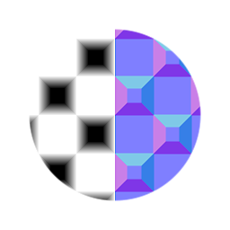

# Biseau (nœud de filtre)

<table>
<tr style="border: 0;">
<td width="33.33%" style="border: 0;" valign="top">

{width="128px"}

<b>Entrée :</b> Filtres > Effets

</td>
<td width="100.00%" style="border: 0;" valign="top">

## Description

Applique un effet de biseautage des bords à une image en hauteur en niveaux de gris en entrée. Renvoie la valeur Heightmap biseautée et la valeur Normalmap en fonction de cette valeur Heightmap.

Il s’agit d’un nœud utile pour appliquer des profils de courbe exacts sur une carte de hauteur de base binaire (noir/blanc à fort contraste).

</td>
</tr>
</table>

## Entrées

|  |  |
|:---|:---|
| <b>entrée</b> <i>Entrée en niveaux de gris</i> | Mappage de hauteur à convertir. |
| <b>Courbe personnalisée</b> <i>Entrée en niveaux de gris</i> | Dégradé qui détermine la courbe/pente exacte. Idéalement, il s&#39;agit d&#39;un nœud linéaire en dégradé, sur lequel vous pouvez effectuer tout type de réglage tel que les [niveaux](../../../../../../compositing-graphs/nodes-reference-for-com/atomic-nodes/levels/levels.md) ou les [courbes](../../../../../../compositing-graphs/nodes-reference-for-com/atomic-nodes/curve/curve.md). Cette option est uniquement active lorsque l’option « Utiliser la courbe personnalisée » a la valeur True. |

## Paramètres

|  |  |
|:---|:---|
| <b>Distance</b> <i>-1.0 - 1.0</i> | Étendue de l’effet de biseau. |
| <b>Type d&#39;angle</b> <i>Arrondi, Angular</i> | Indique si le profil en biseau doit être arrondi ou droit. |
| <b>Lissage</b> <i>0.0 - 5.0</i> | Niveau de lissage supplémentaire (flou) à appliquer après le biseau. |
| <b>Utiliser un flou non uniforme</b> <i>Faux/Vrai</i> | Indique si le lissage doit être effectué de manière non uniforme. |
| <b>Utiliser la courbe personnalisée</b> <i>Faux/Vrai</i> | Active/désactive l&#39;utilisation de votre propre courbe d&#39;height personnalisée. Voir ci-dessus pour plus d’informations. |
| <b>Intensité normale</b> <i>0.0 - 50.0</i> | Intensité de la carte de normales générée. |
| <b>Format normal</b> <i>DirectX, OpenGL</i> | Basculer entre différents formats de mappage normal (inverse la couche verte). |

## Exemples

<table style="margin-top: 32px; margin-bottom: 32px">
    <tr style="border: 0">
        <td style="border: 0; background: transparent">
            
        </td>
    </tr>
</table>
