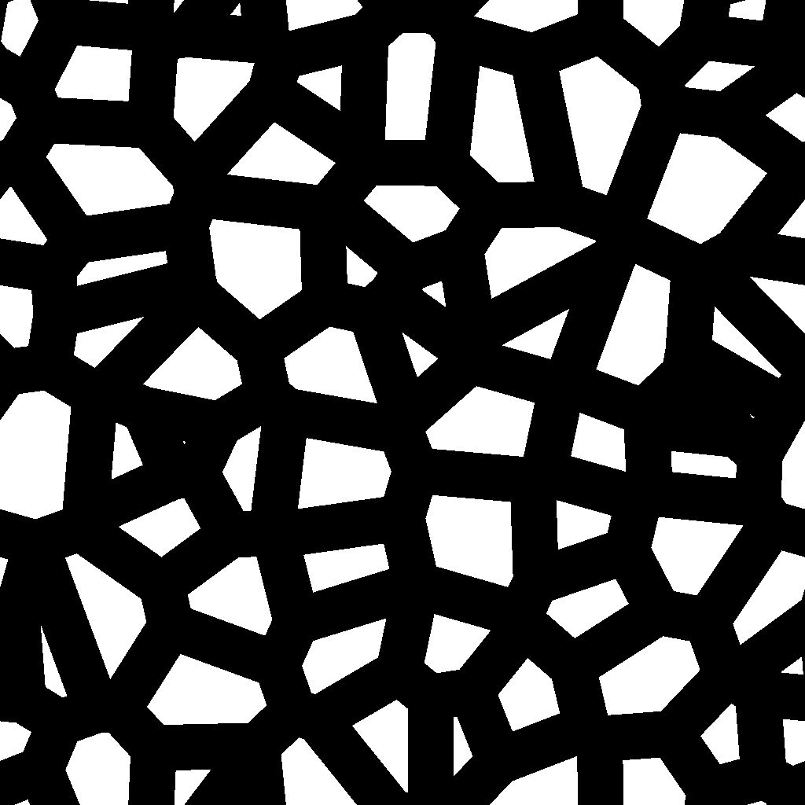
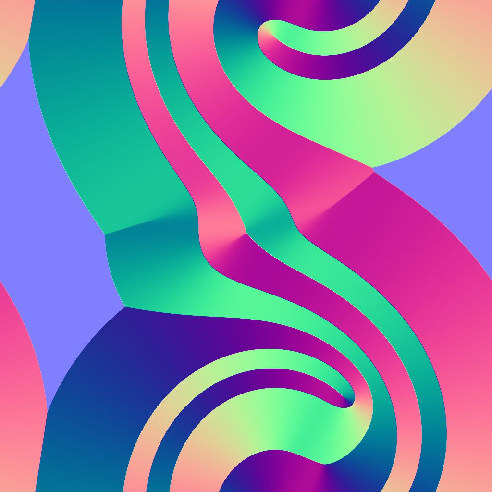
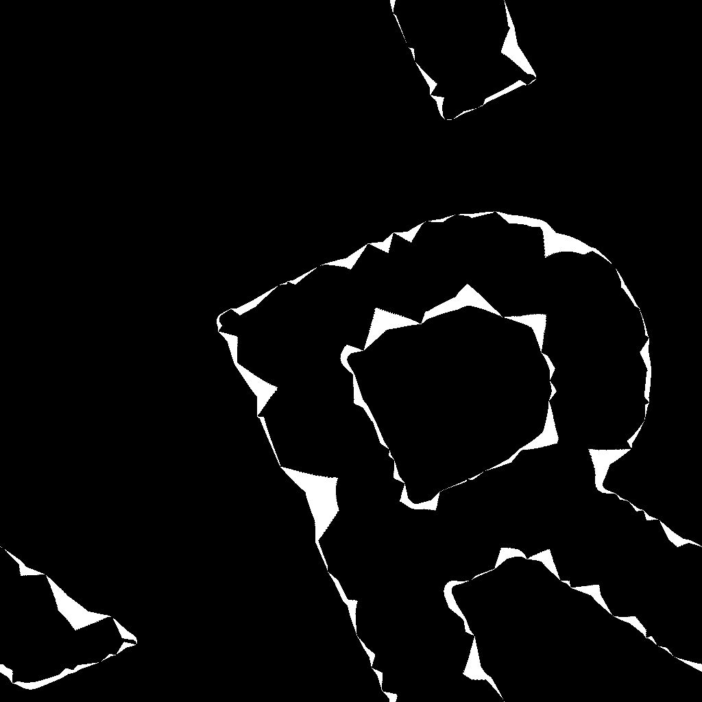

# Bevel smooth

<table>
<tr style="border: 0;">
<td width="33.33%" style="border: 0;" valign="top">

Icône {width="200px"}

<b>Entrée :</b> Filtres > Effets

</td>
<td width="100.00%" style="border: 0;" valign="top">

## Description

Trace un dégradé ou une couleur plate à partir des bordures d’un masque vers l’extérieur, l’intérieur ou les deux.

Les dégradés qui se chevauchent sont triés par distance normalisée inversée afin de tracer la distance par rapport à la bordure la plus proche.

La distance du dégradé peut être ajustée dynamiquement le long de la bordure à l’aide d’une map distance.

</td>
</tr>
</table>

>[!TIP]
>
> Le nœud [Directional distance](../../../../../../compositing-graphs/nodes-reference-for-com/node-library/filters/effects/directional-distance/directional-distance.md) offre des fonctionnalités similaires, où la dilatation est effectuée dans une direction spécifique.

## Entrées

|  |  |
|:---|:---|
| <b>Entrée de masque</b> <i>Niveaux de gris</i> PRINCIPAUX | Image à partir de laquelle extraire le masque.   Toutes les valeurs supérieures à la valeur « Seuil du masque » sont blanches dans ce masque. |
| <b>Entrée source</b> <i>Niveaux de gris</i> | Entrée facultative utilisée uniquement lorsque le paramètre « Mode de sortie » est défini sur « Dilatation ».   Dans ce cas, l’image est incrustée sur les zones blanches du masque et les valeurs de niveaux de gris des bordures sont dilatées. |
| <b>Map distance</b> <i>Niveaux de gris</i> | Entrée facultative utilisée lorsque la valeur du paramètre Multiplicateur de Map distance est supérieure à 0.   Il est utilisé pour ajuster la distance de biseautage/dilatation le long des bordures du masque, où une valeur plus sombre réduit la distance. |

## Sorties

|  |  |
|:---|:---|
| <b>Sortie</b> <i>Niveaux de gris</i> | Image du résultat, en fonction du « Mode de sortie » sélectionné. |
| <b>UV</b> <i>Couleur</i> | Carte UV dans laquelle les UV sont dilatés le long des bordures du masque.   Vous pouvez le connecter à un nœud [mappeur UV](../../../../../../compositing-graphs/nodes-reference-for-com/node-library/spline-paths-tools/spline-tools/uv-mapper-color/uv-mapper-color.md) pour mapper n&#39;importe quelle autre image à l&#39;aide de ces UV dilatés. |

## Paramètres

|  |  |
|:---|:---|
| <b>Mode de sortie</b> *Nombre entier* | Méthode de dilatation des bordures du masque :<ul data-preserve-html="true"> <li data-preserve-html="true"><b>Biseau :</b> dessinez un dégradé de 1 à 0, où 0 est atteint à la &#39;distance&#39; maximale</li> <li data-preserve-html="true"><b>Dilatation :</b> dessinez une couleur unie jusqu&#39;à la distance maximale. Cette couleur est le blanc de l’image de couleur « Entrée source » à la bordure du masque, si elle est connectée</li> <li data-preserve-html="true"><b>Distance :</b> distance brute à partir de la bordure de masque la plus proche, dans l&#39;espace d&#39;image normalisé où 1 est la longueur du côté le plus court de l&#39;image</li> </ul> |
| <b>Direction</b> *Nombre entier* *Disponible lorsque le « mode de sortie » est défini sur « Biseau » ou « Dilation »* | Le côté de la bordure du masque qui doit être dilaté :<ul data-preserve-html="true"> <li data-preserve-html="true"><b>Entrée :</b> dessinez vers l&#39;intérieur du masque</li> <li data-preserve-html="true"><b>Sortie :</b> dessinez vers l&#39;extérieur du masque</li> <li data-preserve-html="true"><b>Entrée/Sortie :</b> dessinez vers l&#39;intérieur et l&#39;extérieur du masque</li> </ul> |
| <b>Distance maximale</b> *Flotter* | Distance de dilatation, dans l&#39;espace image normalisé où 1 est la longueur du côté le plus court de l&#39;image d&#39;entrée. |
| <b>Masquer le smoothness</b> *Flotter* | Intensité du lissage appliqué au masque.   La valeur correspond au rayon du flou et 1 unité correspond à 1/256e de l’image. |
| <b>Décalage du masque</b> *Flotter* | Déplace les bordures du masque vers l’intérieur ou vers l’extérieur. |
| <b>Seuil de masque</b> *Flotter* | Valeur utilisée pour détecter les bordures du masque dans l’image « Entrée de masque ».   Les valeurs supérieures à ce seuil correspondent à l&#39;*intérieur* des formes de masque, tandis que les valeurs inférieures correspondent à l&#39;*extérieur*. |
| <b>Échelle</b> *Float2* | Règle les distances horizontale (X) et verticale (Y) de la dilatation.   Ces valeurs sont des multiplicateurs pour la valeur du paramètre Distance maximale. |
| <b>Multiplicateur de Map distance</b> *Nombre entier* | Ajuste l&#39;impact de la « Map distance » sur la « Distance maximale ». |

## Exemples

<table>
<tr style="border: 0;">
<td style="border: 0;" valign="top">

{width="1024px" zoomable="yes"}

</td>
<td style="border: 0;" valign="top">

{width="1024px" zoomable="yes"}

</td>
</tr>
</table>

<table>
<tr style="border: 0;">
<td style="border: 0;" valign="top">

<table>
  <tr>
    <td>
      
       <i>Avant</i>
    </td>
    <td>
      
       <i>Après</i>
    </td>
  </tr>
</table>

</td>
<td style="border: 0;" valign="top">

<table>
  <tr>
    <td>
      
       <i>Avant</i>
    </td>
    <td>
      
       <i>Après</i>
    </td>
  </tr>
</table>

</td>
</tr>
</table>

<table>
<tr style="border: 0;">
<td style="border: 0;" valign="top">

<table>
  <tr>
    <td>
      
       <i>Avant</i>
    </td>
    <td>
      
       <i>Après</i>
    </td>
  </tr>
</table>

</td>
<td style="border: 0;" valign="top">

<table>
  <tr>
    <td>
      
       <i>Avant</i>
    </td>
    <td>
      
       <i>Après</i>
    </td>
  </tr>
</table>

</td>
</tr>
</table>

<table>
  <tr>
    <td>
      
       <i>Avant</i>
    </td>
    <td>
      
       <i>Après</i>
    </td>
  </tr>
</table>
