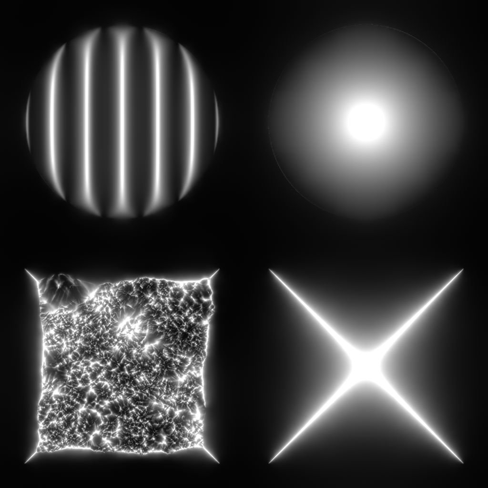

# Lissage de courbure

<table>
<tr style="border: 0;">
<td width="33.33%" style="border: 0;" valign="top">

{width="200px"}

<b>Entrée :</b> Filtres > Effets

</td>
<td width="100.00%" style="border: 0;" valign="top">

## Description

Calcule la courbure d&#39;une surface décrite par une texture normale.

Une courbe map représente les zones concaves et convexes d&#39;une surface.\
Les zones plates sont grises à 50 %. Les zones convexes sont plus claires, tandis que les zones concaves sont plus sombres.

</td>
</tr>
</table>

Les zones concaves et convexes sont également divisées en leurs propres sorties, pour faciliter la sélection ou le masquage des zones en fonction de ces caractéristiques.

>[!TIP]
>
> Pour une version plus nette, consultez la section [Courbure](../../../../../../compositing-graphs/nodes-reference-for-com/node-library/filters/effects/curvature-filter-node/curvature-filter-node.md) ou[Courbure Sobel](../../../../../../compositing-graphs/nodes-reference-for-com/node-library/filters/effects/curvature-sobel/curvature-sobel.md) si vous avez besoin d&#39;autres options.

<table>
<tr style="border: 0;">
<td style="border: 0;" valign="top">

</td>
<td style="border: 0;" valign="top">

### Connecteurs de sortie

</td>
<td style="border: 0;" valign="top">

### Paramètres

</td>
</tr>
</table>

## Connecteurs d’entrée

|  |  |
| --- | --- |
| <b>Normal</b> *Couleur* <b>PRIMAIRE</b> | Carte de normales décrivant la surface dont la courbure doit être calculée. |

## Connecteurs de sortie

|  |  |
| --- | --- |
| <b>Courbure</b> *Niveaux de gris* | Courbure map calculée à partir de la courbe normale map d&#39;entrée.   Les zones plates sont grises à 50 %. Les zones convexes sont plus claires, tandis que les zones concaves sont plus sombres. |
| <b>Convexité</b> *Niveaux de gris* | La carte de convexité est calculée à partir de la carte normale d&#39;entrée.   Plus une zone est convexe, plus elle est lumineuse sur la carte.  Les zones plates ou concaves sont noires. |
| <b>Concavité</b> *Niveaux de gris* | Carte de concavité calculée à partir de la carte normale d&#39;entrée.   Plus une zone est concave, plus elle est lumineuse sur la carte.  Les zones plates ou convexes sont noires. |

## Paramètres

|  |  |
| --- | --- |
| <b>Format normal</b> *Nombre entier* | Format du mappage normal en entrée. Inverse efficacement la couche verte.<ul data-preserve-html="true"> <li data-preserve-html="true"><b>DirectX :</b> l&#39;axe Y pointe vers le haut</li> <li data-preserve-html="true"><b style="">OpenGL :</b> l’axe Y pointe vers le bas</li> </ul> |

## Exemples

<table>
  <tr>
    <td>
      
       <i>Avant</i>
    </td>
    <td>
      
       <i>Après</i>
    </td>
  </tr>
</table>

<table>
<tr style="border: 0;">
<td style="border: 0;" valign="top">

{zoomable="yes"}

</td>
<td style="border: 0;" valign="top">

{zoomable="yes"}

</td>
</tr>
</table>

<table>
  <tr>
    <td>
      
       <i>Avant</i>
    </td>
    <td>
      
       <i>Après</i>
    </td>
  </tr>
</table>

<table>
<tr style="border: 0;">
<td style="border: 0;" valign="top">

{zoomable="yes"}

</td>
<td style="border: 0;" valign="top">

{zoomable="yes"}

</td>
</tr>
</table>
