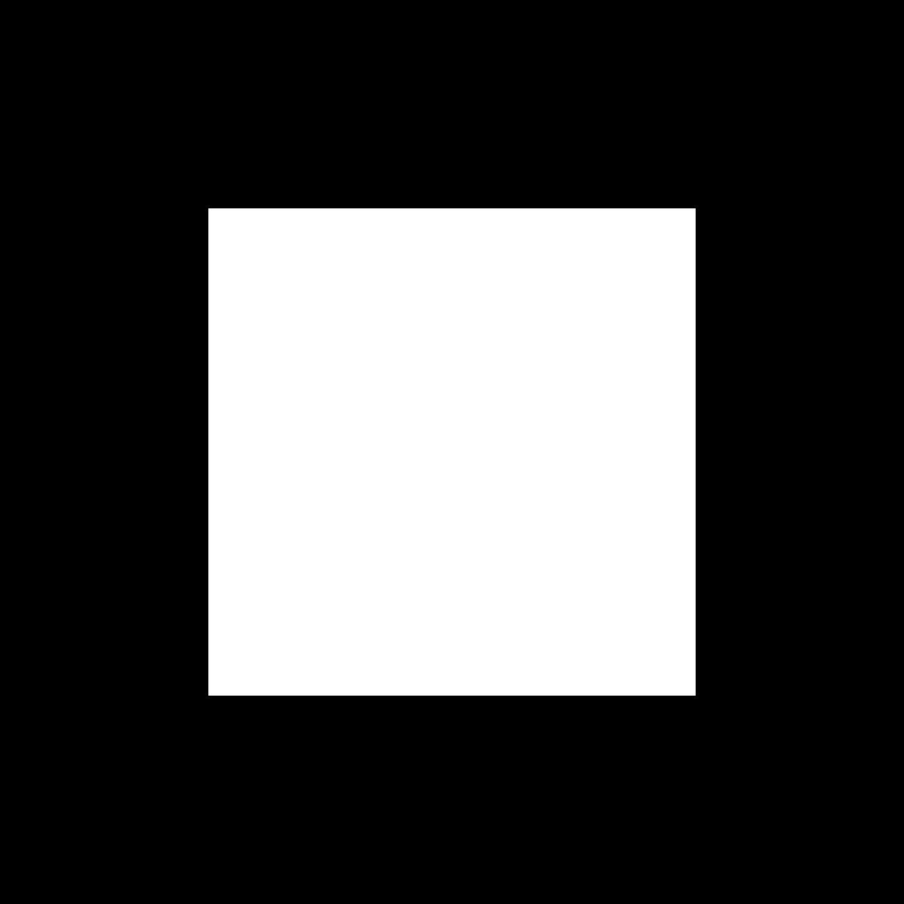

# Diffusion UV

<table>
<tr style="border: 0;">
<td width="41.60%" style="border: 0;" valign="top">

{width="200px"}

**Entrée :** *Filtres/Effets*

**Intermédiaire**

</td>
<td width="58.30%" style="border: 0;" valign="top">

## Description

Appliquez un processus de diffusion aux coordonnées UV dans l&#39;entrée d&#39;image **source** en fonction de l&#39;entrée d&#39;image **masque** fournie, en interpolant les coordonnées entre les valeurs de **source**.

Seuls les UV des pixels correspondant au masque sont diffusés ; les autres pixels ne participent pas au résultat.

Remarque : lorsque la fonction de mosaïque est *activée* (ce qui est le cas par défaut), les coordonnées voisines peuvent être moyennées au-delà de la limite 0/1.

Par exemple, si la valeur de la coordonnée U est de 0,1 sur un pixel et de 0,8 sur un autre, la valeur moyenne sera de 0,95 au lieu de 0,45, car la *juxtaposition des coordonnées est prise*. Cela est indépendant de la position réelle des pixels : les valeurs des coordonnées sont traitées de la même manière sur toute l’image.

Cela peut entraîner des résultats indésirables lors de l&#39;utilisation de ce filtre pour la *déformation de texture*. Si cela se produit, assurez-vous que votre masque définit des « courbes/points de contrôle » espacés de *moitié au maximum de la texture*.

</td>
</tr>
</table>

## Paramètres

* **Itérations** : *0,0 - 64,0* le nombre d&#39;itérations de diffusion à effectuer (plus le nombre est élevé, mieux c&#39;est, mais plus le nombre est lent). Les valeurs utiles sont comprises dans la plage [8, 48].\
  Veuillez noter que si vous ne recherchez pas l&#39;exactitude mathématique, les valeurs faibles sont correctes ou même meilleures.

## Entrées

* **Source** *Couleur*\
  Les UV à diffuser. Veuillez noter que les mosaïques sont traitées de manière spéciale dans ce filtre (voir *Description*).
* **Masque** *Niveaux de gris* Le masque de diffusion : les pixels blancs sont échantillonnés dans *Source* et diffusés dans les pixels noirs. L’image doit être en noir et blanc. Si le masque comprend des dégradés, la valeur de découpe est 0,5.

## Exemples d’images

<table>
<tr style="border: 0;">
<td style="border: 0;" valign="top">

{width="256px"}

</td>
<td style="border: 0;" valign="top">

{width="256px"}

</td>
</tr>
</table>

<table>
<tr style="border: 0;">
<td style="border: 0;" valign="top">

{width="256px"}

</td>
<td style="border: 0;" valign="top">

{width="256px"}

</td>
</tr>
</table>
