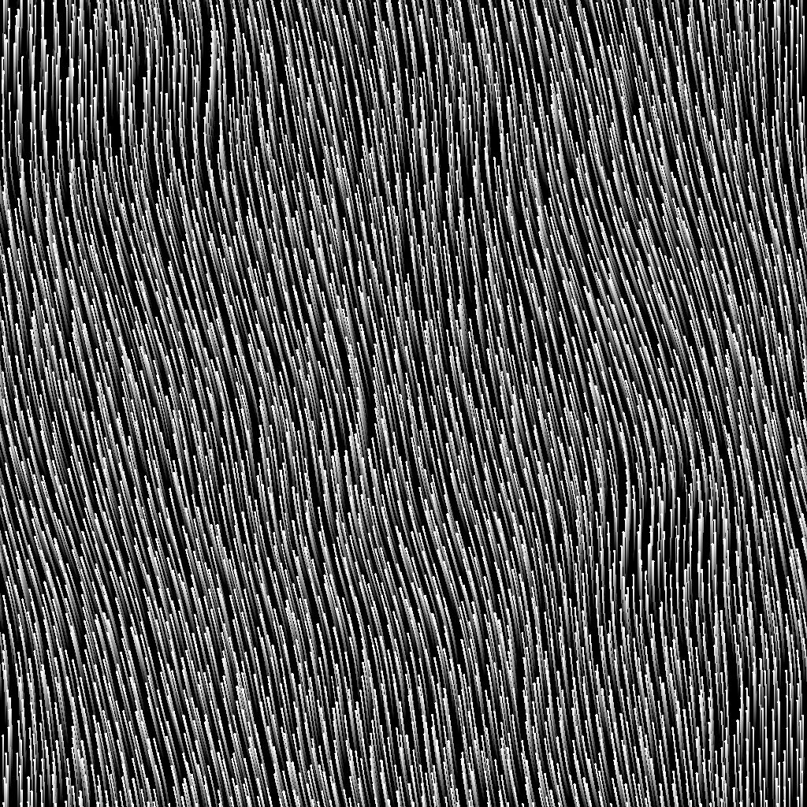

# Directional distance

<table>
<tr style="border: 0;">
<td width="33.33%" style="border: 0;" valign="top">

Icône {width="200px"}

<b>Entrée :</b> Filtres > Effets

</td>
<td width="100.00%" style="border: 0;" valign="top">

## Description

Trace un dégradé de distance à partir des bordures d’un masque dans une direction spécifiée.

Les dégradés qui se chevauchent sont triés par distance normalisée inversée afin de tracer la distance par rapport à la bordure la plus proche.

La distance du dégradé peut être ajustée dynamiquement le long de la bordure à l’aide d’une map distance.

</td>
</tr>
</table>

>[!TIP]
>
> Le nœud [Bevel smooth](../../../../../../compositing-graphs/nodes-reference-for-com/node-library/filters/effects/bevel-smooth/bevel-smooth.md) offre des fonctionnalités similaires, où la dilatation est effectuée dans toutes les directions.

## Entrées

|  |  |
|:---|:---|
| <b>Entrée</b> <i>Niveaux de gris</i> PRINCIPAUX | Image à partir de laquelle extraire le masque.   Toutes les valeurs supérieures à 0,5 sont blanches dans ce masque. |
| <b>Map distance</b> <i>Niveaux de gris</i> | Entrée facultative utilisée lorsque la valeur du paramètre Multiplicateur de Map distance est supérieure à 0.   Il est utilisé pour ajuster la distance de biseautage/dilatation le long des bordures du masque, où une valeur plus sombre réduit la distance. |
| <b>Angle map</b> <i>Niveaux de gris</i> | Entrée facultative utilisée lorsque la valeur du paramètre Multiplicateur d’angle de courbe est supérieure à 0.   Il est utilisé pour ajuster la direction du dégradé de distance en ajoutant sa valeur à l&#39;angle de direction, en nombre de tours.   Le paramètre Décalage de la courbe de référence vous permet de remapper les valeurs en spécifiant la valeur 0. |

## Sorties

|  |  |
|:---|:---|
| <b>Sortie</b> <i>Niveaux de gris</i> | Image du résultat en fonction du « Mode de sortie » sélectionné. |
| <b>UV</b> <i>Couleur</i> | Une image d’UV où les UV sont dilatés par rapport au masque est entourée dans la direction spécifiée.   Vous pouvez le connecter à un nœud [mappeur d&#39;UV](../../../../../../compositing-graphs/nodes-reference-for-com/node-library/spline-paths-tools/spline-tools/uv-mapper-color/uv-mapper-color.md) pour mapper n&#39;importe quelle autre image à l&#39;aide de ces UV dilatés. |

## Paramètres

|  |  |
|:---|:---|
| <b>Mode de sortie</b> *Entier* | Méthode de dessin du dégradé de distance à partir des bordures du masque :<ul data-preserve-html="true"> <li data-preserve-html="true"><b>Distance normalisée inversée :</b> dégradé de 1 à 0 où 0 est atteint à la &#39;Distance maximale&#39;, multiplié par la &#39;Map distance&#39; si elle est connectée</li> <li data-preserve-html="true"><b>Distance :</b> dégradé de valeurs de distance brutes par rapport à la bordure du masque, où 1 correspond à la longueur du côté le plus court de l&#39;image d&#39;entrée</li> </ul> |
| <b>Distance maximale</b> *Flottant* | Distance parcourue par le dégradé de distance, dans l&#39;espace d&#39;image normalisé où 1 est la longueur du côté le plus court de l&#39;image d&#39;entrée. |
| <b>Angle</b> *Flottant* | Direction du dégradé de distance en nombre de tours, où 0 est horizontal et à droite - c&#39;est-à-dire un vecteur (1,0). |
| <b>Multiplicateur de Map distance</b> *Flottant* | Ajuste l&#39;impact de la « Map distance » sur la « Distance maximale ».   Remarque : ce paramètre n’a aucun effet lorsque l’entrée « Map distance » n’est pas connectée. |
| <b>Multiplicateur de courbe d&#39;angle</b> *Flottant* | Ajuste l&#39;impact de la Courbe d&#39;angle sur l&#39;angle. |
| <b>Décalage de la courbe d&#39;angle</b> *Flottant* | Remappe les valeurs de la « Courbe d&#39;angle » en spécifiant la valeur 0 dans cette courbe.   Par exemple, un décalage de 0,5 signifie qu’une valeur de 0,75 correspond à 0,25 tour et une valeur de 0,3 à -0,2 tour. |

## Exemples

<table>
<tr style="border: 0;">
<td style="border: 0;" valign="top">

<table>
  <tr>
    <td>
      
       <i>Avant</i>
    </td>
    <td>
      
       <i>Après</i>
    </td>
  </tr>
</table>

</td>
<td style="border: 0;" valign="top">

<table>
  <tr>
    <td>
      
       <i>Avant</i>
    </td>
    <td>
      
       <i>Après</i>
    </td>
  </tr>
</table>

</td>
</tr>
</table>

<table>
<tr style="border: 0;">
<td style="border: 0;" valign="top">

<table>
  <tr>
    <td>
      
       <i>Avant</i>
    </td>
    <td>
      
       <i>Après</i>
    </td>
  </tr>
</table>

</td>
<td style="border: 0;" valign="top">

<table>
  <tr>
    <td>
      
       <i>Avant</i>
    </td>
    <td>
      
       <i>Après</i>
    </td>
  </tr>
</table>

</td>
</tr>
</table>

<table>
  <tr>
    <td>
      
       <i>Avant</i>
    </td>
    <td>
      
       <i>Après</i>
    </td>
  </tr>
</table>
