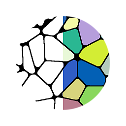

# Flood Fill à Couleur aléatoire

<table>
<tr style="border: 0;">
<td width="33.33%" style="border: 0;" valign="top">

{width="128px"}

<b>Entrée :</b> Filtres > Effets

</td>
<td width="100.00%" style="border: 0;" valign="top">

## Description

Génère des vignettes avec des couleurs de RGB aléatoires à partir d&#39;une base [Flood Fill](../../../../../../compositing-graphs/nodes-reference-for-com/node-library/filters/effects/flood-fill/flood-fill.md). Utile pour ajouter des variantes de couleur aux carreaux.

</td>
</tr>
</table>

## Exemples

<table style="margin-top: 32px; margin-bottom: 32px">
    <tr style="border: 0">
        <td style="border: 0; background: transparent">
            
        </td>
        <td style="border: 0; background: transparent">
            
        </td>
    </tr>
</table>
