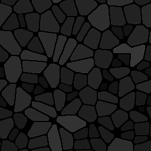

# Flood Fill à la taille de la boîte

<table>
<tr style="border: 0;">
<td style="border: 0;" valign="top">

{width="128px"}

## Flood Fill à la taille de la boîte

**Entrée :** *Filtres/Effets*

**Simple**

</td>
<td style="border: 0;" valign="top">

## Description

Génère un mappage en niveaux de gris à partir d&#39;un [Flood Fill](../../../../../../compositing-graphs/nodes-reference-for-com/node-library/filters/effects/flood-fill/flood-fill.md), avec des valeurs liées à la taille individuelle de chaque vignette.

Les valeurs sont calculées par rapport à la taille totale de la zone de travail (un carreau blanc intégral étire toute la zone de travail). Le contraste est donc souvent faible.

## Paramètres

* **Sortie** : *max(X, Y), X, Y* Définit la mesure sur laquelle la valeur est basée : la largeur, la longueur ou les deux.

## Exemples d’images

| 

 |
| --- |
|  |

</td>
</tr>
</table>
