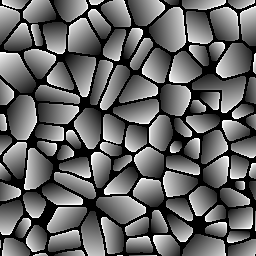

# Flood Fill au dégradé

<table>
<tr style="border: 0;">
<td style="border: 0;" valign="top">

{width="128px"}

## Flood Fill au dégradé

**Entrée :** *Filtres/Effets*

**Simple**

</td>
<td style="border: 0;" valign="top">

## Description

Transforme une base [Flood Fill](../../../../../../compositing-graphs/nodes-reference-for-com/node-library/filters/effects/flood-fill/flood-fill.md) en dégradés (orientés de manière aléatoire). Très utile pour créer une carte de hauteur où les carreaux sont inclinés et inclinés de manière aléatoire.

## Paramètres

### Entrées

* **Flood Fill** : *entrée de couleur* données du Flood Fill de base.
* **Entrée Angle** : *Entrée Niveaux De Gris*\
  Carte facultative pour déterminer l’angle par cellule avec une carte externe.
* **Entrée de Pente** : *Entrée en niveaux de gris* Mappage facultatif pour déterminer l’intensité de la pente du dégradé par cellule.

### *Paramètres*

* **Angle** :*0.0 - 1.0* Définit un angle/une direction uniforme et global pour toutes les mosaïques.
* **Variation d’angle** : *0.0 - 1.0* aléatoire l’angle de chaque carreau individuellement. C&#39;est le paramètre le plus utile et le plus puissant !
* **Multiplier par la taille du cadre de sélection** :*0.0 - 1.0* met à l’échelle l’ensemble de l’effet linéaire en fonction de la taille du cadre de sélection individuel de la vignette. Cela signifie que les carreaux plus petits finiront par être plus sombres que les plus grands.
* **Multiplicateur d&#39;entrée d&#39;image d&#39;angle** : *0.0 - 1.0* Définir l&#39;influence de la carte d&#39;entrée d&#39;angle facultative sur les directions de dégradé générées
* **Multiplicateur d&#39;entrée d&#39;image de Pente** : *0.0 - 1.0*\
  Définir l&#39;influence de la carte d&#39;entrée de Pente facultative sur l&#39;intensité de la pente de dégradé générée.
* **Multiplier par l&#39;intensité de la Pente** : *0,0 - 1,0*
* **Couleur de Pente plate** : *(Valeur de niveaux de gris)*Permet de définir une valeur solide pour les pentes plates.

## Exemples d’images

| 

 | 

 |
| --- | --- |
|  |  |

</td>
</tr>
</table>
