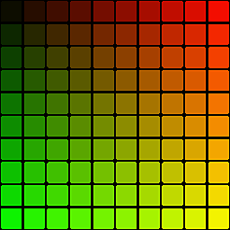

# Flood Fill à la position

<table>
<tr style="border: 0;">
<td style="border: 0;" valign="top">

{width="128px"}

## Flood Fill à la position

**Entrée :** *Filtres/Effets*

**Simple**

</td>
<td style="border: 0;" valign="top">

## Description

Génère un mappage de position par carreau à partir d&#39;une base [Flood Fill](../../../../../../compositing-graphs/nodes-reference-for-com/node-library/filters/effects/flood-fill/flood-fill.md).

La couleur de chaque carreau représente son centre de coordonnées X et Y, stocké dans les couches Rouge et Vert. Cette carte est destinée à servir de base à d&#39;autres calculs, plutôt qu&#39;à une carte prête à l&#39;emploi.

## Paramètres

*Aucun paramètre.*

## Exemples d’images

| 

 | 

 | 

 |
| --- | --- | --- |
|  |  |  |

</td>
</tr>
</table>
