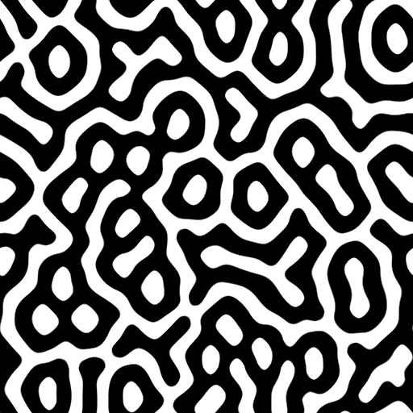

# Réaction Diffusion Rapide

<table>
<tr style="border: 0;">
<td width="33.33%" style="border: 0;" valign="top">

<b>Entrée :</b> Filtres > Effets

</td>
<td width="100.00%" style="border: 0;" valign="top">

## Description

Ce nœud réalise un effet de réaction-diffusion sur une image en niveaux de gris d&#39;entrée.

La réaction-diffusion est un processus par lequel la matière se répand (diffuse) et interagit (réagit) avec d’autres matières. Il s&#39;agit d&#39;un modèle mathématique qui simule ce qui se passe dans la nature lorsque certains motifs se forment sur la peau des animaux par exemple.

Ce nœud est optimisé pour les performances et effectue certains compromis de précision pour la vitesse.

</td>
</tr>
</table>

## Connecteurs d’entrée

<b>Entrée</b> *Niveaux de gris* Image en niveaux de gris à laquelle l&#39;effet Réaction-diffusion doit être appliqué.

## Connecteurs de sortie

<b>Sortie </b>*Niveaux de gris* Image en niveaux de gris représentant l&#39;effet Réaction-diffusion appliqué à l&#39;image d&#39;entrée.

## Paramètres

<b>Rayon</b> *Flottant*&#x200B;Étendue de l’effet.

<b>Contraste</b> *Flotter*\
Règle le contraste de l’entrée et sert de seuil.

## Exemples

<table>
<tr style="border: 0;">
<td style="border: 0;" valign="top">

</td>
<td style="border: 0;" valign="top">

</td>
<td style="border: 0;" valign="top">

</td>
</tr>
</table>
