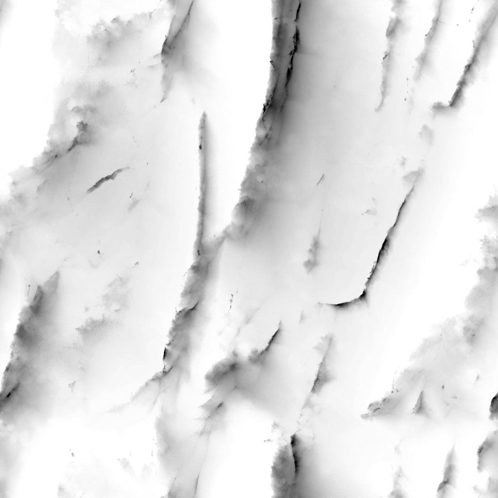

# Tons foncés RT

<table>
<tr style="border: 0;">
<td width="33.33%" style="border: 0;" valign="top">

Icône de nœud 

<b>Entrée :</b> Filtres > Effets

</td>
<td width="100.00%" style="border: 0;" valign="top">

## Description

Génère des ombres avec lancer de rayon à partir d’une entrée de courbe de transfert d’height.

Ce nœud ne doit pas être utilisé en combinaison avec le moteur CPU (SSE) en raison du temps de calcul.

</td>
</tr>
</table>

## Paramètres

|  |  |
|:---|:---|
| <b>Exemples</b> <i>Nombre entier</i> | Nombre de rayons utilisés pour calculer les ombres. Une valeur plus élevée offre un résultat plus lisse et plus précis, au détriment des performances. |
| <b>Mode</b> <i>Nombre entier</i> | Méthode de dessin des ombres sur la surface. |
| <b>Échelle d&#39;Height</b> <i>Flotter</i> | Multiplicateur de l’intensité de la courbe d’height d’entrée. |
| <b>Position claire</b> <i>Float2</i> | Position de la source lumineuse sur une sphère englobant la surface :  - <b>X</b> : position horizontale, en nombre de tours ; - <b>Y</b> : position verticale, où 0,5 est le zénith et 0/1 est l&#39;horizon. |
| <b>Intensité de la lumière</b> <i>Flotter</i> | Intensité de la source lumineuse. |
| <b>Taille légère</b> <i>Float2</i> | (Disponible lorsque le <b>Mode</b> est défini sur <i>Ombré</i>) Taille de la source lumineuse sous forme de rectangle. |
| <b>Échelle de la lumière (ombres douces)</b> <i>Flotter</i> | Multiplicateur de la contribution de la <b>taille de la lumière</b> à la direction des rayons. Plus la valeur est élevée, plus les ombres sont lisses. |
| <b>Garder La Lumière Au-Dessus De L&#39;Horizon</b> <i>Booléen</i> | Si la <b>position de la lumière</b> est définie de manière à placer la lumière sous l&#39;horizon, ce paramètre empêche la lumière de franchir ce seuil, ce qui signifie que les valeurs Y sont ajustées à la plage [0;1]. |
| <b>Opacité de l&#39;ombre</b> <i>Flotter</i> | Multiplicateur de l’opacité des tons foncés dessinés sur la surface. |
| <b>Atténuation des ombres</b> <i>Flotter</i> | Multiplicateur de l&#39;atténuation des ombres à mesure qu&#39;elles s&#39;éloignent de leur projection. Une valeur de 0 donne des ombres uniformes (des ombres légères sont toujours appliquées). |
| <b>Longueur max. des ombres</b> <i>Flotter</i> | Distance maximale à laquelle une ombre peut être dessinée de sa projection. Une valeur de 0 ne produit aucune ombre visible. |

## Exemples

<table style="margin-top: 32px; margin-bottom: 32px">
    <tr style="border: 0">
        <td style="border: 0; background: transparent">
            
        </td>
        <td style="border: 0; background: transparent">
            
        </td>
        <td style="border: 0; background: transparent">
            
        </td>
    </tr>
</table>
