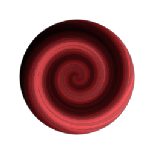

# Tourbillon

<table>
<tr style="border: 0;">
<td style="border: 0;" valign="top">

## Tourbillon (Niveaux de gris)

**Entrée :** *Filtres/Effets*

**Simple**

</td>
<td style="border: 0;" valign="top">

## Description

Cela transforme une image d’entrée en la déformant dans une direction de tourbillon. Il dispose d’une commande supplémentaire pour déplacer le tourbillon vers certaines parties de la zone de travail.

## Paramètres

* **Matrice**\
  Permet de déplacer manuellement l’effet Tourbillon. Peut également être modifié en interagissant avec les poignées dans l’aperçu 2D.
  * **Matrice** : *(Matrice De Transformation)*
  * **Décalage** : *0,0 - 1,0*
* **Quantité** : *-16.0 - 16.0* Intensité de l&#39;effet de tourbillon.

## Exemples d’images

</td>
</tr>
</table>
