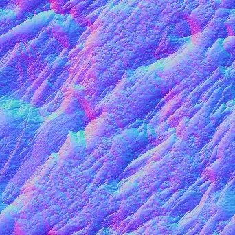

# Normale courbée

<table>
<tr style="border: 0;">
<td width="33.33%" style="border: 0;" valign="top">

Icône de nœud 

<b>Entrée :</b> Filtres > Map normal

</td>
<td width="100.00%" style="border: 0;" valign="top">

## Description

Génère une Map normal recourbée en fonction d&#39;une entrée de map height. Une Map normal courbée est une version spéciale de [Normal](../../../../../../compositing-graphs/nodes-reference-for-com/atomic-nodes/normal/normal.md) et [Ambient occlusion (RTAO)](../../../../../../compositing-graphs/nodes-reference-for-com/node-library/filters/effects/ambient-occlusion-rtao/ambient-occlusion-rtao.md), qui génère une map normal avec un ambient occlusion incorporé.\
Cela peut être utilisé dans les moteurs en temps réel pour que l&#39;Ambient occlusion soit baké dans la carte normale, par exemple pour des réflexions d&#39;occlusion plus précises sur les métaux.

Ce nœud ne doit pas être utilisé en association avec le moteur CPU (SSE) en raison du temps de calcul.

</td>
</tr>
</table>

## Paramètres

|  |  |
|:---|:---|
| <b>Utiliser la Taille physique</b> <i>Booléen</i> | Activez/désactivez cette option pour utiliser les paramètres de Taille physique afin de déterminer l’échelle d’height. |
| <b>Taille physique</b> <i>Flottant3</i> | (Disponible lorsque <b>Utiliser la Taille physique</b> est défini sur <i>Vrai</i>) Ajuste l&#39;échelle d&#39;height en fonction de la taille physique réelle de la surface. |
| <b>Exemples</b> <i>Entier</i> | Nombre de rayons utilisés pour calculer la normale courbée. Une valeur plus élevée offre un résultat plus lisse et plus précis au détriment des performances. |
| <b>Échelle d&#39;Height</b> <i>Flottant</i> | (Disponible lorsque l’option Utiliser la Taille physique est définie sur Faux) Multiplicateur de l’intensité de la map height saisie. |
| <b>Distribution</b> <i>Entier</i> | Définit la méthode de distribution. Affecte la réduction vers les zones ombrées. |
| <b>Distance Maximale</b> <i>Flottant</i> | Définit la distance maximale que les rayons peuvent parcourir pour être occultés. |
| <b>Angle de répartition</b> <i>Flottant</i> | Définit l’angle d’étalement des rayons sur lesquels la prise de vue doit être effectuée. Une valeur de 1 correspond à un hémisphère entier. |
| <b>Format normal</b> <i>Entier</i> | Inverse la couche verte de la sortie. |

## Exemples

<table style="margin-top: 32px; margin-bottom: 32px">
    <tr style="border: 0">
        <td style="border: 0; background: transparent">
            
        </td>
    </tr>
</table>
