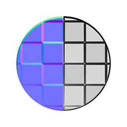

# Face à la normale

<table>
<tr style="border: 0;">
<td width="33.33%" style="border: 0;" valign="top">

{width="128px"}

<b>Entrée :</b> Filtres > Map normal

</td>
<td width="100.00%" style="border: 0;" valign="top">

## Description

Ce filtre prend une image Normalmap en tant qu’image d’image en niveaux de gris et génère une valeur correspondant à la position des normales dans l’espace de texture.

</td>
</tr>
</table>
