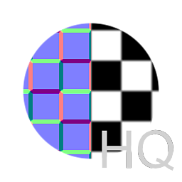

# Normal à l’Height du QG

<table>
<tr style="border: 0;">
<td style="border: 0;" valign="top">

{width="128px"}

## Normal à l’Height du QG

**Entrée :** *Filtres/Mappage de normales*

**Intermédiaire**

</td>
<td style="border: 0;" valign="top">

## Description

Nœud de conversion inverse qui tente de reconvertir une carte normale d&#39;espace tangent en carte de hauteur. Il s&#39;agit du nœud le plus avancé ; l&#39;option [Normal à l&#39;Height](../../../../../../compositing-graphs/nodes-reference-for-com/node-library/filters/normal-map/normal-to-height/normal-to-height.md) offre moins d&#39;options et utilise des calculs différents.

Utile lorsque vous n&#39;avez qu&#39;une source Normalmap, mais que vous souhaitez néanmoins effectuer des opérations la combinant avec une carte de hauteur. Gardez à l’esprit que cela ne permettra jamais d’obtenir un résultat correct à 100 %, car les informations sont perdues par nature lors de la conversion de l’Height en normalité. Il ne peut jamais remplacer une carte de hauteur correctement générée !

## Paramètres

* **Format normal** : *DirectX, OpenGL*\
  Bascule entre différents formats de mappage normal (inverse la couche verte).
* **Balance des Reliefs** :*0,0 - 1,0* Mélange entre les biais basse et haute fréquence.
* **Intensité de l&#39;Height** : *0,0 - 1,0* L&#39;intensité ou le multiplicateur de la carte de hauteur, fonctionne un peu comme l&#39;opacité globale.
* **Normaliser l&#39;Height** :*Faux/Vrai* met automatiquement à l&#39;échelle la plage de la carte de hauteur pour utiliser le contraste complet, comme un [niveau automatique](../../../../../../compositing-graphs/nodes-reference-for-com/node-library/filters/adjustments/auto-levels/auto-levels.md).
* **Qualité** :*Normal, Élevé* Bascule entre la vitesse ou la qualité.

## Exemples d’images

| 

 |
| --- |
|  |

</td>
</tr>
</table>
