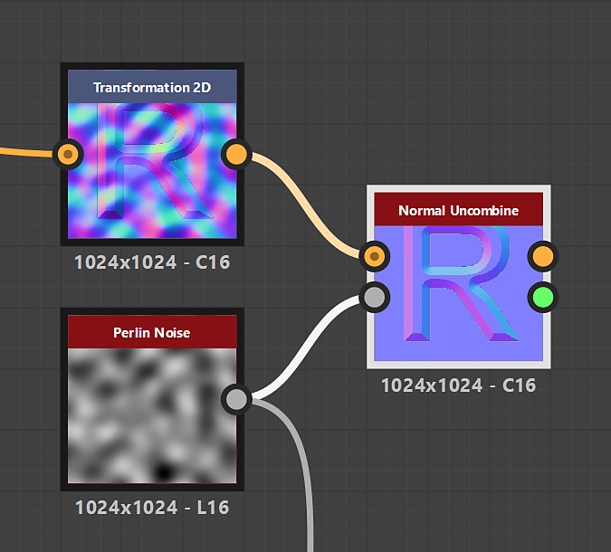

# Dissociation normale

<table>
<tr style="border: 0;">
<td width="33.33%" style="border: 0;" valign="top">

{width="200px"}

<b>Entrée :</b> Filtres > Mappage normal

</td>
<td width="100.00%" style="border: 0;" valign="top">

## Description

Supprime d&#39;une carte de normales les détails de surface décrits par une carte d&#39;height.

</td>
</tr>
</table>

## Entrées

|  |  |
|:---|:---|
| <b>Normal combiné</b> <i>Couleur</i> PRINCIPALE | Mappage normal dans lequel les détails doivent être supprimés. |
| <b>Height</b> <i>Niveaux de gris</i> | La carte d&#39;height représentant les détails de surface qui doivent être supprimés de la carte de normales. |

## Sorties

|  |  |
|:---|:---|
| <b>Normal non combiné</b> <i>Couleur</i> | La carte de normales où les détails de surface décrits par la carte d&#39;height d&#39;entrée ont été supprimés. |
| <b>Intensité estimée</b> <i>Flotter</i> | Estimation de l&#39;intensité qui doit être définie sur un nœud [Normal](../../../../../../compositing-graphs/nodes-reference-for-com/atomic-nodes/normal/normal.md) relié à la carte d&#39;height d&#39;entrée, pour correspondre à l&#39;intensité de la carte de normale d&#39;entrée. |

## Paramètres

|  |  |
|:---|:---|
| <b>Format normal</b> *Nombre entier* | Format du mappage normal en entrée. Inverse efficacement la couche verte.<ul data-preserve-html="true"> <li data-preserve-html="true"><b>DirectX :</b> l&#39;axe Y pointe vers le haut</li> <li data-preserve-html="true"><b>OpenGL :</b> l’axe Y pointe vers le bas</li> </ul> |

## Exemples

<table>
  <tr>
    <td>
      
       <i>Avant</i>
    </td>
    <td>
      
       <i>Après</i>
    </td>
  </tr>
</table>

{zoomable="yes"}

<table>
  <tr>
    <td>
      
       <i>Avant</i>
    </td>
    <td>
      
       <i>Après</i>
    </td>
  </tr>
</table>

{zoomable="yes"}

<table>
  <tr>
    <td>
      
       <i>Avant</i>
    </td>
    <td>
      
       <i>Après</i>
    </td>
  </tr>
</table>

{zoomable="yes"}
