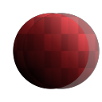

# Cloner (nœud de filtre)

<table>
<tr style="border: 0;">
<td style="border: 0;" valign="top">

## Cloner

**Entrée :** *Filtres/Transformations*

**Intermédiaire**

</td>
<td style="border: 0;" valign="top">

## Description

Clone l’image d’entrée une fois à un emplacement spécifié. Peut fonctionner comme un outil de « tampon de duplication » brut.

Nécessite un certain soin pour obtenir les résultats escomptés :

* Idéalement, l’image d’entrée doit avoir une couche alpha (comme une décalcomanie), puisque la fusion est une copie directe.
* Le masque étant défini par défaut sur le noir, une valeur de niveaux de gris blanc uniforme doit au moins être utilisée pour visualiser les résultats.
* Le décalage se découpe facilement en dehors de l’image. Utilisez donc des valeurs faibles.

## Paramètres

### Entrées

* **Source** : *Entrée couleur*\
  Image à dupliquer. Important : idéalement, l’image doit avoir une couche alpha !
* **Masque** : *Entrée En Niveaux De Gris*\
  Emplacement de masque utilisé pour masquer les effets du nœud. Par défaut, c’est le noir !

### Paramètres

* **Décalage** : *-*\
  Déplace ou traduit le résultat. Positif correspond à Gauche et Haut, Négatif à Droite et Bas. Utilisez de petites valeurs, 1,0 et plus le déplace en dehors de l’image !
* **Masque de flou** : *0.0 - 10.0\
  Appliquez un filtre de flou au masque pour adoucir les contours.*

## Exemples d’images

| 

 |
| --- |
|  |

</td>
</tr>
</table>
