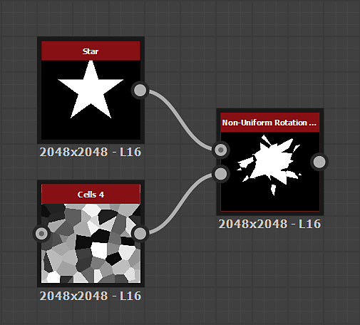

# Rotation non uniforme

<table>
<tr style="border: 0;">
<td width="33.33%" style="border: 0;" valign="top">

<table>
<tr style="border: 0;">
<td style="border: 0;" valign="top">

{width="200px"}

</td>
<td style="border: 0;" valign="top">

{width="200px"}

</td>
</tr>
</table>

<b>Entrées :</b> Filtres > Transformes

</td>
<td width="100.00%" style="border: 0;" valign="top">

## Description

Le nœud **Rotation non uniforme** fait pivoter l&#39;**entrée** à l&#39;aide de l&#39;entrée **Map rotation**.

Les valeurs de l&#39;image représentent un *nombre de tours*. La rotation s&#39;effectue autour de la position spécifiée par la valeur **Position de pivot** ou l&#39;entrée **Position de pivot map**.\
Les valeurs positives de l&#39;entrée **Map rotation** entraînent une rotation *horaire*.

</td>
</tr>
</table>

## Entrées

|  |  |
|:---|:---|
| <b>Entrée</b> <i>Niveaux de gris/Couleur</i> | Image en niveaux de gris d&#39;entrée à faire pivoter. |
| <b>Map rotation</b> <i>Niveaux de gris</i> | Mappage utilisé pour contrôler le degré de rotation, en *nombre de tours*. Les valeurs échantillonnées sont multipliées par rapport au **multiplicateur d&#39;angle de rotation**. Les valeurs négatives entraînent une rotation *antihoraire*. |
| <b>Cartographie de Position de pivot de rotation</b> <i>Couleur</i> | Image utilisée pour spécifier la position de la rotation *pivot*. La position **X/Y** est mappée aux couches **R/G** de l&#39;image. |

## Paramètres

|  |  |
|:---|:---|
| <b>Multiplicateur d&#39;angle de rotation</b> <i>Flottant</i> | Règle l&#39;intensité de l&#39;entrée de **Map rotation**. |
| <b>Décalage de l&#39;angle de rotation</b> <i>Flottant</i> | Applique la rotation supplémentaire spécifiée. |
| <b>Utiliser le mappage de Position de pivot</b> <i>Booléen</i> | Utilisez une *entrée bitmap* pour spécifier la position du pivot de rotation. La position **X/Y** est mappée aux canaux **R/G** de l&#39;entrée **Mappage de position**. |
| <b>Position de pivot</b> <i>Float2</i> | Position du pivot autour duquel l&#39;image est pivotée. |
| <b>Couleur d&#39;arrière-plan</b> <i>Float/Float4</i> | Couleur d&#39;arrière-plan pour afficher *à l&#39;extérieur* des limites de l&#39;image au cas où la mosaïque n&#39;est pas définie sur **Mosaïque de type H et V**. |
| <b>Mode de filtrage</b> <i>Nombre entier</i> | Définit le traitement des résultats échantillonnés lors de l&#39;*interpolation* entre les pixels :  -*Nearest* : échantillonnera exactement la *même* valeur (plus rapide) -*Bilinéaire* : appliquera un filtre bilinéaire sur le résultat pour un aspect *plus lisse* |

## Exemples

<table style="margin-top: 32px; margin-bottom: 32px">
    <tr style="border: 0">
        <td style="border: 0; background: transparent">
            
        </td>
        <td style="border: 0; background: transparent">
            
        </td>
        <td style="border: 0; background: transparent">
            
        </td>
    </tr>
</table>
