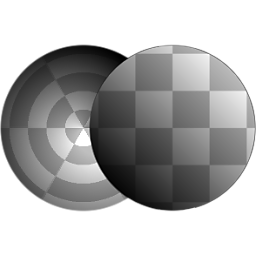
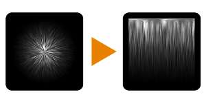

# Polaire à Cartésien

<table>
<tr style="border: 0;">
<td width="33.33%" style="border: 0;" valign="top">

{width="128px"}

{width="128px"}

<b>Entrées :</b> Filtres > Transformes

</td>
<td width="100.00%" style="border: 0;" valign="top">

## Description

Convertit une entrée en coordonnées polaires (angle et rayon) en coordonnées Cartésien (X et Y). L&#39;inverse est possible avec [Cartésien à polaire](../../../../../../compositing-graphs/nodes-reference-for-com/node-library/filters/transforms/cartesian-to-polar/cartesian-to-polar.md).

</td>
</tr>
</table>

## Exemples

<table style="margin-top: 32px; margin-bottom: 32px">
    <tr style="border: 0">
        <td style="border: 0; background: transparent">
            
        </td>
    </tr>
</table>
