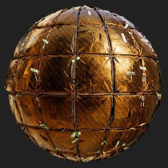

# Rendu PBR

<table>
<tr style="border: 0;">
<td width="41.60%" style="border: 0;" valign="top">

{width="250px"}

**Entrée :** *Filtres de matériaux/Utilitaires PBR*

**Complexe**

</td>
<td width="58.30%" style="border: 0;" valign="top">

## Description

Effectue le rendu d’un matériau PBR sur une sphère, un plan ou un cylindre à l’aide de l’éclairage basé sur l’image (IBL). Il s’agit d’un moteur de rendu à l’intérieur d’un nœud, qui peut être très utile pour générer des vignettes, des aperçus ou des ressources 2D. Il ne s’agit pas d’un rendu comme la vue 3D, mais d’une véritable texture générée dans votre graphique.

Ce nœud nécessite au moins un matériel PBR complet à brancher. Dans l’idéal, vous devez utiliser les modes de création de lien pour connecter le matériau au Rendu PBR. En outre, vous aurez besoin d’un environnement HDRI à enveloppe sphérique pour le rendu afin de calculer l’éclairage à partir de. Les matériaux à tester se trouvent sous Matériaux PBR, les cartes d&#39;environnement sous [Vue 3D dans la bibliothèque.](../../../../../../compositing-graphs/nodes-reference-for-com/node-library/3d-view-library/3d-view-library.md)

</td>
</tr>
</table>

>[!WARNING]
>
> **Moteur CPU (SSE2)**
> 
> Le nœud Rendu PBR est très lourd et ne fonctionne pas bien avec le moteur CPU de SSE2. Passez à un autre moteur en appuyant sur F9, si le nœud fonctionne extrêmement mal.

## Entrées

* **Canal matière** **entrées**\
  Plusieurs entrées de matière sont utilisées pour effectuer le rendu de la matière sur la géométrie :
  * Couleur de base
  * Normale
  * Émissif
  * Rugosité
  * Métallique
  * Niveau spéculaire
  * Hauteur
  * Occlusion ambiante
  * Masque d’opacité
  * Niveau d&#39;anisotropie
  * Angle d&#39;anisotropie
  * Translucidité
  * Échelle de distance de dispersion
* **Carte de Dirt de l&#39;objectif** : *Carte d&#39;entrée en niveaux de gris* personnalisée pour le dirt sur l&#39;objectif, qui apparaît lorsque les halos sont visibles.
* **Carte de l&#39;ouverture de l&#39;objectif** : *L&#39;entrée en niveaux de gris* peut être utilisée pour remplacer la forme Bokeh floue. Plus il est contrasté, plus il est visible. Gardez à l’esprit que seul un cercle de la texture est échantillonné, donc toute forme doit tenir dans un cercle.
* **Entrée d&#39;arrière-plan** : *Entrée de couleur*\
  Mappage personnalisé utilisé comme arrière-plan lorsque le paramètre **Mode arrière-plan** est défini sur *Entrée arrière-plan*
* **Carte d&#39;environnement** : *entrée de couleur* carte d&#39;environnement utilisée pour calculer l&#39;éclairage. Doit être mappé sphériquement et en HDR.

Sorties

* **Beauté**\
  Le rendu final
* **Irradiance brute**\
  Les données d’irradiance du rendu final\
  *Alpha :* mappage d&#39;opacité
* **Specular Brut**\
  Les données de specular du rendu final\
  *Alpha :* carte de l&#39;ombre du Specular
* **Espace universel normal**\
  Données des normales de l’espace universel du rendu final\
  *Alpha :* Carte de l&#39;height spatial mondial
* **Espace Tangent Normal**\
  Les données des normales de l’espace tangent du rendu final\
  *Alpha :* mappage d&#39;height d&#39;espace tangent
* **UV**\
  Les données UV du rendu final\
  *Alpha :* mappage d&#39;opacité

## Paramètres

* **Forme** : *Sphère, Plan, Cylindre*\
  Définit la forme utilisée pour le rendu. Les formes personnalisées ne sont pas possibles.
* **Intensité du Displacement** : *0,0 - 0,5* Définissez l&#39;intensité du displacement à partir de l&#39;height.
* **Rotation de l&#39;environnement** : *0.0 - 1.0*\
  Fait pivoter l’environnement d’éclairage. Pré-rotation par rapport au déplacement de la caméra.
* **Mode Arrière-Plan** : *Couleur, Environnement, Ambiant, Entrée Arrière-Plan*\
  Définissez ce qui s’affiche en arrière-plan. La couleur est une couleur unie, l’environnement est la carte que vous avez connectée avec un flou facultatif. Ambiant est une version très floue de l&#39;environnement.
* **Couleur d&#39;arrière-plan** : *(valeur de couleur)*\
  Disponible uniquement lorsque le mode Arrière-plan est défini sur Couleur.
* **Flou d&#39;arrière-plan de l&#39;environnement** : *0.0 - 1.0*\
  Disponible uniquement lorsque le mode Arrière-plan est défini sur Environnement.
* **Forme**
  * **Échelle** : *0.0 - 2.0*\
    Définissez l’échelle de la sphère.
  * **Taille du plan** : *0.0 - 1.0*\
    Définissez l’échelle du plan.
  * **Rayon du cylindre** : *0.0 - 1.0*\
    Définissez le rayon du cylindre.
  * **Longueur du cylindre** : *0.0 - 1.0*\
    Définissez la longueur du cylindre.
  * **Rotation** : *0.0 - 1.0*\
    Fait pivoter la forme sans faire pivoter l’éclairage.
  * **Sens De La Rotation** : *0.0 - 1.0*\
    Définit l’axe de rotation en 2D.
  * **Rotation Autour De La Direction** : *0.0 - 1.0*\
    Forme en rotation sur l’axe de rotation.
  * **Position de la forme** : *-1.0 - 1.0*\
    Déplace les formes.
  * **Carrelage UV** : *1.0 - 6.0*\
    Définit la quantité de recouvrement UV.
  * **Échelle UV Sphère** : *0.0 - 4.0*\
    Définit l&#39;échelle des UV sur la sphère.
  * **Échelle UV de l&#39;avion** : *1.0 - 4.0*\
    Définit l’échelle des UV sur le plan.
  * **Échelle UV de cylindre** : *1.0 - 6.0*\
    Définit l&#39;échelle des UV sur le cylindre.
  * **Décalage des UV** : *0.0 - 1.0*\
    Décale les UV
  * **Inclinaison UV** : *Faux/Vrai*\
    Inclinaison les UV de 45 degrés pour la sphère.
* **Appareil photo**
  * **Exposition** : *-4.0 - 4.0*\
    Définissez l’exposition de l’appareil photo.
  * **Mappeur de tonalité** : *Linear, ACES, Filmic Hejl*\
    Définissez la solution de mappage de tonalité à utiliser pour l’image finale.
  * **Mode Appareil Photo** : *Perspective, Orthographique*\
    Permutez la caméra entre deux modes de projection.
  * **Champ de vision** : *0.01 - 100.0*\
    Définissez l’angle FOV de la caméra.
  * **Distance** : *0,0 - 4,0*\
    Définissez la distance entre la caméra et le centre de l’objet.
  * **Intensité du vignetage** : *0.0 - 1.0*\
    Définissez l’intensité de l’effet de vignette.
  * **Rayon de vignetage** : *0.0 - 1.0*\
    Définissez le rayon de l’effet de vignette.
  * **Position à l&#39;écran** :\
    Déplace la caméra autour de l’objet. Cette option peut également être modifiée à l’aide d’un objet dans la vue 2D.
* **Profondeur de champ**
  * **Rayon d’ouverture** : *0.0 - 0.1* Définit le rayon de l’ouverture. Des valeurs élevées signifient que les zones floues deviennent plus floues (bokeh).
  * **Lames d&#39;ouverture** : *3 - 9*\
    Définit la forme du flou bokeh.
  * **Bague d&#39;ouverture** : *0.0 - 1.0*\
    Ajoute un dégradé interne à la forme bokeh.
  * **Difraction D&#39;Ouverture** : *0.0 - 2.0*\
    Ajoute une aberration chromatique au bokeh.
  * **Swirly Bokeh** : *0.0 - 1.0*\
    Ajoute un effet de tourbillon ou de rotation aux zones floues bokeh floues floues.
  * **Mode Focus** : *Auto, Point*\
    Définissez si le focus est prédéterminé ou défini par l’utilisateur. La mise au point vous permet de déplacer un point dans la vue 2D pour déterminer la distance de mise au point.
  * **Point focal** :\
    Si le focus est défini sur Point, vous pouvez déplacer ce point. dispose d’un widget de vue 2D.
  * **Décalage de mise au point** : *-0.5 - 0.5*\
    Si le focus est défini sur Auto, vous permet de le déplacer d’avant en arrière.
  * **Utiliser la carte d&#39;ouverture personnalisée** : *Faux/Vrai*\
    Remplace les paramètres d’ouverture ci-dessus et utilise l’entrée de courbe d’ouverture pour déterminer la forme bokeh. Nécessite une entrée.
* **Effets postérieurs**
  * **Activer les effets postérieurs** : *Faux/Vrai*\
    Active/désactive les post-effets *tous* dans le rendu final.
  * **Intensité de la floraison** : *0.0 - 2.0* Définit l&#39;intensité de l&#39;effet de floraison.
  * **Seuil de floraison** : *0.0 - 2.0* Définit un seuil bas pour l&#39;apparition de la floraison.
  * **Décalage chromatique de la floraison** : *0.0 - 1.0*
  * **Intensité du halo de l’objectif** : *0.0 - 1.0* Définit l’intensité de l’effet de halo de l’objectif.
  * **Intensité du halo** : *0.0 - 1.0* Définit l&#39;intensité du halo. Assurez-vous que la lumière de l’arrière-plan de votre environnement est bien visible pour voir correctement cet effet.
  * **Intensité du Dirt de l&#39;objectif** : *0.0 - 1.0* Définit l&#39;effet de la carte du dirt de l&#39;objectif sur les halos.
* **Paramètres de rendu**
  * **Qualité Diffuse** : *16 Échantillons, 32 Échantillons, 64 Échantillons, 128 Échantillons*\
    Basculez entre les niveaux de qualité pour la carte de diffusion.
  * **Multiplicateur Émissif Diffus** : *0.0 - 1.0*\
    Contrôle la contribution des parties émissives à l&#39;irradiation.
  * **Intensité de l&#39;ombre diffuse** : *0.0 - 1.0*\
    Contrôle l’intensité des ombres diffuses.
  * **Tramage Specular** : *0.0 - 1.0*\
    Définissez la quantité de tramage pour le specular.
  * **Multiplicateur d&#39;ombre de Specular** : *0.0 - 1.0*\
    Contrôle l’intensité des ombres dans les reflets specular.
  * **Test d&#39;Alpha tramé en mode opacité** *Mode Alpha simple*\
    Contrôle la méthode d’application de la transparence. Le mode de fusion *Alpha simple* est plus visible sur des arrière-plans uniformes.
  * **Intensité de l&#39;Occlusion ambiante** : *0,0 - 1,0*\
    Définit l’intensité des ombres de l’occlusion ambiante.
* **Réglages de matière**
  * **Recalculer les normales** : *Faux/Vrai*\
    Les normales seront recalculées à partir de la carte d&#39;height en fonction de l&#39;intensité du displacement.
  * **Format normal** : *DirectX, OpenGL*\
    Basculer entre différents Formats de map normaux (inverse la couche verte)
  * **Entrée F0 diélectrique** : *valeur constante, entrée de Specular level*\
    Définissez ce qui détermine les valeurs F0. Entrée de specular level signifie qu&#39;il sera piloté par un mappage d&#39;entrée.
  * **F0** diélectrique : *0.0 - 0.08*\
    Si l’option Valeur constante est choisie pour Entrée diélectrique F0, ce curseur vous permet de définir la valeur globale.
* **Pelage transparent**
  * **Activer le pelage transparent** :*Faux/Vrai*\
    Permet d’ajouter un calque de revêtement transparent simple et supplémentaire sur le matériau d’entrée.
  * **Effacer le poids du pelage** : *0,0 - 1,0*\
    Définit l’intensité ou l’intensité du calque clearcoat.
  * **Effacer le Specular level du pelage** : *0.0 - 1.0*\
    Définit la rugosité du calque clearcoat.
  * **Hériter de la normale à partir du calque de base** : *Faux/Vrai* Définissez cette option si clearcoat ignore ou utilise les normales du matériau de base.
* **Émissif**
  * **Activer l&#39;éclairage émissif** *Vrai/Faux* Active/désactive la contribution diffuse de l&#39;éclairage émissif.
  * **Intensité émissive** : *0.0 - 10.0*\
    Définit le multiplicateur global pour la carte émissive.
* **Diffusion Souterraine**
  * **Activer La Diffusion Subsurface** *Vrai/Faux*\
    Active/désactive la diffusion de la sous-surface dans le rendu final.\
    *Remarque :* la diffusion sous la surface nécessite que la valeur d&#39;entrée **Translucidité** soit *supérieure à 0,0*
  * **Distance de diffusion** *0.0 - 1.0*\
    Ajuste la distance maximale de l’effet de diffusion.\
    *Remarque :* cette valeur est multipliée par rapport à la valeur d&#39;entrée *de l&#39;**échelle de distance de diffusion**par couche de couleur*.
  * **Décalage Rouge** *0.0 - 1.0*\
    Règle l’intensité de l’effet de décalage du rouge dans la diffusion.
  * **Rayleigh** *0.0 - 1.0*\
    Règle l’intensité de l’effet Rayleigh dans la diffusion.

## Exemples d’images

Toutes les images ont été générées directement à l&#39;intérieur de Designer, dans la fenêtre d&#39;affichage 2D, à l&#39;aide des matériaux de la bibliothèque [Ressources Substance 3D](https://substance3d.adobe.com/assets).

| 

 | 

 | 

 | 

 |
| --- | --- | --- | --- |
|  |  |  |  |
| 

 | 

 | 

 | 

 |
|  |  |  |  |
