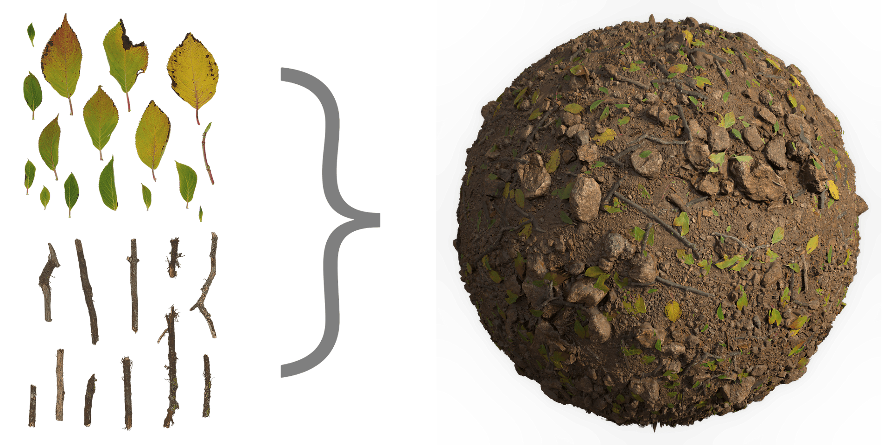

# Atlas scatter

<table>
<tr style="border: 0;">
<td style="border: 0;" valign="top">

{width="200px"}

## Atlas scatter

**Entrée :** *Filtres de matière/Traitement de la numérisation*

**Complexe**

</td>
<td style="border: 0;" valign="top">

## Description

Extrayez des éléments d’un atlas et placez-les en dispersion sur un arrière-plan. Les entrées Atlas sont des matériaux complets, composés d&#39;éléments individuels disposés et emballés sur une seule feuille de texture. Ce nœud les divise (à l&#39;aide d&#39;un processus interne d&#39;[Atlas splitter](../../../../../../compositing-graphs/nodes-reference-for-com/node-library/material-filters/scan-processing/atlas-splitter/atlas-splitter.md)) et les dispersion, comme dans le cas de la [dispersion de forme](../../../../../../compositing-graphs/nodes-reference-for-com/node-library/texture-generators/patterns/shape-splatter/shape-splatter.md). L’Atlas scatter nécessite au minimum une entrée de mappage d’opacité et une entrée de mappage d’Height pour que l’Atlas fonctionne.

>[!NOTE]
>
> Des centaines de [atlas](https://source.substance3d.com/allassets?assetType=substanceAtlas), prêts à être utilisés dans le nœud d&#39;Atlas scatter, sont disponibles sur [Substance Source](https://source.substance3d.com/).

## Entrées et paramètres

### Paramètres

* **Résolution d&#39;entrée Atlas** : *résolution, de 1 à 12*\
  Définissez manuellement la résolution de l’atlas d’entrée complet, pour garantir un bon rapport performances/qualité.
* **X Quantité** : *1 - 64*\
  Quantité de répétitions X du motif.
* **Quantité Y** : *1 - 64*\
  Nombre de répétitions Y du motif.
* **Motif**
  * **Plage de motifs** : *0 - 10*\
    Définit la plage de motifs à diffuser. Si cette option est définie sur 0, tous les motifs seront utilisés.
  * **Mode de distribution de motif** : *Aléatoire, Index de motif, Index de ligne, Index de colonne* Définit l&#39;ordre dans lequel les éléments de l&#39;atlas sont utilisés.
  * **Multiplicateur de carte de distribution de motif** : *0.0 - 1.0*\
    Sélectionnez le motif de forme en fonction de la valeur de niveaux de gris de l’image d’entrée.
  * **Rotation Du Motif** : *0, 90, 180, 270*\
    Applique une rotation fixe à chaque élément de l’atlas, selon la valeur de degrés sélectionnée.
  * **Aléatoire de la rotation du motif** : *0.0 - 1.0*\
    Applique une rotation aléatoire à la partie définie des éléments de l’atlas.
  * **Précision de la détection de forme Atlas** :*formes simples ou petites, formes complexes ou grandes, aucun mode d&#39;échec*\
    Définit la précision de détection des formes. Plus la précision est grande, plus l’impact sur les performances est important.
  * **Opacité de l&#39;atlas de réduction d&#39;échelle (détection plus rapide)** : *-4 - 0*\
    Permet de contrôler le taux de réduction de l’opacité de la carte d’atlas d’entrée, qui est utilisée pour la détection de forme. Une résolution inférieure améliore les performances au détriment de la précision.
  * **Ignorer la forme inférieure à** : *0.0 - 1.0* définit la taille minimale qu’une forme doit être détectée, exprimée sous la forme du rapport de l’image globale
* **Taille**
  * **Échelle** : *0.0 - 5.0*\
    Définit l’échelle relative des formes dispersées.
  * **Échelle Aléatoire** : *0.0 - 1.0*\
    Définit le multiplicateur pour appliquer une mise à l’échelle aléatoire à chaque forme diffusée.
  * **Aucun Chevauchement D&#39;Échelle** : *0.0 - 1.0*\
    Réduit l’échelle de la forme afin qu’elles ne se chevauchent pas.
  * **Multiplicateur De Mappage D&#39;Échelle** : *0.0 - 1.0*\
    Multiplie l’échelle de la forme en fonction de la valeur de niveaux de gris de l’image d’entrée.
  * **Taille** : *0,0 - 1,0*\
    Définit l’échelle relative des formes dispersées en fonction de leur longueur (X) et de leur largeur (Y).
  * **Rapport de taille de la Pente Bg** : *0,0 - 1,0*\
    Modifie le rapport de taille de la forme en fonction de la pente d’height de l’arrière-plan.
  * **Conserver le rapport de grandeur** : *0,0 - 1,0*\
    Détermine le degré de conservation des proportions d’origine des formes dispersées, au lieu d’utiliser le rapport des cellules de la grille, c’est-à-dire le rapport des valeurs Quantité X et Quantité Y.
* **Position**
  * **Position aléatoire** : *0.0 - 2.0*\
    Multiplicateur permettant de déplacer chaque forme dans une direction aléatoire à partir de leur point de départ de grille.
  * **Distribution Aléatoire** : *Gaussien, Uniforme*\
    Bascule d&#39;une distribution gaussienne à une distribution uniforme pour la position aléatoire. La distribution gaussienne produira un résultat plus organique par rapport à la distribution Uniforme.
  * **Multiplicateur de carte vectorielle** : *0.0 - 1.0*\
    Contrôle l’influence de l’entrée de la carte vectorielle pour déplacer les formes dans la direction du vecteur spécifié par les canaux rouge (X) et vert (Y) de la carte.
  * **Décalage Horizontal** : *-2,0 - 2,0*\
    Multiplicateur de décalage le long de l’axe X.
  * **Décalage vertical** : *-2.0 - 2.0*\
    Multiplicateur pour le décalage de position le long de l’axe Y.
  * **Option Hors limites** : *Mise à l&#39;échelle de la forme, Contrainte de position*\
    En raison de la nature technique de la tache, les formes ne peuvent pas être dessinées à plus de 2 cellules de la taille de leur position d&#39;origine. Si une forme devient trop grande ou est déplacée trop loin, vous avez deux options : - L’option Mise à l’échelle réduit la taille de la forme lorsqu’elle atteint un cadre - L’option Conserver la position déplace la forme vers sa position d’origine
* **Rotation**
  * **Rotation** : *0.0 - 1.0*\
    Permet de contrôler la rotation locale de toutes les formes.
  * **Rotation Aléatoire** : *0.0 - 1.0*\
    Multiplicateur pour une valeur aléatoire de rotation appliquée par forme.
  * **Rotation à partir de la Pente du bloc** : *0.0 - 1.0*\
    Modifie la rotation de la forme en fonction de la pente d’height de l’arrière-plan. Généralement utilisé en combinaison avec le paramètre « Size Ratio from Bg Pente »
  * **Multiplicateur de Map rotation** : *0.0 - 1.0*\
    Multiplie la rotation de la forme en fonction de la valeur de niveaux de gris de l’image entrée.
  * **Multiplicateur de carte vectorielle** : *0.0 - 1.0*\
    Définit la rotation de la forme en fonction de l’entrée d’image vectorielle.
* **Height**
  * **Ajustement automatique de l&#39;échelle d&#39;Height** : *Faux/Vrai*\
    Ajustez automatiquement l’height en fonction de l’échelle du motif pour conserver un height de forme proportionnel à l’height d’arrière-plan.
  * **Mode De Fusion** : *Fusion Height, Test Alpha*\
    Définit la méthode de résolution des chevauchements de formes.
  * **Décalage Height** : *-1.0 - 1.0*\
    Applique un décalage global à l’height des formes
  * **Décalage aléatoire de l&#39;Height** : *0,0 - 1,0*\
    Multiplicateur d’un décalage d’height aléatoire appliqué par forme
  * **Multiplicateur de mappage de décalage d&#39;Height** : *0.0 - 1.0*\
    Multiplie le décalage de l’height de la forme en fonction de la valeur de niveaux de gris de l’image d’entrée.
  * **Échelle D&#39;Height** : *0.0 - 1.0*\
    Permet de contrôler l’échelle d’height globale des formes dispersées
  * **Échelle D&#39;Height Aléatoire** : *0.0 - 1.0*\
    Application d’un multiplicateur pour une échelle d’height aléatoire par forme
  * **Multiplicateur de mappage d&#39;échelle d&#39;Height** : *0.0 - 1.0*\
    Multiplie l’échelle d’height de la forme en fonction de la valeur de niveaux de gris de l’image d’entrée.
  * **Se conformer à l&#39;arrière-plan** : *0.0 - 1.0*\
    À 0, l’height de forme reste intact, à 1, l’height de forme sera déformé par l’arrière-plan de l’height sous-jacent.
  * **Arrière-Plan Conforme Lisse** : *0.0 - 2.0*\
    Permet de contrôler le degré de lissage appliqué à la déformation d’height de la forme lorsqu’elle est uniformisée à son arrière-plan.
  * **Inclinaison par rapport à la Pente principale** : *0.0 - 1.0*\
    Déforme l’height de forme en fonction de la pente locale de l’height d’arrière-plan : un dégradé linéaire correspondant à la pente d’arrière-plan est ajouté à l’height de forme.
  * **Smoothness de Pente d&#39;arrière-plan** : *0.0 - 2.0*\
    Contrôle le degré de lissage appliqué à la pente d’arrière-plan lorsque la forme est inclinée en fonction de cette pente.
  * **Découpage Des Pixels Noirs** : *Faux/Vrai*\
    Ignore la valeur de noir des entrées de motif.
  * **Aplatir La Base Du Motif** : *Faux/Vrai*\
    Permet d’aplatir l’height d’arrière-plan sous une forme pour qu’il corresponde à l’height de départ.
* **Masquage**
  * **Aléatoire du masque** : *0.0 - 1.0*\
    Masque un nombre aléatoire de formes, exprimé sous la forme d’un rapport de la quantité totale.
  * **Multiplicateur de mappage aléatoire du masque** : *0.0 - 1.0*\
    Définit le masquage de forme aléatoire en fonction de l’entrée d’image en niveaux de gris.
  * **Masquer à partir de la grande Pente** : *-1.0 - 1.0*\
    Contrôle le masquage des formes en fonction de la pente de l’arrière-plan à leur emplacement.
* **Couleur**
  * **Réglage Des Couleurs** : *-1.0 - 1.0*\
    Permet d’ajuster globalement les couleurs des éléments dispersés.
  * **Color Random** : *0.0 - 1.0*\
    Multiplicateur permettant de modifier les valeurs chromatiques de façon aléatoire par forme.
  * **Couleur d&#39;arrière-plan** : *0.0 - 1.0*\
    Décale les couleurs de la forme en fonction de la couleur d’arrière-plan à leur emplacement.
* **Normal**
  * **Inclinaison par rapport à la Pente principale** : *0.0 - 1.0*\
    Inclinez la forme normalement en fonction de la normale de l’arrière-plan.
  * **Aléatoire normal** : *0,0 - 1,0*\
    Multiplicateur permettant d’incliner la normale d’une valeur aléatoire par forme.
  * **Format normal** : *DirectX, OpenGL*\
    Basculer entre différents Formats de map normaux (inverse la couche verte)
* **Rugosité**
  * **Réglage De La Rugosité** : *-1.0 - 1.0*\
    Permet de décaler la rugosité globale de la forme.
  * **Rugosité de l&#39;arrière-plan** : *0.0 - 1.0*\
    Déplace la rugosité des formes vers la rugosité de l’arrière-plan à leur emplacement.
  * **Rugosité aléatoire** : *0,0 - 1,0* un multiplicateur pour décaler la rugosité d’une valeur aléatoire par forme.

## Exemples d’images

{width="512px"}

</td>
</tr>
</table>
